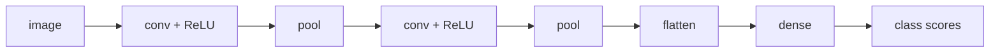

A photograph is a grid of numbers. A convolutional network reads that grid the way you read a page: a small window, slid across, summarizing what is nearby. The same small window is used everywhere. That reuse is the whole idea, and it is a *prejudice* — the right one, if a cat in the top-left corner is the same animal as a cat in the bottom-right.

If you have a first course in linear algebra (dot products, matrices) and the integral from Calculus 1, you are the intended reader. Every term is defined when it appears. We will not train ImageNet. We will roll two dice, edge-detect a handmade square, count parameters until a fully-connected layer looks ridiculous, and only then stack the windows into a network.

- [You already know this: two dice](#you-already-know-this-two-dice)
- [The integral, then the sum](#the-integral-then-the-sum)
- [The kernel](#the-kernel)
- [A square, a question in nine numbers](#a-square-a-question-in-nine-numbers)
- [A window, by hand](#a-window-by-hand)
- [Convolution versus correlation](#convolution-versus-correlation)
- [Stride, padding, channels](#stride-padding-channels)
- [Why share the weights](#why-share-the-weights)
- [Pooling](#pooling)
- [Receptive field](#receptive-field)
- [The stack is a network](#the-stack-is-a-network)
- [A Fourier aside](#a-fourier-aside)
- [What the napkin leaves out](#what-the-napkin-leaves-out)

---

# You already know this: two dice
{: #you-already-know-this-two-dice}

The first convolution most people meet is not an image. It is a pair of dice.

One fair die has $P(X=i)=\tfrac16$ for $i=1,\ldots,6$. Two independent dice, $S=X+Y$. The ways to roll a $7$ are the pairs whose faces *sum* to $7$:

$$
(1,6),\;(2,5),\;(3,4),\;(4,3),\;(5,2),\;(6,1).
$$

Six of them, each $\tfrac1{36}$, so $P(S=7)=\tfrac6{36}$. In general

$$
P(S=n) \;=\; \sum_{i} P(X=i)\, P(Y=n-i).
$$

That sum *is* a convolution. Write $a_i = P(X=i)$ and $b_j = P(Y=j)$; then $(a*b)_n = \sum_{i+j=n} a_i b_j$. You have been convolving every time you asked for the law of a sum.

<table>
  <thead>
    <tr><th>\(n\)</th><th>2</th><th>3</th><th>4</th><th>5</th><th>6</th><th>7</th><th>8</th><th>9</th><th>10</th><th>11</th><th>12</th></tr>
  </thead>
  <tbody>
    <tr><td>ways</td><td>1</td><td>2</td><td>3</td><td>4</td><td>5</td><td>6</td><td>5</td><td>4</td><td>3</td><td>2</td><td>1</td></tr>
    <tr><td>\(P(S=n)\)</td><td>1/36</td><td>2/36</td><td>3/36</td><td>4/36</td><td>5/36</td><td>6/36</td><td>5/36</td><td>4/36</td><td>3/36</td><td>2/36</td><td>1/36</td></tr>
  </tbody>
</table>

The triangle of ways is the convolution of two flat lists of length 6. An image will be the same algebra, in two indices, with a tiny second list we get to choose.


---

# The integral, then the sum
{: #the-integral-then-the-sum}

In continuous time, for functions $f$ and $g$,

$$
(f * g)(s) \;=\; \int_{-\infty}^{\infty} f(x)\, g(s-x)\, dx.
$$

The $s-x$ is the slide: as $s$ moves, $g$ is dragged across $f$. At each $s$ you multiply the overlapping values and take the area. That is the entire definition.


The same algebra on sequences is the sum we already wrote:

$$
(a * b)_n \;=\; \sum_{i+j=n} a_i\, b_j.
$$


And the two pictures, side by side, so the dice and the integral are visibly cousins:


An image is a 2-D sequence. The same sum, now in two indices, is the operation a CNN runs at every location.

---

# The kernel
{: #the-kernel}

In a CNN the second function is tiny, and we give it a name.

> **Definition.** A **kernel** (also **filter**) is a small matrix of weights, typically $3\times 3$ or $5\times 5$, that is slid across an image. At each position the kernel and the patch under it are multiplied entrywise and summed: one number, one location.

The Romance languages are more honest than English here. Spanish and Portuguese say *núcleo*; French says *noyau*. The kernel is the *center* of the operation: a little template that asks, at every pixel, “how much does this neighborhood look like me?”

The weights can be chosen by hand. Four classical $3\times 3$ templates, applied to the same photograph:


- **Identity.** A $1$ in the center and zeros elsewhere copies the image. The kernel looks at the neighborhood and throws it away.
- **Box blur.** Every entry $1/9$. Each output pixel is the average of its $3\times 3$ neighborhood. Nearby color leaks in; the photograph softens.
- **Sharpen.** The center is large and positive, the four-neighbors negative. The kernel *subtracts* a blur from the original, which is the classical unsharp mask.
- **Edge detection.** Center $8$, every neighbor $-1$. The kernel sums to zero, so a flat region produces $0$ (black). A jump in brightness produces a large response (white).

A Gaussian blur is the same idea with a softer template: weights that fall off like a bell curve from the center, often a $5\times 5$.

In a CNN nobody writes these matrices by hand. The entries are **parameters**. They start random, and training nudges them so that the first layer’s kernels become edge- and texture-detectors, the next layer’s kernels become detectors of combinations of those, and so on. The algebra does not change. Only who chooses the numbers.

---

# A square, a question in nine numbers
{: #a-square-a-question-in-nine-numbers}

Forget photographs for a moment. Draw an $8\times 8$ of zeros, put a $4\times 4$ of ones in the middle, and drop the edge kernel on it. Valid padding, so the output is $6\times 6$.


Read the response. The interior of the square is $0$: every $3\times 3$ of ones, against a kernel that sums to zero, is zero. The far background is negative and small. The **boundary** is large and positive — $3$ along the sides, $5$ at the corners, where two edges meet. The kernel did not “see a square.” It asked, nine numbers at a time, “is there a jump here?” and the jumps were the only places that said yes.

That is the whole visual content of a first convolutional layer. Edges, then textures, then parts. The later layers are the same question, asked of the answers to earlier questions.

---

# A window, by hand
{: #a-window-by-hand}

Take the $4\times 4$ grid we will pool in a later section,

$$
I \;=\;
\begin{pmatrix}
1 & 1 & 2 & 4 \\
5 & 6 & 7 & 8 \\
3 & 2 & 1 & 0 \\
1 & 2 & 3 & 4
\end{pmatrix},
$$

and the box-blur kernel $K = \tfrac19$ of all ones. Sit $K$ on the top-left $3\times 3$ of $I$:

$$
\begin{pmatrix} 1 & 1 & 2 \\ 5 & 6 & 7 \\ 3 & 2 & 1 \end{pmatrix}
\quad\longrightarrow\quad
\frac{1+1+2+5+6+7+3+2+1}{9} \;=\; \frac{28}{9} \approx 3.11.
$$

That single number is the output at position $(0,0)$. Slide one pixel to the right:

$$
\begin{pmatrix} 1 & 2 & 4 \\ 6 & 7 & 8 \\ 2 & 1 & 0 \end{pmatrix}
\quad\longrightarrow\quad
\frac{31}{9} \approx 3.44.
$$

A $4\times 4$ input and a $3\times 3$ kernel, slid with no padding, produce a $2\times 2$. Four dot products. The network does this at every location, for every kernel, for every layer.

```python
import numpy as np

I = np.array([[1, 1, 2, 4],
              [5, 6, 7, 8],
              [3, 2, 1, 0],
              [1, 2, 3, 4]], dtype=float)
K = np.ones((3, 3)) / 9

out = np.zeros((2, 2))
for i in range(2):
    for j in range(2):
        out[i, j] = np.sum(I[i:i+3, j:j+3] * K)
print(out)
# [[3.111..., 3.444...],
#  [3.333..., 3.667...]]
```

---

# Convolution versus correlation
{: #convolution-versus-correlation}

One bookkeeping warning, because the integral and the code do not quite match. The continuous formula uses $g(s-x)$, which **flips** $g$ before the slide. Image libraries almost always skip the flip and compute the **cross-correlation**

$$
(I \star K)(i,j) \;=\; \sum_m \sum_n I(i+m,\, j+n)\, K(m,n)
$$

and still call it a convolution. For a learned kernel the flip is absorbed into the learned weights — training would have learned the flipped template instead — so nothing is lost. On the napkin we will not flip. We will do what the code does: drop the kernel on a patch, multiply, add.

If you ever implement a Gaussian blur from a textbook formula and it comes out shifted by one pixel, this is why.

---

# Stride, padding, channels
{: #stride-padding-channels}

Three words that are just arithmetic on the window, plus one that is a stack of windows.

**Stride.** How many pixels the kernel jumps. Stride $1$ is every adjacent patch. Stride $2$ skips every other location and roughly halves the width.

**Padding.** If you want the output to keep the input’s spatial size, you frame the input with zeros (or a copy of the border) so the kernel can sit on the edge pixels. **Valid** padding means no frame: the output shrinks. For a kernel of size $k$, stride $s$, padding $p$ on each side, an input of width $W$ produces width

$$
\Bigl\lfloor \frac{W - k + 2p}{s} \Bigr\rfloor + 1.
$$

That is the only shape formula. For the $4\times 4$ example: $W=4$, $k=3$, $p=0$, $s=1$ gives $\lfloor 1\rfloor+1 = 2$.

**Channels.** The full output of one kernel is itself an image — usually smaller, always of one channel. A layer that runs $n$ kernels in parallel produces $n$ feature maps, stacked as $n$ **channels**. An RGB photograph arrives as $3$ channels; after the first layer it might be $32$ or $96$ channels of edges and textures, no longer “colors.”

A kernel that reads $C_{\mathrm{in}}$ channels and writes one feature map has $k \times k \times C_{\mathrm{in}}$ weights, not $k\times k$. A $3\times 3$ on RGB is $27$ numbers, one $3\times 3$ per color, summed. A bank of $C_{\mathrm{out}}$ such kernels is a 4-tensor of shape $C_{\mathrm{out}}\times C_{\mathrm{in}}\times k\times k$. That is the object `nn.Conv2d` stores.

---

# Why share the weights
{: #why-share-the-weights}

A fully connected layer on a $224\times 224\times 3$ photograph, writing $1000$ scores, has

$$
224 \cdot 224 \cdot 3 \cdot 1000 \;=\; 150{,}528{,}000
$$

parameters. One layer. No reason for two nearby pixels to share anything. A $3\times 3$ convolution from $3$ channels to $64$ has

$$
3 \cdot 3 \cdot 3 \cdot 64 \;=\; 1{,}728
$$

parameters, **reused at every location**. The next $3\times 3$, $64$ to $64$, is $36{,}864$. You can stack a dozen of those and still not reach the fully-connected layer’s budget.

<table>
  <thead>
    <tr><th>layer</th><th>parameters</th></tr>
  </thead>
  <tbody>
    <tr><td>dense \(224\times 224\times 3 \to 1000\)</td><td>150,528,000</td></tr>
    <tr><td>\(3\times 3\) conv, 3 → 64</td><td>1,728</td></tr>
    <tr><td>\(3\times 3\) conv, 64 → 64</td><td>36,864</td></tr>
    <tr><td>ten of those 64 → 64</td><td>368,640</td></tr>
  </tbody>
</table>

Nearby pixels are treated the same way. Shift the cat one pixel to the right and the feature maps shift one pixel to the right. That is **translation equivariance**, and it is why the same detector that finds an eye in the top-left corner also finds an eye in the bottom-right, with no extra parameters. A fully connected net would have to learn “eye in the top-left” and “eye in the bottom-right” as unrelated facts.

Equivariance is a *prejudice*. It is the right prejudice for photographs, spectrograms, and chessboards. It is the wrong prejudice for a spreadsheet.

---

# Pooling
{: #pooling}

Convolution summarizes a neighborhood linearly. **Pooling** summarizes a neighborhood by a single statistic, with no learned weights inside the window.

Sit a small filter on the image — typically $2\times 2$ — and replace the patch by its maximum (**max pool**), its mean (**average pool**), or, more rarely, its min or median. Then jump. With a $2\times 2$ filter and stride $2$ the patches do not overlap, and the spatial size halves.

On the same $4\times 4$ as above:


$$
\max\begin{pmatrix}1&1\\5&6\end{pmatrix}=6,
\quad
\max\begin{pmatrix}2&4\\7&8\end{pmatrix}=8,
\quad
\max\begin{pmatrix}3&2\\1&2\end{pmatrix}=3,
\quad
\max\begin{pmatrix}1&0\\3&4\end{pmatrix}=4.
$$

The $4\times 4$ became a $2\times 2$. The large numbers survived; the small ones did not. Max pool is a cheap “is there a detector firing *somewhere* in this $2\times 2$?” It is coarser than a convolution, it has no parameters, and it is mildly **invariant** to a one-pixel jitter: the cat can move a little and the pooled map stays put. Convolution was equivariant (the map moves with the cat). Pooling is the step that starts forgetting *where*, and keeping *whether*.

Average pool keeps more of the magnitude and less of the “is it there.” In vision, max pool has usually won. Modern networks often skip pooling and downsample with a strided convolution, which learns how to shrink. The napkin still wants the $2\times 2$ max: it is the operation you can do with a highlighter.

---

# Receptive field
{: #receptive-field}

Each output cell depends on a patch of the input. That patch is the cell’s **receptive field**. A $3\times 3$ convolution, stride $1$, gives every output a receptive field of $3$. Then a $2\times 2$ pool, stride $2$, grows it to $4$ and doubles the jump between adjacent cells. Then another $3\times 3$: each of those three input-cells to the second conv is already $4$ wide, and they sit two pixels apart, so the field becomes $4 + 2\cdot 2 = 8$.

Start with field $1$ and jump $1$. After a kernel of size $k$ and stride $s$,

$$
\mathrm{field} \;\leftarrow\; \mathrm{field} + (k-1)\cdot\mathrm{jump},
\qquad
\mathrm{jump} \;\leftarrow\; \mathrm{jump}\cdot s.
$$


That is why later layers see loops and stems and the crossbar of a $7$, while the first layer sees edges. Nobody told them to. The field got bigger.

---

# The stack is a network
{: #the-stack-is-a-network}

A **convolutional neural network** is these operations, stacked, then a decision.


Read the figure left to right.

1. **Input.** A $28\times 28$ grayscale digit: one channel.
2. **Conv.** A bank of $5\times 5$ kernels, valid padding. Each kernel produces a $24\times 24$ feature map. The stack has $n_1$ channels.
3. **Max pool**, $2\times 2$. Spatial size $12\times 12$, still $n_1$ channels.
4. **Conv** again, $5\times 5$, now reading all $n_1$ input channels at once. Output $8\times 8\times n_2$.
5. **Max pool** again: $4\times 4\times n_2$.
6. **Flatten.** The $4\times 4\times n_2$ cube is reshaped into a single vector of length $16 n_2$.
7. **Dense layers.** Ordinary matrix–vector products with a nonlinearity (almost always **ReLU**, $x\mapsto\max(0,x)$) and, near the end, dropout. The last layer has ten scores, one per digit.

The last layer is ordinary classification: ten numbers, a softmax, a cross-entropy against the true label. Everything interesting happened in the stack that *built* the vector.

A typical block is

$$
\text{conv} \;\to\; \text{ReLU} \;\to\; \text{pool}.
$$

ReLU is pointwise and cheap. It is there so the stack is not just one giant linear map. Without a nonlinearity, a tower of convolutions is a single (larger) convolution: $(I * K_1) * K_2 = I * (K_1 * K_2)$. The dice again. The network would be a blur. ReLU is the thing that makes two layers more than one.



ImageNet-scale versions — AlexNet, VGG, ResNet — add more of the same blocks, residual shortcuts, and a lot of engineering. The later note in this blog on [AlexNet](/blog/2025/03/14/ML-Series-Part-1-AlexNet) is the engine pulled apart at that scale. This one is the napkin: local dot products, reused, then pooled, then classified.

---

# A Fourier aside
{: #a-fourier-aside}

Named fact, because it is too pretty to skip and too long to prove here. The **convolution theorem** says that convolution in space is multiplication in frequency:

$$
\widehat{f * g} \;=\; \hat f \cdot \hat g.
$$

A blur kernel is concentrated in space, so its Fourier transform is concentrated at *low* frequencies. Multiplying by that transform throws away the high frequencies. That is why a box blur (or a Gaussian) looks like a low-pass filter, and why the edge kernel — which sums to zero, hence has no DC term — is a high-pass. The first layer of a CNN, before anyone trains it, is already speaking the language of “smooth versus jumpy.” Training chooses *which* jumps.

---

# What the napkin leaves out
{: #what-the-napkin-leaves-out}

**Backpropagation** is the chain rule on this stack. The gradient of the loss with respect to a kernel entry is the sum, over every location the kernel was applied, of (upstream gradient at that location) times (the input patch). Weight sharing makes the gradient shared too: one kernel, many patches, one update. That is the other half of the prejudice. The kernel is not just reused on the way up. It is reused on the way down.

**Batch normalization, residual connections, depthwise-separable convolutions, 1×1 bottlenecks** are later plumbing. They make deep stacks trainable. They do not change the meaning of a kernel. A $1\times 1$ convolution, for the record, is a dense layer at each pixel, mixing channels and leaving space alone — useful, and not a window in the sense of this note.

**What a CNN is for.** Anything with a grid topology: photographs, spectrograms, voxels, some board games. Translation equivariance is the inductive bias. If the pattern you care about can appear anywhere and looks the same wherever it appears, a shared kernel is the right prejudice.

The original 2012 demonstration that this prejudice was enough to dominate computer vision is Krizhevsky, Sutskever, and Hinton. The operation itself is older: Fukushima’s Neocognitron, LeCun’s LeNet, and, if you want to be annoying at dinner, the convolution theorem.

The next note in this series gives up the grid. Sequences have an order, not a neighborhood, and the sticky note that carries the order is a hidden state.

Cheers.

---

# Further reading

Grant Sanderson, [But what is a convolution?](https://www.youtube.com/watch?v=KuXjwB4LzSA). 3Blue1Brown. The continuous and discrete pictures, and the dice.

[CSE 416, University of Washington, lecture 10](https://courses.cs.washington.edu/courses/cse416/22su/lectures/10/lecture_10.pdf). A clean slide-level pass over kernels, pooling, and the stack.

Yann LeCun, Léon Bottou, Yoshua Bengio, and Patrick Haffner, [Gradient-Based Learning Applied to Document Recognition](http://yann.lecun.com/exdb/publis/pdf/lecun-01a.pdf). *Proc. IEEE* (1998). LeNet.

Alex Krizhevsky, Ilya Sutskever, and Geoffrey E. Hinton, [ImageNet Classification with Deep Convolutional Neural Networks](https://proceedings.neurips.cc/paper_files/paper/2012/file/c399862d3b9d6b76c8436e924a68c45b-Paper.pdf). NeurIPS 2012. AlexNet.

Ian Goodfellow, Yoshua Bengio, and Aaron Courville, *Deep Learning*, Chapter 9. MIT Press. Convolution, pooling, and the equivariance argument.
