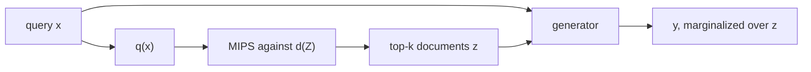

A language model stores what it knows in its weights. Those weights are a finite notebook, written once at training time. **Retrieval-augmented generation** is a library card. The lookup is a probability over documents; the writing is an ordinary sequence model conditioned on what was found.

The slogan “forces the model to cite its sources” is a use of the machine, not the machine. Lewis et al. (2020) wrote a latent-variable model. We will write that model, run a two-document Obama question all the way through to two different answers, and watch RAG-Token *prefer the Frankenstein*. Then, and only then, the posterior $p(z\mid x,y)$ — which is the actual citation, and which the 2020 model throws away.

If you have softmax, inner products, and the chain rule for a product of conditionals, you are the intended reader. Every term is defined when it appears. A later note in this blog, [Information Geometry of RAG](/blog/2025/04/11/ML-Series-Part-5-RAG), is the same paper at more length.

- [Two memories](#two-memories)
- [The latent document](#the-latent-document)
- [The retriever](#the-retriever)
- [The generator](#the-generator)
- [RAG-Sequence and RAG-Token](#rag-sequence-and-rag-token)
- [Two documents, two answers, by hand](#two-documents-two-answers-by-hand)
- [The posterior is the citation](#the-posterior-is-the-citation)
- [Decoding](#decoding)
- [What this does and does not fix](#what-this-does-and-does-not-fix)

---

# Two memories
{: #two-memories}

A seq2seq model — BART, T5, a vanilla encoder–decoder — is a distribution $p_\theta(y \mid x)$ over output strings $y$ given an input string $x$. All of the facts it can use live in $\theta$. Call that **parametric memory**. It is bounded by the number of weights, it is frozen after training, and it is mixed: the date of a battle and the syntax of English occupy the same matrices. Update a fact and you are asking a blend of a billion numbers to forget a date without forgetting a language.

**Non-parametric memory** is an external corpus $\mathcal{Z}$ of documents, indexed so that you can fetch the ones that look like $x$. Wikipedia passages, a company’s tickets, the last month of emails. The index can be updated without retraining $\theta$. Swap the dump, keep the English. The 2020 paper’s claim is that a generator with access to such an index hallucinates less on **knowledge-intensive** tasks — questions whose answer is a fact, not a style.

The architecture, as they drew it:

A query $x$ is encoded, the nearest documents $z_i$ are fetched by **maximum inner product search** (MIPS), and a generator $p_\theta$ produces $y$ while treating $z$ as a latent variable. End-to-end training is allowed to move both the query encoder and the generator. The document vectors can be frozen (they were, in the paper, for most of the run). The figure’s examples are the right ones: *define “middle ear”*, *Obama was born in Hawaii*, *the Divine Comedy has three cantiche*. Those are library questions. “Write me a sonnet in the style of” is not.

---

# The latent document
{: #the-latent-document}

Without retrieval, generation is

$$
p_\theta(y \mid x) \;=\; \prod_i p_\theta(y_i \mid x,\, y_{<i}).
$$

With retrieval, there is a hidden document $z \in \mathcal{Z}$. The joint is a retriever times a generator,

$$
p(z \mid x) \, p(y \mid x, z),
$$

and the quantity you want is the **marginal**

$$
p(y \mid x) \;=\; \sum_{z \in \mathcal{Z}} p(z \mid x)\, p(y \mid x, z).
$$

That identity is older than the paper. It is a mixture model. The corpus is tens of millions of passages, so the sum is truncated to a top-$k$ that the retriever actually returns. That truncation is the whole approximation, and it is also the whole point: you are betting that the answer-containing documents are near $x$ in inner-product space.

Two design choices remain: does one $z$ have to serve the entire $y$, or may the generator switch documents mid-sentence? Those are RAG-Sequence and RAG-Token. First, how $p(z \mid x)$ is built.

---

# The retriever
{: #the-retriever}

Sparse lexical search (TF–IDF, BM25) scores a query against a document by overlapping words. It fails when the question says “author” and the passage says “writer.” **Dense passage retrieval** (DPR, Karpukhin et al. 2020) replaces the overlap by an inner product in a learned vector space.

Two encoders, both BERT, not sharing weights:

$$
\mathbf{q}(x) \;=\; \mathrm{BERT}_q(x) \in \mathbb{R}^d,
\qquad
\mathbf{d}(z) \;=\; \mathrm{BERT}_d(z) \in \mathbb{R}^d.
$$

The score of a document is the inner product $\mathbf{d}(z)^\top \mathbf{q}(x)$, and the retriever is the softmax of those scores:

$$
p_\eta(z \mid x)
\;=\;
\frac{\exp\bigl(\mathbf{d}(z)^\top \mathbf{q}(x)\bigr)}
{\sum_{z' \in \mathcal{Z}} \exp\bigl(\mathbf{d}(z')^\top \mathbf{q}(x)\bigr)}.
$$

The denominator is a sum over the whole corpus. You never compute it at runtime. You precompute every $\mathbf{d}(z)$, drop the vectors in an index (FAISS, in the paper), and retrieve the $k$ documents of largest inner product in sublinear time. That is MIPS. The softmax is then taken over those $k$, or used only as a training objective; either way, the retrieved set is $\mathrm{top}\text{-}k\bigl(p_\eta(\cdot\mid x)\bigr)$.

A numerical pulse. Suppose $d=2$, three documents, query vector $\mathbf{q} = (1, 0)$, and document vectors

$$
\mathbf{d}_1 = (1, 0), \qquad \mathbf{d}_2 = (0.2, 0.1), \qquad \mathbf{d}_3 = (0, 1).
$$

Inner products: $1$, $0.2$, $0$. Softmax:

$$
p(z_1\mid x) \approx 0.550,\qquad
p(z_2\mid x) \approx 0.247,\qquad
p(z_3\mid x) \approx 0.202.
$$

Document $1$ is “about” the query; document $3$ is orthogonal to it. The retriever has no access to the *words* at this stage, only to two vectors. Training DPR is contrastive: push $\mathbf{q}$ toward documents that contain the answer, away from random other documents.

Why inner product and not cosine. Cosine divides out the norms, so a long, shouty document and a timid one with the same direction score the same. DPR lets the encoder *use* the norm as a confidence knob: documents the encoder is sure about can sit farther from the origin and win more inner products. That is a feature. It is also a way to retrieve garbage with a large norm, which is why people sometimes L2-normalize anyway.

In the 2020 RAG paper the document encoder is initialized from a DPR model trained on TriviaQA and Natural Questions, and the index is Wikipedia split into 100-word passages. That index is the non-parametric memory. Twenty-one million sticky notes, none of them in $\theta$.

---

# The generator
{: #the-generator}

The generator is any encoder–decoder. The paper uses **BART-large** (400M parameters). The input is the concatenation of the query and the retrieved passage, as raw text: `[x] [SEP] [z]`. BART then produces $y$ token by token,

$$
p_\theta(y_i \mid x, z,\, y_{<i}).
$$

So there are two memories, and they have different jobs. $\theta$ knows English, and a haze of facts. The index knows particular passages. Concatenation is the whole interface. There is no special fusion layer. The encoder attends to $x$ and $z$ together; the decoder attends to the encoder. If the generator ignores $z$ and writes a fluent wrong answer anyway, that is **unfaithful generation**, and the mixture will not save you. Retrieval is an opportunity to copy. It is not a pair of handcuffs.

---

# RAG-Sequence and RAG-Token
{: #rag-sequence-and-rag-token}

The latent $z$ can be summed out in two places.

**RAG-Sequence** draws one document and generates the whole $y$ from it.

$$
p_{\mathrm{seq}}(y \mid x)
\;\approx\;
\sum_{z \in \mathrm{top}\text{-}k}
p_\eta(z \mid x)\,
p_\theta(y \mid x, z)
\;=\;
\sum_{z \in \mathrm{top}\text{-}k}
p_\eta(z \mid x)
\prod_i p_\theta(y_i \mid x, z,\, y_{<i}).
$$

**RAG-Token** allows a different document at each output position. The sum moves *inside* the product:

$$
p_{\mathrm{tok}}(y \mid x)
\;=\;
\prod_i
\sum_{z \in \mathrm{top}\text{-}k}
p_\eta(z \mid x)\,
p_\theta(y_i \mid x, z,\, y_{<i}).
$$

Sequence is “pick a source, write the answer.” Token is “you may switch sources mid-sentence.” Token can stitch a date from one passage onto a place from another. Sequence is more committed, and more interpretable, because a single $z$ is responsible for $y$. That sounds like a virtue until you want to combine two facts that never co-occurred. It sounds like a vice the moment the stitch is *Chicago Hawaii*.

---

# Two documents, two answers, by hand
{: #two-documents-two-answers-by-hand}

Query $x = $ “Where was Obama born?” Two documents, already retrieved:

- $z_1$: “Barack Obama was born in Hawaii.” with $p(z_1\mid x)=0.7$
- $z_2$: “Obama taught at Chicago.” with $p(z_2\mid x)=0.3$

A toy generator, two tokens at a time, with made-up but stubborn conditionals. The faithful continuation is $y^\star = $ `born Hawaii`. The Frankenstein is $y^\dagger = $ `Chicago Hawaii`.

Under $z_1$:

$$
p(\texttt{born}\mid z_1)=0.8,\quad p(\texttt{Hawaii}\mid\texttt{born},z_1)=0.9,
\quad p(\texttt{Chicago}\mid z_1)=0.1,\quad p(\texttt{Hawaii}\mid\texttt{Chicago},z_1)=0.5.
$$

Under $z_2$:

$$
p(\texttt{born}\mid z_2)=0.4,\quad p(\texttt{Hawaii}\mid\texttt{born},z_2)=0.1,
\quad p(\texttt{Chicago}\mid z_2)=0.5,\quad p(\texttt{Hawaii}\mid\texttt{Chicago},z_2)=0.2.
$$

RAG-Sequence multiplies *inside* a document, then mixes:

$$
\begin{aligned}
p_{\mathrm{seq}}(y^\star\mid x)
&= 0.7\cdot(0.8\cdot 0.9) + 0.3\cdot(0.4\cdot 0.1)
= 0.516,\\[4pt]
p_{\mathrm{seq}}(y^\dagger\mid x)
&= 0.7\cdot(0.1\cdot 0.5) + 0.3\cdot(0.5\cdot 0.2)
= 0.065.
\end{aligned}
$$

RAG-Token mixes *at each token*, then multiplies:

$$
\begin{aligned}
p_{\mathrm{tok}}(\texttt{born}\mid x) &= 0.7\cdot 0.8 + 0.3\cdot 0.4 = 0.68,\\
p_{\mathrm{tok}}(\texttt{Hawaii}\mid\texttt{born},x) &= 0.7\cdot 0.9 + 0.3\cdot 0.1 = 0.66,\\
p_{\mathrm{tok}}(y^\star\mid x) &= 0.68\cdot 0.66 = 0.449,
\end{aligned}
$$

$$
\begin{aligned}
p_{\mathrm{tok}}(\texttt{Chicago}\mid x) &= 0.7\cdot 0.1 + 0.3\cdot 0.5 = 0.22,\\
p_{\mathrm{tok}}(\texttt{Hawaii}\mid\texttt{Chicago},x) &= 0.7\cdot 0.5 + 0.3\cdot 0.2 = 0.41,\\
p_{\mathrm{tok}}(y^\dagger\mid x) &= 0.22\cdot 0.41 = 0.090.
\end{aligned}
$$

Sequence likes the faithful answer more ($0.516$ against $0.449$) and the Frankenstein less ($0.065$ against $0.090$). Token, mixing at every step, can take `Chicago` from $z_2$ and `Hawaii` from $z_1$ without ever committing to a document that contains both. That is the feature and the bug. If you are writing a biography from scattered passages, you want the stitch. If you are answering a factoid, you want Sequence to pick a page and stay there.

On the napkin: Sequence is a mixture of language models. Token is a language model of mixtures.

---

# The posterior is the citation
{: #the-posterior-is-the-citation}

The 2020 model *marginalizes* $z$. That is the opposite of naming it. If you actually want a source, you want the **posterior** given the answer you just wrote.

Bayes, with two documents and a one-token answer $y=$ `Hawaii`, using $p(y\mid z_1)=0.9$ and $p(y\mid z_2)=0.2$:

$$
p(y\mid x) = 0.7\cdot 0.9 + 0.3\cdot 0.2 = 0.69,
$$

$$
p(z_1\mid x,y) = \frac{0.63}{0.69} \approx 0.91,
\qquad
p(z_2\mid x,y) = \frac{0.06}{0.69} \approx 0.09.
$$

The retriever said $0.70$ / $0.30$. The answer updated that to $0.91$ / $0.09$. *That* is a citation: not “we fetched these $k$ passages,” but “given what we wrote, this is the passage that explains it.”

The paper does not decode this posterior. You can. Any RAG system that displays the retrieved chunks without the $p(z\mid x,y)$ is showing you the library card, not the footnote.

---

# Decoding
{: #decoding}

At test time you need an actual string, not a sum.

RAG-Token factors as an ordinary per-token mixture, so a single beam search works: at each step the generator is run once per remaining $z$, the scores are mixed by $p_\eta(z\mid x)$, and the beam proceeds.

RAG-Sequence does **not** factor that way. $p(y\mid x)$ is a sum of full-sequence probabilities, so a token that looks cheap under $z_1$ and expensive under $z_2$ cannot be scored without committing to a $z$. The paper’s **thorough decoding** runs a separate beam search for each $z$, collects the union of hypotheses, and for each hypothesis $y$ computes $\sum_z p_\eta(z\mid x)\, p_\theta(y\mid x,z)$ — including a fresh forward pass for any $(y,z)$ pair that did not appear in that $z$’s beam. **Fast decoding** skips those extra forwards and pretends $p_\theta(y\mid x,z)=0$ when $y$ was never hypothesized from $z$.

On the napkin: Sequence decoding is “generate $k$ candidates, then rerank by the mixture.” Token decoding is “one beam, mixture at every step.” Thorough is the honest sum. Fast is the sum over a set that is too small, and it will quietly drop a hypothesis that only one document liked.

---

# What this does and does not fix
{: #what-this-does-and-does-not-fix}

**What it fixes.** Factual questions whose answer sits in the index. The generator no longer has to memorize the middle ear, or the structure of the *Divine Comedy*, as weights. It has to *recognize* a retrieved passage and copy from it. Updating the index (a new Wikipedia dump, a new internal wiki) updates the facts without a new pretraining run. Long-context models later ate some of this lunch — if the whole corpus fits in the window, concatenation *is* retrieval — but twenty-one million passages do not fit in the window. MIPS is how you pick the $k$ that do.

**What it does not fix.** If the retriever misses, the generator is a language model looking at the wrong page, and it will still write a fluent wrong answer. If the index is stale or sparse, retrieval cannot help. If the generator is unfaithful, the right page is sitting right there and the model invents anyway. RAG is not a citation mechanism unless you compute $p(z\mid x,y)$ and display it. And concatenation of $x$ with $z$ is bounded by the generator’s context window, so “the whole corpus” is never in the prompt — only the top $k$.

The envelope is the latent-variable identity $p(y\mid x) = \sum_z p(z\mid x)\, p(y\mid x,z)$, with $p(z\mid x)$ an inner-product softmax and $p(y\mid x,z)$ a seq2seq model on the concatenation. Sequence mixes language models; Token is a language model of mixtures. The footnote, if you want one, is the posterior. Everything else — FAISS, BART, thorough decoding — is engineering around that sum.

Cheers.

---

# Further reading

Patrick Lewis et al., [Retrieval-Augmented Generation for Knowledge-Intensive NLP Tasks](https://arxiv.org/abs/2005.11401). NeurIPS 2020. The paper. The architecture, sequence, retriever, generator, and decoding figures in this note are from it.

Vladimir Karpukhin et al., [Dense Passage Retrieval for Open-Domain Question Answering](https://arxiv.org/abs/2004.04906). EMNLP 2020. The retriever.

Mike Lewis et al., [BART: Denoising Sequence-to-Sequence Pre-training for Natural Language Generation, Translation, and Comprehension](https://arxiv.org/abs/1910.13461). ACL 2020. The generator.

Jeff Johnson, Matthijs Douze, and Hervé Jégou, [Billion-scale similarity search with GPUs](https://arxiv.org/abs/1702.08734). FAISS, the MIPS index.

Gautier Izacard and Édouard Grave, [Leveraging Passage Retrieval with Generative Models for Open Domain Question Answering](https://arxiv.org/abs/2007.01282). Fusion-in-Decoder: concatenate many $z$’s, generate once. A cousin, not a mixture.
