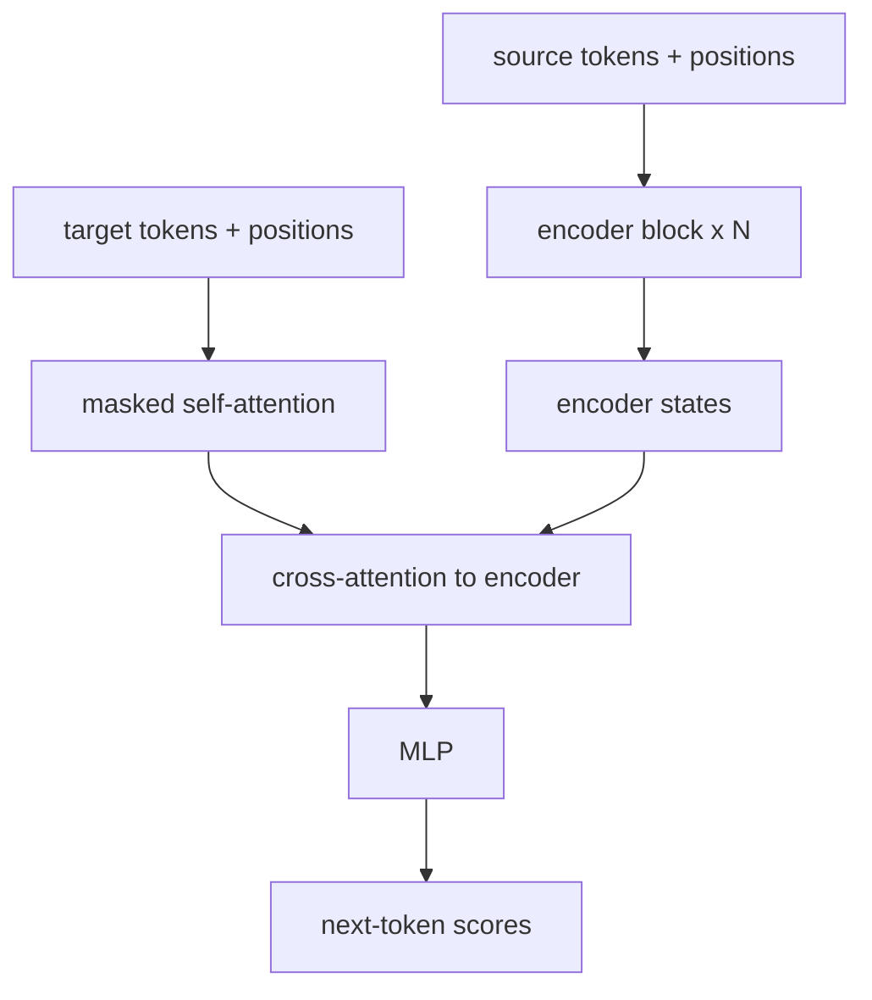

Three prejudices, three geometries.

A convolution looks at a *neighborhood*. A recurrent net looks at a *chain*. Attention looks at a *complete graph*: every position scores every other position, softmax, weighted sum. The 2017 paper that replaced recurrence with a matrix multiply is almost literally titled. Once you can look directly from any token to any token, you do not need a running hidden state, and you do not need a sliding kernel. You need a score for every pair.

If you have matrix multiplication, softmax, and the chain rule, you are the intended reader. Every term is defined when it appears. We will start from a 1964 kernel smoother, run `"not good"` through a causal attention by hand so you can watch *good* look at *not*, plot the sinusoids that tell “dog” from “god”, and only then stack the blocks. A later note in this blog, [Transformers and BERT](/blog/2025/04/04/ML-Series-Part-4-BERT), is the encoder half at BERT-scale.

- [The bottleneck](#the-bottleneck)
- [Attention is a kernel smoother](#attention-is-a-kernel-smoother)
- [Queries, keys, values](#queries-keys-values)
- [Two tokens, by hand](#two-tokens-by-hand)
- [not good](#not-good)
- [The scale](#the-scale)
- [The mask](#the-mask)
- [Multi-head](#multi-head)
- [Position, or: dog bites man](#position-or-dog-bites-man)
- [The transformer](#the-transformer)
- [What “all you need” means](#what-all-you-need-means)

---

# The bottleneck
{: #the-bottleneck}

A recurrent encoder, as in the previous note, reads $x_1, \ldots, x_n$ and dumps the whole sentence into one vector $h_n$. A decoder then writes $y_1, y_2, \ldots$ from that vector. For a long sentence the early tokens have been multiplied through $n$ Jacobians to get there. That is the **bottleneck**: one vector is asked to be a summary of everything, and the path from $x_1$ to $y_k$ is long. The sticky note, at the end of a paragraph, is a smudge.

Bahdanau, Cho, and Bengio (2015) cut a hole in the bottleneck. At each decoder step, do not look only at $h_n$. Look at *every* encoder state $h_1, \ldots, h_n$, score how relevant each is right now, and take a weighted average. The decoder still runs left to right, but it has a **soft lookup** into the source. That lookup is attention.

Vaswani, Shazeer, Parmar, Uszkoreit, Jones, Gomez, Kaiser, and Polosukhin (2017) keep the lookup and throw away the recurrence. Both the encoder and the decoder become a stack of attention layers, plus a small feedforward network at each position. No $W_{hh}$ across time. No convolution. The title.

---

# Attention is a kernel smoother
{: #attention-is-a-kernel-smoother}

Fix a query $q$ and a table of key–value pairs $(k_1, v_1), \ldots, (k_n, v_n)$. Score the query against each key, turn the scores into weights that sum to one, and return the corresponding mixture of values:

$$
\mathrm{Attention}(q, K, V)
\;=\;
\sum_{j=1}^{n}
\alpha_j\, v_j,
\qquad
\alpha_j
\;=\;
\frac{\exp(q^\top k_j)}{\sum_{\ell} \exp(q^\top k_\ell)}.
$$

That is a dictionary lookup with a soft index. If $q$ is aligned with $k_3$ and orthogonal to the rest, $\alpha$ is a spike at $3$ and the output is about $v_3$. If $q$ is equally aligned with everyone, the output is the mean of the $v$’s.

It is also **Nadaraya–Watson** kernel regression from 1964. Given pairs $(x_j, y_j)$ and a kernel $K$, the estimator of $y$ at a new $x$ is

$$
\hat y(x) \;=\; \sum_j \frac{K(x, x_j)}{\sum_\ell K(x, x_\ell)}\, y_j.
$$

Take $K(u,v)=\exp(u^\top v)$, rename $x\mapsto q$, $x_j\mapsto k_j$, $y_j\mapsto v_j$, and you have the display above. Attention is a smoother. The 2017 paper’s contribution is not the smoother. It is putting the smoother in a residual stack, making the kernel a *learned* dot product, and noticing you can train the whole thing in parallel.

The scores $q^\top k_j$ are **dot products**. Other scores exist (an additive MLP, as in Bahdanau; a Gaussian kernel, as in Nadaraya–Watson). The 2017 paper uses the dot product because it is one matrix multiply when you do all queries at once.

---

# Queries, keys, values
{: #queries-keys-values}

**Self-attention** is the same lookup, where the query, the keys, and the values are all linear images of the *same* sequence.

Let $X \in \mathbb{R}^{n \times d}$ be the matrix whose $i$-th row is the embedding of token $i$. Three learned matrices $W^Q, W^K, W^V \in \mathbb{R}^{d \times d_k}$ produce

$$
Q = X W^Q, \qquad K = X W^K, \qquad V = X W^V.
$$

Row $i$ of $Q$ is “what is token $i$ looking for?” Row $j$ of $K$ is “what does token $j$ advertise?” Row $j$ of $V$ is “what does token $j$ contribute if it is selected?” The scores for every pair $(i,j)$ are the product

$$
Q K^\top \;\in\; \mathbb{R}^{n \times n}.
$$

Entry $(i,j)$ is $q_i^\top k_j$. Softmax that matrix **row-wise**, multiply by $V$, and each token has been replaced by a weighted sum of values:

$$
\mathrm{Attention}(Q,K,V)
\;=\;
\mathrm{softmax}\!\left(\frac{QK^\top}{\sqrt{d_k}}\right) V.
$$

That is equation (1) of the paper, and it is the entire mechanism. The $n \times n$ matrix is the **attention pattern**. One row of it is a probability distribution over the sequence, from the point of view of one token.


The figure is from the Transformer Explainer: a GPT-2-style decoder predicting the next word of “Data visualization empowers users to create.” Follow one purple query through the dots. That is one row of $\mathrm{softmax}(QK^\top / \sqrt{d_k})$.

---

# Two tokens, by hand
{: #two-tokens-by-hand}

Take $n=2$, $d_k=2$, and skip the $W$’s: pretend $Q$, $K$, $V$ are already in front of us.

$$
Q = \begin{pmatrix} 1 & 0 \\ 0 & 1 \end{pmatrix},
\quad
K = \begin{pmatrix} 1 & 0 \\ 0 & 1 \end{pmatrix},
\quad
V = \begin{pmatrix} 10 & 0 \\ 0 & 20 \end{pmatrix}.
$$

Then $QK^\top = I$, and $\sqrt{d_k} = \sqrt{2}$. The scaled scores are $1/\sqrt{2}$ on the diagonal and $0$ off it. Softmax of a row $(1/\sqrt{2},\, 0)$:

$$
\alpha
\;=\;
\bigl(\tfrac{e^{1/\sqrt{2}}}{e^{1/\sqrt{2}}+1},\;
\tfrac{1}{e^{1/\sqrt{2}}+1}\bigr)
\;\approx\;
(0.67,\; 0.33).
$$

Token 1 keeps about two-thirds of $v_1$ and borrows one-third of $v_2$: the first output row is about $(6.7,\, 6.6)$. Token 2 does the symmetric mixture of weights, and because $v_2$ is twice as large as $v_1$ its output row is about $(3.3,\, 13.4)$. Nobody has learned anything yet. The point is that the operation is a handful of multiplies, and you can watch mass move from one value to another.

```python
import numpy as np

def softmax(x, axis=-1):
    x = x - x.max(axis=axis, keepdims=True)
    e = np.exp(x)
    return e / e.sum(axis=axis, keepdims=True)

Q = np.array([[1., 0.], [0., 1.]])
K = np.array([[1., 0.], [0., 1.]])
V = np.array([[10., 0.], [0., 20.]])
d_k = Q.shape[1]
A = softmax(Q @ K.T / np.sqrt(d_k))
print(A)
print(A @ V)
```

---

# not good
{: #not-good}

Now make the tokens mean something. Two words, causal attention (each word may look at itself and at the past, not at the future), and a value basis of *(negation, polarity)*. Construct $Q$ and $K$ so that `good`’s query is aligned with `not`’s key.

$$
Q = \begin{pmatrix} 0 & 1 \\ 1 & 0 \end{pmatrix},
\quad
K = \begin{pmatrix} 1 & 0 \\ 0 & 1 \end{pmatrix},
\quad
V = \begin{pmatrix} -2 & 0 \\ 0 & 2 \end{pmatrix}.
$$

Rows are `not`, then `good`. The unscaled dots $QK^\top$ put $1$ on the off-diagonal: `not` wants to look at `good`, and `good` wants to look at `not`. Scale by $\sqrt{2}$, and the off-diagonal is $0.71$. Then the **causal mask** forbids `not` from looking into the future, so that $0.71$ becomes $-\infty$ and softmax puts all of `not`’s mass on itself.


Read the middle panel, left to right, top to bottom.

- `not` attends only to `not` (the mask). Its mixed value is $v_{\texttt{not}} = (-2,\, 0)$: pure negation, no polarity.
- `good` attends $0.67$ to `not` and $0.33$ to itself. Its mixed value is
  $$
  0.67\cdot(-2,\,0) + 0.33\cdot(0,\,2) \;\approx\; (-1.34,\, 0.66).
  $$
  The word `good` is no longer positive. The negation landed on it. That is the whole joke, and it is also the whole mechanism: a later token may look at an earlier one, pull a value across, and *change its mind*.

A bag of words cannot do this. A convolution with a window of $1$ cannot do this. An RNN *can* do this, if the sticky note survives the trip from `not` to `good`. Attention does it in one multiply, and the path is length $1$ whether the two words are adjacent or a paragraph apart.

---

# The scale
{: #the-scale}

The $\sqrt{d_k}$ is not decoration. If the entries of $q$ and $k$ are independent, mean $0$, variance $1$, then $q^\top k$ has variance $d_k$. For $d_k=64$ that is a bell curve of width $8$. Softmax of numbers that large is a one-hot, and the gradient through a one-hot softmax is about zero. Dividing by $\sqrt{d_k}$ puts the variance back to $1$, and the softmax stays in the region where it still has a slope.


Ablating the scale hurts, especially at larger $d_k$. That is the entire argument in §3.2.1 of the paper. It is the same numerical hygiene as dividing a Gaussian by its $\sigma$ before you exponentiate it. Skip it, and the smoother becomes an $\mathrm{argmax}$.

---

# The mask
{: #the-mask}

**Masked** self-attention, used in the decoder, sets the scores for $j > i$ to $-\infty$ before the softmax, so token $i$ cannot look into the future. The allowed pattern is a lower triangle.


Training can still run in parallel: the whole triangle of allowed pairs is one multiply. That is the operational difference from an RNN, which *must* finish $h_{t-1}$ before $h_t$. For a sequence of length $n$, one forward pass produces every next-token distribution $p(x_{t+1}\mid x_{\le t})$ at once. An RNN cannot do that. That, more than any single BLEU number, is why this architecture ate the earlier ones.

The encoder, which is allowed to look both ways, uses the full $n\times n$. BERT is an encoder stack. GPT is a decoder stack. The 2017 translation model is both, with a third attention — **cross-attention** — in which the decoder states are queries and the encoder states are keys and values. That is Bahdanau’s lookup, restored as one more matrix multiply.

---

# Multi-head
{: #multi-head}

One attention pattern is one way of mixing the sequence. Syntax might want a different mixing than coreference. **Multi-head attention** runs $h$ copies of the above in parallel, each with its own $W_i^Q, W_i^K, W_i^V$, concatenates the $h$ outputs, and mixes them with $W^O$:

$$
\mathrm{MultiHead}(X)
\;=\;
\mathrm{Concat}(\mathrm{head}_1, \ldots, \mathrm{head}_h)\, W^O,
\qquad
\mathrm{head}_i
\;=\;
\mathrm{Attention}(X W_i^Q,\, X W_i^K,\, X W_i^V).
$$

The paper’s base model uses $h=8$ and $d_k = d_{\mathrm{model}}/h = 64$, so the $h$ heads together cost about the same as one full-width head. Heads can specialize: one attends to the next token, one to the verb, one to a closing parenthesis. They do not have to. The mechanism only *permits* specialization. People then write papers about whether they do.

A useful picture: each head is a kernel smoother in a different learned inner product. Eight heads are eight bandwidths, eight notions of “nearby in meaning.” Concatenate, mix, residual.

---

# Position, or: dog bites man
{: #position-or-dog-bites-man}

Self-attention is a set operation. Permute the rows of $X$ and you permute the rows of the output the same way. A transformer with nothing but attention and a position-wise MLP cannot tell “dog bites man” from “man bites dog.” It cannot tell them from “bites man dog.” The complete graph has no left and no right.

The 2017 fix is to **add** a position vector $p_t$ to the embedding of token $t$ before the first layer. The paper’s $p_t$ is not learned. It is a fixed pattern of sines and cosines, one pair of frequencies per coordinate:

$$
p_t^{(2i)}   = \sin\!\bigl(t / 10000^{2i/d}\bigr),
\qquad
p_t^{(2i+1)} = \cos\!\bigl(t / 10000^{2i/d}\bigr).
$$


Fast oscillations sit at the top of the figure (small $i$, divisor near $1$). Slow drifts sit at the bottom (large $i$, divisor enormous). Why sinusoids. Because a shift $t \mapsto t+\Delta$ is a linear transform of $(p_t^{(2i)}, p_t^{(2i+1)})$: the angle-addition formulas

$$
\sin(t+\Delta) = \sin t\cos\Delta + \cos t\sin\Delta,
\qquad
\cos(t+\Delta) = \cos t\cos\Delta - \sin t\sin\Delta.
$$

The network can, in principle, attend to “the token three steps back” by a linear map on the position channels, without storing a table of relative offsets. Learned position embeddings also work, and are what GPT-2 uses; the sinusoids are the paper’s inductive bias for length generalization, and they are prettier.

---

# The transformer
{: #the-transformer}

A **transformer block** is:

1. Multi-head self-attention, with a residual connection and layer normalization:
   $X \leftarrow \mathrm{LayerNorm}\bigl(X + \mathrm{MultiHead}(X)\bigr)$.
2. A two-layer MLP, applied to each position independently, again with residual and LayerNorm:
   $X \leftarrow \mathrm{LayerNorm}\bigl(X + \mathrm{MLP}(X)\bigr)$.

The MLP is $W_2\, \mathrm{ReLU}(W_1 x + b_1) + b_2$, the same weights at every position. It is where most of the parameters live. Attention mixes *across* positions; the MLP mixes *across* channels. The residual is the sticky note the LSTM fought for: a path of slope $1$ from the input of the block to the output, so the stack can choose to do nothing. LayerNorm is bookkeeping. Skip it and the residual stream drifts.

The 2017 translation model is an **encoder–decoder**.

- The **encoder** is a stack of $N=6$ blocks with unmasked self-attention: every source token sees every source token.
- The **decoder** is a stack of $N=6$ blocks with *masked* self-attention (the target so far), then a second attention that uses the decoder states as queries and the encoder states as keys and values (**cross-attention**).



A **decoder-only** stack — GPT, and most of what followed — drops the encoder and the cross-attention. There is one sequence, it is masked, and the task is to predict the next token. Same block. Fewer names.

Cost, because the complete graph is not free.

<table>
  <thead>
    <tr><th></th><th>path length, \(x_1\) to \(y_n\)</th><th>compute per layer</th></tr>
  </thead>
  <tbody>
    <tr><td>RNN / LSTM</td><td>\(O(n)\)</td><td>\(O(n d^2)\)</td></tr>
    <tr><td>CNN, kernel \(k\)</td><td>\(O(n/k)\)</td><td>\(O(n k d^2)\)</td></tr>
    <tr><td>self-attention</td><td>\(O(1)\)</td><td>\(O(n^2 d)\)</td></tr>
  </tbody>
</table>

For a sentence, $n^2$ lost to $n d$ and the constant-time path won. For a book, the square matters. Every later efficiency paper (sparse patterns, linear attention, sliding windows) is a reaction to that square. The napkin is the $O(1)$ path. The bill is $n^2$.

---

# What “all you need” means
{: #what-all-you-need-means}

The paper’s ablation is in Table 3. Replacing the dot-product with an additive attention, shrinking the number of heads to $1$, dropping the scale, dropping the sinusoids: everything still trains, most of it a little worse. The thing you cannot drop is the residual stack of mix-across-positions (attention) and mix-across-channels (MLP). Recurrence is not in the list. Convolution is not in the list. For the tasks they measured, those were not needed.

Two costs the napkin should not hide, besides $n^2$.

- The $n \times n$ pattern is not an explanation by itself. It is a routing. What gets routed, and whether a head “means” anything, is a separate empirical question. `"not good"` was a cartoon we built so the routing would be visible. A real head is under no obligation to be that polite.
- “All you need” is a claim about *this* architecture versus recurrence and convolution, on *those* translation benchmarks, in 2017. It is not a claim that you do not need data, or retrieval, or a library card. The retrieval note in this series is the library card.

The envelope is one line,

$$
\mathrm{softmax}\!\bigl(QK^\top / \sqrt{d_k}\bigr)\, V,
$$

plus a residual MLP, plus a position. A smoother from 1964, a mask so the future stays the future, and a complete graph instead of a chain. The rest of the last decade is that line, stacked.

Cheers.

---

# Further reading

Ashish Vaswani et al., [Attention Is All You Need](/blog/assets/2024/attention/0-ATTN-0.pdf). NeurIPS 2017. The paper.

Peter Bloem, [Transformers from scratch](https://peterbloem.nl/blog/transformers). Code, mathematics, and the individual pieces, in order.

Souvik Mandal, [Attention is All You Need](https://itnext.io/attention-is-all-you-need-e8109d2693e). Worked examples and pictures.

Yannic Kilcher, [Attention Is All You Need (paper explained)](https://www.youtube.com/watch?v=iDulhoQ2pro). A pass through the paper.

A. Vaswani, N. Shazeer, N. Parmar, J. Uszkoreit, L. Jones, A. N. Gomez, Ł. Kaiser, and I. Polosukhin, [arXiv:1706.03762](https://arxiv.org/abs/1706.03762).

Saurabh Alone, [Llama 3 from scratch in pure JAX](https://github.com/saurabhaloneai/Llama-3-From-Scratch-In-Pure-Jax). A decoder-only stack with no framework hiding the multiplies.

Dzmitry Bahdanau, Kyunghyun Cho, and Yoshua Bengio, [Neural Machine Translation by Jointly Learning to Align and Translate](https://arxiv.org/abs/1409.0473). ICLR 2015. Attention before it was all you needed.

E. A. Nadaraya, [On Estimating Regression](https://doi.org/10.1137/1109020). *Theory of Probability and its Applications* 9 (1964). The smoother.
