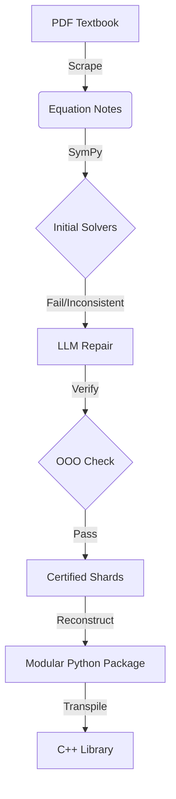

# [Vakyume: A Vacuum Theory PDF-to-C++ Pipeline](https://github.com/juleshenry/vakyume)

Inspired by my brief stint as a test engineer technician in Applied Materials' Austin factory (building 32 FTW), the Vakyume project sought to yield software that performed the following:
1. OCR recognition of pdf or scanned book to extract formulae
2. conversion of said formulae to Python code using sympy
3. in the event sympy were to fail, "return SympyFailure"
4. for all SympyFailures, another script would feed the equation header to an llm to produce candidate code, and `verify` it is correct until testing proves the library complete
5. convert the Python into C++

I set out a while back to make an arbitrary textbook to python library library two years ago, followed a reasonable regime: sympy conversion of my hand crafted notes programmatically writing python classes, accounted for solving one-odd-out kwargs to make the library automagically solve for missing kwargs, and, industrial applications in mind, chose the goal of converting the python product as a intermediate material for transferring to C++ ultimately.

Recently, I revived the project with the aim of incorporating LLM calls through Ollama to metaprogram on the fly when sympy fails. After riotously struggling to write a seamless meta-programming one-touch solution, I threw in the total on the automagicality, manually copy the examples into Claude/ChatGPT-4o's of the day (Tue Feb 18 01:13:01 CST 2025) healing the library's failure points, the proverbial artisenal human in the loop. God only knows for how much longer such an anachronism will exist. By the way of 100+ equations, only one equation, solving for `k`, it did not have an algebraic solution.

The Python code entered the stratosphere with 7593 lines... from 100+ equations, so ~10x the code from notes ratio.

Yet, deeply troubling, I did not even enact the OCR component of my original intended design, which would have aimed to solve the problem of consuming textbook equations and converting them to the .pyeqn markdown language, creating an end-to-end textbook to Py/C++ library pipeline.

In the interim, 2025 presents us with big boy / big girl / big gendered pronoun for child pants, enabling us to admit that project would be futile: typical multimodals already process textbook pdfs well into LateX or some such similar medium.

The Bitter Law that states that data-driven neuron grooming always overtake principles-first, rules-based approaches to optmization problems, in this case, optimizing a functor that can Hoover up a pdf and spit out C++ code. This project, while originally admirable, failed entirely: its methodology was a neandrathal amongst the big data machine learning techniques of the present.

The regime in question may not have been elucidated.

---

# Update: How It Actually Went

The above was written in the thick of it. Feverish, February, 1 AM. I had just given up on the automagic metaprogramming and was pasting equations into ChatGPT like a caveman. That was the truth at the time. But the project did not die there.

I kept going.

What follows is the story of where Vakyume actually landed.

## The Pipeline That Emerged

Vakyume became an eight-stage orchestration. From textbook PDF to compiled C++ binary. The whole thing. Including the OCR scraper I lamented not building. I built it.



The source material: the 1986 edition of *Process Vacuum System Design and Operation* by Ryans and Roper. A book I had sitting around from my Applied Materials days. If you are going to build a pipeline to convert textbooks into code, you might as well pick one you actually care about.

### 1. Extraction & Parsing

The scraper uses PyMuPDF and small local models (Phi-3, Llama-3) to identify numbered equations and variables from the PDF. Equations are stored in a human-readable Python format (`lhs = rhs`). I even built an interactive wizard for chapter selection:

```
============================================================
  VAKYUME PDF Equation Scraper - Interactive Wizard
============================================================

  PDF: textbook.pdf

--- Model Selection ---
  Available Ollama models:
    [1] llama3:latest (default)
    [2] phi3:latest
    [3] llama3.2:latest

  Select model [1-3] (Enter for default):

--- Chapter Selection ---
  Found 28 chapters in PDF:

    [ 1] Introduction (12 pages)
    [ 2] The Scientific Method (8 pages) [auto-skip: non-equation content]
    [ 3] Kinematics (32 pages)
    ...

  Chapters to process: 10
```

So, the OCR component I said I did not even enact? Enacted. The scraper that I said would be futile because multimodals already process textbook pdfs? Built it anyway. Because the point was never to beat GPT-4o at reading a PDF. The point was to own every stage of the pipeline. To understand what breaks when you try to go from a scanned page to a compiled binary with no human in the loop.

A lot breaks, by the way.

### 2. One-Odd-Out (OOO) Verification

Remember the verification saga from the original post? The dummy args, the shards, the consensus algorithm for formulae? That rambling turned into a real methodology.

For any equation (e.g., $PV=nRT$), Vakyume generates solvers for every variable ($P, V, n, R, T$). The "One-Odd-Out" check picks a random input, solves for one variable, then uses that result to solve for the others. If the results do not satisfy the original equation within a $1 \times 10^{-4}$ tolerance, the solver is flagged for repair.

To that end, I developed the [kwasak](https://github.com/juleshenry/kwasak) library, which allowed for ablated solving, provided the underlying methods to solve ABCDE(a=...,b=...,c=...,...) would be of the form ABCDE__a, ABCDE__b, ABCDE__c etc., yet the verification is tricky.

So, we can even imagine a kwarg family, K, in which no equation was solved by sympy. How to verify?

We do not know if the llm output is correct.

K has a,b,c,... methods. So originally what was done was:

# Verification
1. propose dummy args
2. call the function if solved with all variables but "a". Try for multiple dummy args if the inputs are malformed (e.g. 0/0).
3. Take the output of the equation for "a" and store it as a new dummy arg. Plug "a" into all other equations as confirmation that they are valid. If they yield the original argument for all other variables set by the dummy args, then we are good, but with a caveat. Sometimes the equations have multiple solutions. We have only conceived of positive solutions, for simplicity and for physical vacuum systems we are usually downpat, but there are situations where all solutions even imaginary are crucial to know.
4. So, we can say, take the output for "a", even if it were a list, and try it against all other combinations. We choose a from the floats, so we are feeling that we will not get lucky. We can say the family of dummy args, while billed as a <str, float> hashmap has become an adhoc <str, list[float]>; oh boy!

I digress. You see, you still cannot propose dummy args for equations for which no solutions exist with this proposed verification system. My God!

We can now extend the verification amongst shaky answers, but we must first reason about how you will do all this metaprogramming, chopping things up and so forth. It is not so easy to say, solve for this functin signature header "functor_abc(x,y,z)" for equation x+y-z=0. And have the output as a string and then verify it as mentioned. Oh no no no.

You will need scratch paper now in your protocol.

# Sharding
We can isolate the equation on its own and feed it output manipulating the system calls to write scratch paper with (correct Pylibs), call the "shard" equation with dummy args, and capture its output, if it even compiles. I know you typed-lang nerds will say, interpreted, but that's three syllables and I haven't got the time, buster.

So, now you have the case of the K-family shards of unsolvable equations. You'd have to see the ouroboros of metaprogramming this begets. Say, we verify a shard with dummy args 1, get an answer, dummy args 1 calls shard 2, shard 2 confirms shard 1, but shard 2 and shard 1 are wrong. We are now coming into shard 3 with a family of arguments that is in correct, let's say, should be something else.

Now, you may get to 3, in the triad and lament, aha! 3 is incorrect. I knew it, try again. Now, you are provably stuck. Either you try a new regime in which 2 and 3 are prioritized, and create a consensus on ablation until a prevailing head arises, or else risk intellectual dishonesty.

Now you cook up something from shard 3 and feed it to shard 2's child, another attempt, and find out, shard 3 was correct, so shard 2's child is a candidate. You finally try these dummy arguments for shard 1, and lo and behold, the thing is solved.

My word!

All of this became formalized as the OOO check. It works. It is not pretty.

### 3. LLM-Assisted Repair

When symbolic solvers (SymPy) fail on transcendental or complex engineering forms, Vakyume uses LLM-assisted repair. The LLM is given the equation, a working example shard from the same family, and concrete expected-vs-got test cases to produce a corrected solver function.

This is the part where I originally said "I can just copy and paste the SympyFailure equations into ChatGPT-4o or Claude-3.5." That was the manual version. The automated version does essentially the same thing but through Ollama, with structured prompts, and it actually works most of the time. When it does not, the OOO check catches it. When the OOO check does not catch it, well. You need a gosh darn consensus algorithm for formulae just because sympy fails.

It was non trivial.

### 4. Multi-Target Synthesis

The end of the pipeline:

- **Python**: Generates a modular package (`py/`) with the `@kwasak` decorator for automatic variable dispatch.
- **C++**: Transpiles Python AST to C++17, utilizing `std::complex` and custom `LambertW` implementations.
- **Documentation**: Generates an Equation Certification Report (`docs/`) with LaTeX-rendered formulas and variable definitions for peer review.

Yes, the C++ conversion I listed as goal number 5 in my original design? Done. AST manipulation, `std::complex`, the whole nine yards. The Python code entered the stratosphere with 7593 lines from 100+ equations, and the C++ output is its compiled shadow.

## The Project Structure

```text
projects/
└── VacuumTheory/
    ├── notes/           # Input: Equation definitions
    ├── shards/          # Intermediate: Individual solvers
    ├── reports/         # Analysis and verification logs
    ├── docs/            # Output: Equation Certification (LaTeX/MD)
    ├── py/              # Output: Modular Python package
    └── cpp/             # Output: C++ headers and source
```

## Running the Thing

```bash
# End-to-end: Scrape, Verify, Repair, and Transpile
python3 vakyume.py build projects/MyProject --pdf textbook.pdf
```

Or, if you prefer to watch each stage crumble independently:

```bash
# 1. Scrape equations from a PDF
python3 vakyume.py scrape path/to/textbook.pdf -o projects/MyProject/notes

# 2. Run the pipeline: shard, verify, repair
python3 vakyume.py run projects/MyProject

# 3. Reconstruct verified shards into a Python package
python3 vakyume.py reconstruct projects/MyProject

# 4. Transpile to C++ and compile
python3 vakyume.py make-cpp projects/MyProject

# 5. Generate an Equation Certification Report
python3 vakyume.py make-docs projects/MyProject
```

Five commands. PDF to C++. That was the dream. That is the reality.

---

## The Bitter Conclusion

So we are saying the most likely outcome is to do exactly that and yet will we forge the chain based on what? And what if a numerical method is required that cannot be calculated easily? We have a bumpy chain. Imagine we are with N, leave out `k`, and up to `j` we are good. `j+1` unsolvable with shoddy numerical method. And we go along and `j+2` is fine. `j+3` contradicts the chain because it is flat wrong. What are we to believe? `1...j+1` was wrong entirely? Is the regime of the anomaly correct?

We have to see the so-called value chains, sequences in harmonious dummy argument concordance, and let them dominate as proposed shards.

You need a gosh darn consensus algorithm for formulae just because sympy fails!

It was non trivial.

What is even more funny?

I can just copy and paste the SympyFailure equations into ChatGPT-4o or Claude-3.5 and directly paste them, verifiying them myself and saving loads of time, so that is what I have done and propose to you dear viewer. Cheap out!

Meticulosity is for chumps.

"Sorry, your response was filtered by the AI service".

Yeah, don't get too cocky. They can pull the plug any time.

---

# Epilogue

Vakyume is a proof of concept that is, at this point, anachronistic to the wonders of modern LLMs. I started building it when Phi-3 first came out, stitching together SymPy solvers with small local models to get from PDF equations to working code. In the end, this kind of manual hybrid pipeline does not work very well -- too many failure modes, too much glue code, and too brittle to scale gracefully.

That said, I learned a tremendous amount about coding and life through making this. Symbolic math, AST manipulation, C++ transpilation, and OOO verification.

Today, a free tool like the Gemini CLI could vastly outshine this entire pipeline in a single prompt. The world moved fast, and Vakyume is a snapshot of what it took to metaprogram the hard way before it became easy.

The Bitter Law that states that data-driven neuron grooming always overtakes principles-first, rules-based approaches to optimization problems, in this case, optimizing a functor that can Hoover up a pdf and spit out C++ code. This project, while originally admirable, ended as a monument to stubbornness: its methodology was a neandrathal amongst the big data machine learning techniques of the present.

But I built it. All five stages. The OCR. The sharding. The verification. The repair. The transpilation. From a 1986 vacuum textbook to compiled C++17.

The regime in question has now been elucidated.
