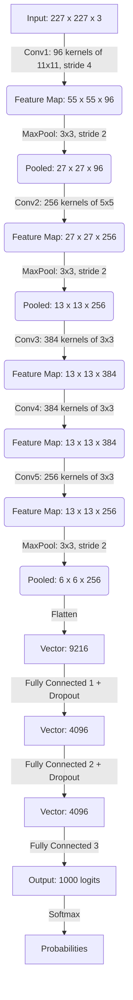

# Welcome to Deep Learning 101 📐

Hey everyone! Welcome to Part 1 of the ML Smörgåsbord. If you're a college freshman stepping into the world of Computer Science, you're probably tired of high-level fluff. You know some calculus, you know some linear algebra, and you want to see how the engine *actually* works under the hood. 

Today, we're tearing down the engine of **AlexNet** (Krizhevsky et al., 2012). This was the model that proved Deep Convolutional Neural Networks (CNNs) could dominate computer vision. We are going to look at the exact math that made this possible.

## 1. The Convolution Operation

Before we look at the network, what *is* a convolution mathematically? 
For a 2D image $I$ and a 2D filter (kernel) $K$, the discrete convolution operation at a specific pixel $(i, j)$ is defined as:

$$ S(i,j) = (I * K)(i,j) = \sum_m \sum_n I(i+m, j+n)K(m,n) $$

In plain English: we are taking a small matrix $K$ (say, $11 \times 11$), sliding it over the image matrix $I$, and computing the dot product at every step. The network *learns* the weights inside $K$ via backpropagation. If $K$ learns to be an edge detector, the output matrix $S$ (called a feature map) will highlight all the edges in the image.

## 2. Why ReLU? Solving the Vanishing Gradient

Prior to AlexNet, most neural networks used the `tanh` or `sigmoid` activation functions. 
$$ \sigma(x) = \frac{1}{1 + e^{-x}} $$

The problem? Look at the derivative of the sigmoid function, $\sigma'(x) = \sigma(x)(1 - \sigma(x))$. The maximum value of this derivative is $0.25$. By the chain rule, if you have a deep network with 10 layers, you are multiplying $0.25 \times 0.25 \times 0.25 \dots$ during backpropagation. The gradients drop to effectively zero (the **Vanishing Gradient Problem**), meaning the early layers never update their weights.

AlexNet popularized **ReLU (Rectified Linear Unit)**:
$$ f(x) = \max(0, x) $$

The derivative of ReLU is beautiful:
$$ f'(x) = \begin{cases} 1 & \text{if } x > 0 \\ 0 & \text{if } x < 0 \end{cases} $$
Because the derivative is $1$ for positive inputs, gradients flow backward through the network without shrinking, allowing us to train much deeper networks!

## 3. The Exact Architecture

AlexNet wasn't just a random assortment of layers. It had a very specific, computationally expensive architecture divided across two GPUs. Let's look at the forward pass dimensions.



*(Note: The original paper stated input size was 224x224, but the math $ (224-11)/4 + 1 $ equals $54.25$. It's widely accepted this was a typo and the actual input cropped size was 227x227!)*

## 4. The Loss Function: Cross-Entropy

To train this behemoth, AlexNet used Cross-Entropy Loss. Let $y$ be the true label (a one-hot vector where the correct class is 1 and rest are 0) and $\hat{y}$ be the softmax probabilities.

$$ \mathcal{L} = - \sum_{c=1}^{1000} y_c \log(\hat{y}_c) $$

Because $y_c$ is 0 for all incorrect classes, this simplifies to just minimizing $-\log(\hat{y}_{\text{correct}})$. By pushing the probability of the correct class towards $1$, $-\log(1)$ approaches $0$.

## 5. Implementing the AlexNet Convolution Block

Here is the exact PyTorch translation of that first convolutional block, explicitly setting the strides and padding.

```python
import torch
import torch.nn as nn

class AlexNetConvBlock1(nn.Module):
    def __init__(self):
        super().__init__()
        # Conv1: 3 input channels (RGB), 96 output filters, 11x11 kernel, stride of 4
        self.conv1 = nn.Conv2d(in_channels=3, out_channels=96, kernel_size=11, stride=4, padding=0)
        self.relu = nn.ReLU(inplace=True)
        # Overlapping Max Pooling: 3x3 window, stride of 2
        self.pool1 = nn.MaxPool2d(kernel_size=3, stride=2)

    def forward(self, x):
        # Input x shape: (Batch_Size, 3, 227, 227)
        x = self.conv1(x) 
        # Shape becomes: (Batch_Size, 96, 55, 55)
        
        x = self.relu(x)  
        # Activation doesn't change shape
        
        x = self.pool1(x) 
        # Shape becomes: (Batch_Size, 96, 27, 27)
        return x

# Test the dimensions!
model = AlexNetConvBlock1()
dummy_image = torch.randn(1, 3, 227, 227) # 1 image, 3 channels, 227x227
output = model(dummy_image)
print(f"Output tensor shape: {output.shape}") 
# Output tensor shape: torch.Size([1, 96, 27, 27])
```

Next week in **Part 2**, we'll leave spatial dimensions behind and dive into time. We'll derive the internal gated equations of Long Short-Term Memory (LSTM) networks and see how matrix multiplication handles sequential memory!