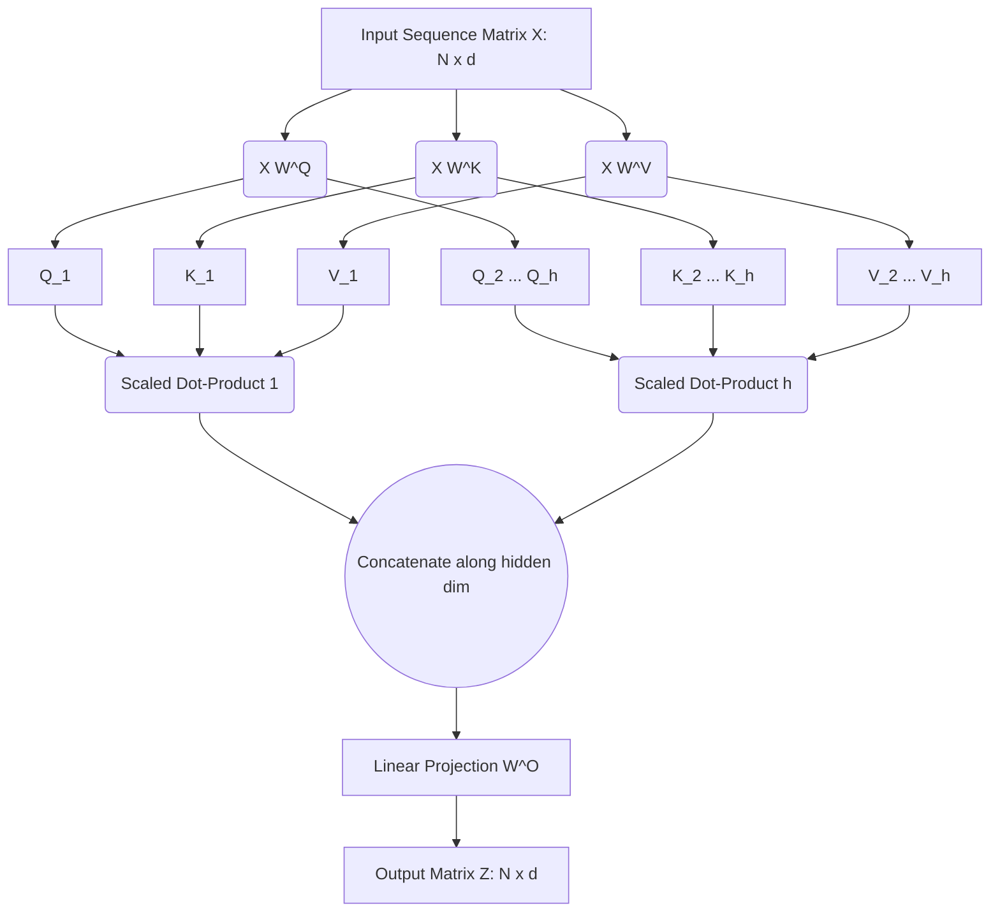

# Parallelizing Language 📖

Welcome to Part 4! In Part 2, we showed that the $O(T)$ sequential bottleneck of BPTT in LSTMs inherently limits training speed. In 2017, Vaswani et al. proposed discarding recurrence entirely in "Attention Is All You Need." Two years later, Devlin et al. utilized the encoder half of this architecture to create **BERT** (Bidirectional Encoder Representations from Transformers).

Today, we dive into the linear algebra that makes Transformers massively parallel and highly expressive: **Scaled Dot-Product Self-Attention**.

## 1. The Death of Recurrence: Positional Encodings

If an architecture reads a sequence $X = [x_1, x_2, \dots, x_N]$ purely in parallel, it has no inherent concept of order. Permuting the input vectors would yield the exact same output. 

To inject temporal information, Transformers add a deterministic **Positional Encoding** matrix $P \in \mathbb{R}^{N \times d_{\text{model}}}$ to the input embedding matrix $E \in \mathbb{R}^{N \times d_{\text{model}}}$. 

The continuous positional encodings are defined via interlocking sinusoids:
$$ P_{(pos, 2i)} = \sin\left(\frac{pos}{10000^{2i/d_{\text{model}}}}\right) $$
$$ P_{(pos, 2i+1)} = \cos\left(\frac{pos}{10000^{2i/d_{\text{model}}}}\right) $$

Where $pos$ is the position in the sequence, and $i$ is the dimension index. Because $sin(a+b)$ can be expressed as a linear combination of $sin(a)$ and $cos(b)$, the network can easily learn to attend to relative positions $pos + k$.

## 2. Scaled Dot-Product Self-Attention

In an LSTM, state is passed horizontally across time. In Self-Attention, every token computes an interaction weight with *every other token* directly via matrix multiplication.

Let $X \in \mathbb{R}^{N \times d}$ be our input matrix (sequence length $N$, embedding dimension $d$). We project $X$ into three distinct spaces: **Queries ($Q$)**, **Keys ($K$)**, and **Values ($V$)**:

$$ Q = X W^Q, \quad K = X W^K, \quad V = X W^V $$
Where $W^Q, W^K, W^V \in \mathbb{R}^{d \times d_k}$ are the learned parameter matrices.

We compute the unnormalized attention scores $S$ by taking the dot product of every Query with every Key:
$$ S = Q K^T \quad \text{(Shape: } N \times N) $$

We scale the scores by $\frac{1}{\sqrt{d_k}}$. This is a crucial mathematical trick. If $Q$ and $K$ are independent random variables with mean $0$ and variance $1$, their dot product will have variance $d_k$. If variance is too high, the softmax will be pushed into regions where gradients are extremely small (vanishing gradients). Dividing by $\sqrt{d_k}$ normalizes the variance back to $1$.

We then apply softmax row-wise to get the attention matrix $A$:
$$ A = \text{softmax}\left(\frac{Q K^T}{\sqrt{d_k}}\right) $$

Finally, we compute the output matrix $Z$ by taking the weighted sum of the Values:
$$ Z = A V $$

**Putting it all together into the core Transformer equation:**
$$ \text{Attention}(Q, K, V) = \text{softmax}\left(\frac{QK^T}{\sqrt{d_k}}\right)V $$

## 3. Multi-Head Attention and the Residual Stream

A single attention head might focus heavily on syntax, but we also want to track semantics. **Multi-Head Attention** computes $h$ parallel self-attention operations, concatenates their outputs, and linearly projects them back to $d_{\text{model}}$.



To enable training of BERT-Large (24 layers, 340M parameters), we rely on **Layer Normalization** and **Residual Connections**. The output of the multi-head attention sub-layer is actually:
$$ X_{\text{out}} = \text{LayerNorm}(X + \text{MultiHead}(X)) $$

## 4. Coding the Math: Self-Attention in PyTorch

Let's implement the pure mathematical formulation of Scaled Dot-Product Attention in Python.

```python
import torch
import torch.nn.functional as F
import math

def scaled_dot_product_attention(Q, K, V):
    """
    Computes Scaled Dot-Product Attention mathematically.
    Q, K, V shape: (Batch, N, d_k)
    """
    d_k = Q.size(-1)
    
    # 1. MatMul: Q * K^T
    # K.transpose(-2, -1) swaps the last two dimensions to (Batch, d_k, N)
    scores = torch.matmul(Q, K.transpose(-2, -1)) # Shape: (Batch, N, N)
    
    # 2. Scale: Divide by sqrt(d_k)
    scaled_scores = scores / math.sqrt(d_k)
    
    # 3. Softmax: Compute probabilities along the last dimension
    attention_weights = F.softmax(scaled_scores, dim=-1)
    
    # 4. MatMul: A * V
    output = torch.matmul(attention_weights, V) # Shape: (Batch, N, d_k)
    
    return output, attention_weights

# Let's verify dimensions
Batch, N, d_k = 2, 5, 64  # Batch size 2, Sequence Length 5, Embed dim 64
Q = torch.randn(Batch, N, d_k)
K = torch.randn(Batch, N, d_k)
V = torch.randn(Batch, N, d_k)

out, attn_map = scaled_dot_product_attention(Q, K, V)

print(f"Output Z shape: {out.shape}")           # torch.Size([2, 5, 64])
print(f"Attention Map A shape: {attn_map.shape}") # torch.Size([2, 5, 5])
```

In **Part 5**, we will move beyond fixed parametric networks and dive into the mathematics of Dense Passage Retrieval, using dual-encoder bi-encoders to search non-parametric vector spaces in **Retrieval-Augmented Generation (RAG)**!
