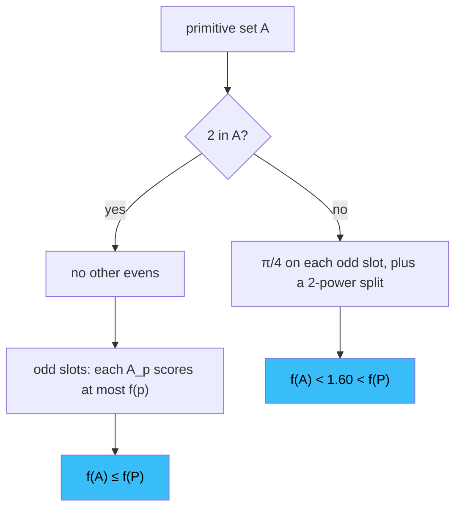

*Primitive Sets:* [Vol. I](/blog/2025/06/08/Back-of-the-Envelope-Primitive-Sets) · [Vol. II](/blog/2025/06/08/Back-of-the-Envelope-Primitive-Sets-Vol-II) · [Vol. III](/blog/2025/06/08/Back-of-the-Envelope-Primitive-Sets-Vol-III) · [Vol. IV](/blog/2025/06/08/Back-of-the-Envelope-Primitive-Sets-Vol-IV) · **Vol. V**



*Conversion against packing. The best a slot of composites can do is an integral, the integral is an arctangent, and the arctangent is a quarter-turn: $\pi/4\approx 0.785$ of the prime it is trying to replace.*

[Vol. IV](/blog/2025/06/08/Back-of-the-Envelope-Primitive-Sets-Vol-IV) left us inside a single slot $A_n$ of composites with two facts in tension. An element at distance-from-prime $v$ converts density into score at rate about $e^\gamma/(1+v)$, and the elements closer to prime than $v$ can spend at most about $\sqrt v$ of the slot's density $d(L_n)$. This volume finds the best a challenger can do under both constraints, and then finishes the theorem.

<strong>Contents</strong>
<ol>
  <li><a href="#buckets-then-pi4">buckets, then π/4</a></li>
  <li><a href="#odd-primes-beat-their-own-composites">odd primes beat their own composites</a></li>
  <li><a href="#the-prime-2">the prime 2</a></li>
  <li><a href="#the-argument-on-one-page">the argument on one page</a></li>
  <li><a href="#what-is-still-open">what is still open</a></li>
  <li><a href="#further-reading">further reading</a></li>
</ol>

---

# buckets, then $\pi/4$
{: #buckets-then-pi4}

We now have two functions of $v$, inside a fixed slot $A_n$ of composites:

- an element at level $v$ converts density to $f$-weight at rate about $e^{\gamma}/(1+v)$;
- all the elements with $v(a) < v$ together spend at most about $\sqrt{v}$ of the ambient density $d(L_n)$.

To bound the total $f$, split the composites into **buckets** by $v$, which is how the paper actually proceeds, and only then pass to an integral.

Pick a partition $0 = v_0 < v_1 < \cdots < v_k = 1$ of the interval $[0,1]$. Put in bucket $i$ those $a \in A_n$ with $v_i \le v(a) < v_{i+1}$. (Anything with $v(a) \ge 1$, i.e. $P(a)^2 \le a$, converts at rate $\le 1/2$ and can be lumped into the last bucket.) In bucket $i$,

$$
f(\text{bucket } i) \;\le\; \frac{e^{\gamma}}{1+v_i} \cdot d(\text{that bucket's $L$-sets}),
$$

because every element there has conversion rate $\le 1/(1+v_i)$. Write $d_i$ for that bucket's density. The packing constraint, applied to the union of the first $j$ buckets (the *closer-to-prime* elements), says

$$
d_0 + d_1 + \cdots + d_{j-1} \;\le\; \sqrt{v_j}\, d(L_n).
$$

The rates $1/(1+v_i)$ are *decreasing* in $i$: small $v$ is the high-value real estate. Given a decreasing sequence of rates and upper bounds on the *cumulative* densities, the most $f$ you can extract is by filling each cumulative budget as soon as it opens --- spend as much as you are allowed at the highest remaining rate.

A three-bucket cash register, before the symbols. Rates $1 \ge 0.8 \ge 0.5$, and you may spend at most density $0.5$ at the top rate, at most $0.7$ in the first two buckets combined, at most $1$ in all three. Fill high-rate first: $0.5$ at rate $1$, then the newly unlocked $0.2$ at rate $0.8$, then the remaining $0.3$ at rate $0.5$. Revenue $0.50+0.16+0.15=0.81$. Any other allocation is worse. That is the paper's rearrangement lemma, in English.

<strong>Check yourself.</strong> Why is "any other allocation worse"? Try moving $0.1$ of density from bucket 1 to bucket 2.

Bucket 1 can't hold more than $0.5$, so the only moves are <em>down</em>: shift density from a higher-rate bucket to a lower-rate one. Moving $0.1$ from rate $0.8$ to rate $0.5$ loses $0.1\times(0.8-0.5)=0.03$. Every legal move trades a unit at a higher rate for a unit at a lower one. In general this is summation by parts: $\sum r_i d_i = \sum_j (r_{j-1}-r_j)\,D_j + r_{k-1}D_k$ with $D_j$ the cumulative sums, and every coefficient $r_{j-1}-r_j$ is $\ge 0$, so the sum is largest when every $D_j$ is as large as allowed.

The worst case is therefore $d_0 + \cdots + d_{j-1} = \sqrt{v_j}\, d(L_n)$, so the density of bucket $i$ is at most the newly unlocked packing room

$$
\bigl(\sqrt{v_{i+1}} - \sqrt{v_i}\bigr)\, d(L_n).
$$

Hence

$$
f(A_n) \;\le\; e^{\gamma}\, d(L_n) \sum_{i=0}^{k-1} \frac{\sqrt{v_{i+1}} - \sqrt{v_i}}{1+v_i}.
$$

This is a Riemann sum for an integral. Taking a finer and finer partition ($v_i = i/k$, then $k \to \infty$),

$$
\sum_{i} \frac{\sqrt{v_{i+1}} - \sqrt{v_i}}{1+v_i} \;\longrightarrow\; \int_0^1 \frac{1}{1+v}\cdot \frac{d}{dv}\bigl[\sqrt{v}\bigr]\, dv \;=\; \int_0^1 \frac{dv}{2\sqrt{v}\,(1+v)}.
$$

The derivative of $\sqrt{v}$ is $\frac12 v^{-1/2} = 1/(2\sqrt{v})$: the extra packing room unlocked at level $v$ is $dv/(2\sqrt{v})$. Near $v=0$ the integrand blows up like $1/(2\sqrt{v})$, which is the white curve in the figure above. Do not panic: $\int_0^1 v^{-1/2}\,dv = 2$ is finite, so the singularity is integrable.

A coarse numerical check, four buckets, left endpoints:

| $v_i$ | $\sqrt{v_i}$ | $\sqrt{v_{i+1}}-\sqrt{v_i}$ | $1/(1+v_i)$ | product |
|------|-------------|------------------------------|-------------|---------|
| $0$ | $0$ | $0.500$ | $1$ | $0.500$ |
| $0.25$ | $0.500$ | $0.207$ | $0.800$ | $0.166$ |
| $0.50$ | $0.707$ | $0.159$ | $0.667$ | $0.106$ |
| $0.75$ | $0.866$ | $0.134$ | $0.571$ | $0.076$ |
| **sum** | | | | **$0.848$** |

The sum $0.848$ is a coarse overestimate of $\pi/4 \approx 0.785$, as a left Riemann sum on a decreasing integrand should be. Finer partitions close the gap. Watch them close it, and flip the axis to see the substitution coming:

  

  

  <svg id="pv-bkt-svg" viewBox="0 0 640 300" role="img" aria-label="Staircase of bucket contributions over the integrand, with the running sum compared to pi over 4"></svg>
  

  

    <label>buckets k <input type="range" id="pv-bkt-k" min="1" max="64" value="4"></label>
    <button type="button" data-ax="v">v axis</button>
    <button type="button" data-ax="u">u = √v axis</button>
    <b style="background:#3987e5"></b>bucket i's contribution<b style="background:#e0a100"></b>integrand
  

Each blue bar has area $(\sqrt{v_{i+1}}-\sqrt{v_i})/(1+v_i)$, bucket $i$'s worst-case contribution. On the $v$ axis the integrand $1/(2\sqrt v(1+v))$ blows up at $0$ (clipped here). On the $u=\sqrt v$ axis the same bars become a left Riemann sum for the tame curve $1/(1+u^2)$: the singularity was an artefact of the coordinate.

Now the integral, by substitution. Set $u = \sqrt{v}$, so $v = u^2$ and $dv = 2u\, du$. The limits stay $0$ to $1$, and the $2u$ in the numerator cancels the $2\sqrt{v}=2u$ in the denominator:

$$
\int_0^1 \frac{dv}{2\sqrt{v}\,(1+v)} \;=\; \int_0^1 \frac{2u\, du}{2u\,(1+u^2)} \;=\; \int_0^1 \frac{du}{1+u^2}.
$$

The antiderivative of $1/(1+u^2)$ is $\arctan u$. (Chain rule: if $\theta = \arctan u$ then $u=\tan\theta$, $du/d\theta = \sec^2\theta = 1+\tan^2\theta = 1+u^2$.) And $\arctan 1 = \pi/4$, because that is the angle whose tangent is $1$: a $45^\circ$ angle, a quarter of a half-turn. Also $\arctan 0 = 0$. So

$$
\boxed{\displaystyle \int_0^1 \frac{dv}{2\sqrt{v}\,(1+v)} \;=\; \frac{\pi}{4}}.
$$

The left shaded region has area $\pi/4$. That same number is the angle on the right, in radians: $\mathrm{opp}/\mathrm{adj}=1/1=1$.

The factor $\pi/4 \approx 0.785$ is the proportion of a full-rate $e^{\gamma}$ that a slot of composites can realize under the $\sqrt{v}$ constraint. In the envelope, a slot $A_n$ of composites scores at most about

$$
f(A_n) \;\le\; \frac{\pi}{4}\, e^{\gamma}\, d(L_n).
$$

That is the true output of the $\pi/4$ argument: a bound on a *slot of composites*, in terms of the density of the ambient territory $L_n$. It is **not** a global bound "$f(\text{all composites}) \le 1.399$." (That global-looking number $e^{\gamma}\pi/4 \approx 1.399$ does appear, as an upper bound on $f(A)$ for primitive sets of *large* elements. That is a different theorem, about tails.)

---

# odd primes beat their own composites
{: #odd-primes-beat-their-own-composites}

Specialize to $n = p$, an odd prime, with $p \notin A$. Then $A_p$ is a primitive set of composites all having smallest prime factor $p$, and the ambient territory is $L_p$, with

$$
e^{\gamma}\, d(L_p) \;\approx\; f(p)
$$

by Mertens (this is the same comparison that produced $(\star)$ in [Vol. IV](/blog/2025/06/08/Back-of-the-Envelope-Primitive-Sets-Vol-IV)). The $\pi/4$ bound becomes

$$
f(A_p) \;\le\; \frac{\pi}{4}\cdot\bigl(1+\text{a small Mertens error}\bigr)\cdot f(p).
$$

The error is tracked in the paper with explicit bounds on Mertens' product. The worst odd prime is $p = 3$, and even there the constant comes out strictly less than $0.901$. For larger odd primes it is better, and it tends to $\pi/4 \approx 0.785$ as $p \to \infty$. In all cases it is less than $1$:

<strong>Theorem (Lichtman, Theorem 1.3).</strong> For every primitive set $A$ and every odd prime $p$,
$$ f(A_p) \;\le\; f(p). $$
If $p \notin A$, the inequality is strict: $f(A_p) < 0.901\, f(p)$.

Simply: **you should never skip an odd prime in favour of composites with that smallest prime factor.** Skipping $p$ and filling the slot with $3p$, $p^2$, products of larger primes, whatever primitive combination you like, returns less than $90\%$ of what $p$ itself was worth. (In the slot of an odd prime $p$ every element is odd, since its smallest prime factor is $p$.)

That is the true reason the primes win on the odd slots. The $\pi/4$ is a local comparison of composites to their parent prime, not a global score for "all the composites in $A$." The $21\%$ of slack is what swallows the Mertens oscillation that killed $(\star)$ for infinitely many large primes.

If $p \in A$, then primitivity forbids any other multiple of $p$ from joining $A$, so $A_p = \lbrace p\rbrace$ and $f(A_p) = f(p)$ on the nose.

---

# the prime $2$
{: #the-prime-2}

Every odd prime is Erdős-strong. The remaining slot is $p = 2$.

**If $2 \in A$**, then $A$ contains no other even number. The odd part of $A$ is a primitive set of odd numbers, and the odd-prime theorem gives $f(A_p) \le f(p)$ for every odd $p$. Adding $f(2)$ back, $f(A) \le f(\mathcal{P})$.

**If $2 \notin A$**, the criterion $(\star)$ fails and the constants around $\pi/4$ do not quite prove that $2$ is Erdős-strong. The idea of the paper's substitute is a $2$-power split. Every even $a$ factors as $2^k$ times an odd integer. The odd part lives in an odd slot, where we already win; the $2^k$ costs a factor $\sim 2^{-k}$ in the weight, so a pile of even composites is cheaper, in bulk, than $2$ itself. Tracking the possible $k$ and applying the odd-prime bounds to the odd parts produces a global estimate $f(A) < 1.60 < f(\mathcal{P})$. We will not replay the constants. The conjecture does not need $2$ to be Erdős-strong: when $2$ is missing, this direct bound already loses to the primes.

Whether $2$ itself is Erdős-strong --- whether some primitive set of even numbers, none of which is $2$, can score more than $f(2) \approx 0.721$ in the even slot --- was left open in 2022.

<strong>Student.</strong> So where exactly does the napkin stop and the paper start?

<strong>Teacher.</strong> Three places. First, the disjointness of the copies $L_{ac}$ in <a href="/blog/2025/06/08/Back-of-the-Envelope-Primitive-Sets-Vol-IV#copies-and-the-sqrtv-packing">Vol. IV</a>, which we stated and did not prove; it is the combinatorial heart of the paper and the only place primitivity is used beyond the 1935 lemma. Second, every "$\approx$" that came from Mertens is, in the paper, an explicit inequality with an explicit error; that is what turns $\pi/4$ into $0.901$ at $p=3$. Third, the global bound $1.60$ when $2\notin A$. The shape of the argument (budget, discount, packing, quarter-turn) is exactly the napkin.

---

# the argument on one page
{: #the-argument-on-one-page}

1. **Objects** ([Vol. I](/blog/2025/06/08/Back-of-the-Envelope-Primitive-Sets)). A primitive set has no element dividing another. The primes are one; so are $\lbrace 6,10,15\rbrace$, every $(x,2x]$, and every $\lbrace\Omega = k\rbrace$. Counting and density cannot rank them.
2. **Ruler** ([Vol. II](/blog/2025/06/08/Back-of-the-Envelope-Primitive-Sets-Vol-II)). $f(A)=\sum 1/(a\log a)$, on the knife-edge: infinite over all integers, $1.6366$ over the primes.
3. **Budget** ([Vol. III](/blog/2025/06/08/Back-of-the-Envelope-Primitive-Sets-Vol-III)). Territories $L_a$ are disjoint for primitive $A$, so $\sum d(L_a)\le 1$. Mertens converts density to score at rate $e^\gamma$, giving $f(A)\lt e^\gamma = 1.781$.
4. **Slots and discount** ([Vol. IV](/blog/2025/06/08/Back-of-the-Envelope-Primitive-Sets-Vol-IV)). Compete prime by prime. A composite converts at the discounted rate $e^\gamma/(1+v)$, and nearly-prime composites can fill at most $\sqrt v$ of a slot.
5. **Quarter-turn** (this volume). Discount against packing integrates to $\int_0^1 \frac{du}{1+u^2}=\pi/4$. Every odd prime beats its composites by nearly $10\%$. The prime $2$ is handled by a direct bound, $1.60 \lt 1.6366$.

The theorem says something simple enough to tell after one semester: among all the ways to pick integers so that none divides another, the primes are the heaviest, when each integer $a$ is weighed by $1/(a\log a)$. The reason, on a napkin, is local. In the slot of numbers with smallest prime factor $p$, a composite converts density at a discount $1/(1+v)$, the dangerous nearly-prime composites cannot spend more than density $\sqrt{v}$ of the slot, and the integral of that tradeoff is a quarter-circle. For every odd prime, that is strictly worse than taking $p$ itself.

---

# what is still open
{: #what-is-still-open}

**Is $2$ Erdős-strong?** Lichtman proved every odd prime is. A negative answer would not have damaged the 2022 theorem --- the case $2 \notin A$ is already lost to $f(\mathcal{P})$ by the global bound $1.60$ --- but it would have meant that some primitive set of even numbers, none of which is $2$, scores more than $f(2) \approx 0.721$ in the even slot.

**The Erdős–Sárközy–Szemerédi tail conjecture (1968).** Restrict to primitive sets of *large* elements:

$$
\lim_{x \to \infty} \sup_{\substack{A \subset [x,\infty)\\ A \text{ primitive}}} f(A) \;\stackrel{?}{\le}\; 1.
$$

This is where $e^{\gamma}\pi/4 \approx 1.399$ appears as a theorem: Lichtman's method gives that upper bound on the lim-sup. The value $1$ is forced as a lower bound if the conjecture is true, because the set of integers with $\Omega(n) = k$ lives in $[2^k, \infty)$ and Lichtman had already proved that its Erdős sum tends to $1$ as $k \to \infty$.

A May 2026 preprint of Alexeev, Barreto, Li, Lichtman, Price, Shah, Tang, and Tao, [arXiv:2605.00301](https://arxiv.org/abs/2605.00301), claims both that $2$ is Erdős-strong and that the tail conjecture is true, by a different method: a von Mangoldt-weighted Markov chain on the divisibility poset. It is marked preliminary. The 2022 $\pi/4$ argument remains the one this series unpacks.

Cheers.

---

# further reading
{: #further-reading}

Jared Duker Lichtman, [A proof of the Erdős primitive set conjecture](https://arxiv.org/abs/2202.02384). *Forum of Mathematics, Pi* (2023). The paper. The envelope in this series is the argument of its introduction; the actual inequalities are in sections 2–4.

Boris Alexeev, Kevin Barreto, Yanyang Li, Jared Duker Lichtman, Liam Price, Jibran Iqbal Shah, Quanyu Tang, and Terence Tao, [Primitive sets and von Mangoldt chains](https://arxiv.org/abs/2605.00301). May 2026 preprint. A different method, claiming the tail conjecture and that $2$ is Erdős-strong.

Jared Duker Lichtman, [Almost primes and the Banks–Martin conjecture](https://arxiv.org/abs/1909.00804). Proves $f(\mathbb{N}_k) \to 1$.

Paul Erdős and András Sárközy, [On the divisibility of sequences of integers](https://users.renyi.hu/~p_erdos/1970-13.pdf). Source of the 1968 tail conjecture.

Tsz Ho Chan, Jared Duker Lichtman, and Carl Pomerance, [On the critical exponent for $k$-primitive sets](https://math.dartmouth.edu/~carlp/4695pomerance.pdf). Where $\tau = 1.1403\ldots$ comes from, and why the $t$-pointwise analogue of the conjecture fails.

Jared Duker Lichtman and Carl Pomerance, [The Erdős conjecture for primitive sets](https://arxiv.org/abs/1904.12226). The $e^{\gamma}$ bound.

Hugh L. Montgomery and Robert C. Vaughan, *Multiplicative Number Theory I: Classical Theory*. Cambridge, 2007. Mertens' theorems and the prime number theorem.

Quanta Magazine, [Graduate Student's Side Project Proves Prime Number Conjecture](https://www.quantamagazine.org/graduate-students-side-project-proves-prime-number-conjecture-20220606/). The human story of the proof.

---

*Primitive Sets:* [Vol. I](/blog/2025/06/08/Back-of-the-Envelope-Primitive-Sets) · [Vol. II](/blog/2025/06/08/Back-of-the-Envelope-Primitive-Sets-Vol-II) · [Vol. III](/blog/2025/06/08/Back-of-the-Envelope-Primitive-Sets-Vol-III) · [Vol. IV](/blog/2025/06/08/Back-of-the-Envelope-Primitive-Sets-Vol-IV) · **Vol. V**
