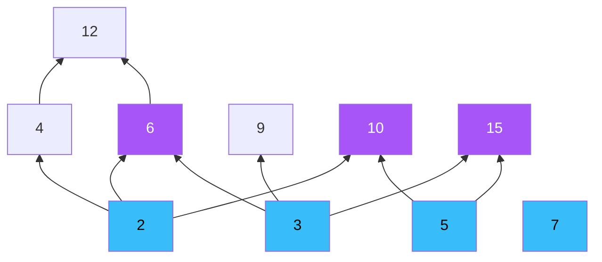
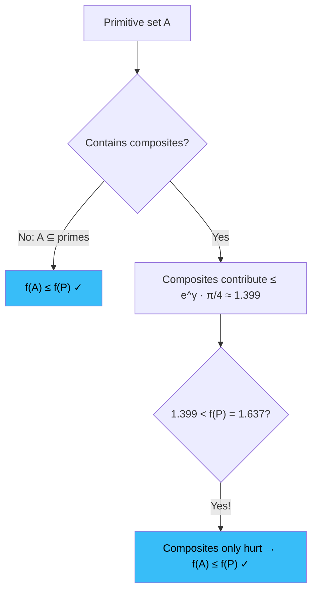
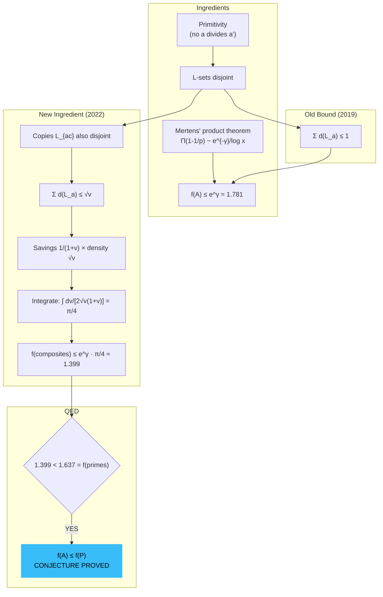

# The Joyous Structure of the Nature of Primes (Primitive Sets Theorem Proved!)

Reading the conjecture for the first time in Covid-19 locked-down Boston, I was sure it was true.
There was a sense of deep vindication when I soon came across the proof of this conjecture by Erdős, years later, by a bright PhD student named Jared Duker Lichtman.
This statement about the nature of primes was so beautiful it surely had to be true.

The [original paper can be found here.](https://arxiv.org/abs/2202.02384)

Herein we go into the thick of things -- heavy-handedly, every derivation spelled out. If you've taken a semester of calculus and have a taste for beautiful mathematics, you have everything you need. Keep reading.

---

# The Crash Course (Skip If You Know This Stuff)

I won't belabor fundamentals, but we need a common language. Three things.

**Divisibility.** We write $a \mid b$ when $b = ka$ for some integer $k$. So $3 \mid 12$ because $12 = 4 \cdot 3$, but $5 \nmid 12$. The Fundamental Theorem of Arithmetic says every integer $n > 1$ factors uniquely into primes:

$$n = p_1^{e_1} \cdot p_2^{e_2} \cdots p_r^{e_r}, \quad p_1 < p_2 < \cdots < p_r.$$

For $360 = 2^3 \cdot 3^2 \cdot 5$, the smallest prime factor is $p(360) = 2$, the largest is $P(360) = 5$, and the total count of prime factors (with repeats) is $\Omega(360) = 3 + 2 + 1 = 6$. We write $\mathbb{N}_k$ for the set of integers with exactly $k$ prime factors: the primes are $\mathbb{N}_1$, the semiprimes $\{4, 6, 9, 10, 14, 15, \ldots\}$ are $\mathbb{N}_2$, and so on.

**Series convergence.** The harmonic series $\sum 1/n$ diverges -- you can see this by grouping terms into blocks of $2^k$, each contributing at least $1/2$. But $\sum 1/n^2 = \pi^2/6$ converges. The integral test is our workhorse: $\sum g(n)$ converges iff $\int g(x)\,dx$ converges. Two key facts we'll use:

$$\int_2^{\infty} \frac{dx}{x \ln x} = \Big[\ln(\ln x)\Big]_2^{\infty} = \infty \quad \text{(diverges!)}$$

$$\int_2^{\infty} \frac{dx}{x (\ln x)^2} = \left[-\frac{1}{\ln x}\right]_2^{\infty} = \frac{1}{\ln 2} \quad \text{(converges!)}$$

So $\sum 1/(n \log n)$ diverges -- the extra $\log n$ isn't enough to tame the harmonic series. But $\sum 1/(n (\log n)^2)$ converges. The sum over primes we care about will land between these two. Keep that in mind.

**The Euler-Mascheroni constant.** Define $\gamma$ as the gap between the harmonic sum and the natural log:

$$\gamma = \lim_{N \to \infty} \left(\sum_{n=1}^{N} \frac{1}{n} - \ln N\right) = 0.5772\ldots$$

The number $e^{\gamma} = 1.7810\ldots$ will haunt us. It appears whenever you convert between discrete sums over primes and continuous logarithmic integrals -- Mertens figured this out in 1874 and we owe him big time.

One last tool: **partial summation** (Abel's summation formula). This is integration by parts for sums. If $A(x) = \sum_{n \leq x} a_n$ and $g$ is differentiable:

$$\sum_{n \leq x} a_n \, g(n) = A(x)\,g(x) - \int_1^x A(t)\,g'(t)\,dt.$$

This is how you turn knowledge about counting functions (like $\pi(x) \sim x/\ln x$, the Prime Number Theorem) into knowledge about sums over primes. We will use it relentlessly.

---

# Primitive Sets: The Main Character

> **Definition.** A set $A \subset \mathbb{Z}_{>1}$ is **primitive** if no element of $A$ divides another element of $A$.

That's it. That's the whole definition. In the language of posets: $A$ is an antichain in the divisibility ordering of the integers.

Some examples to build your intuition:

**The primes** $\{2, 3, 5, 7, 11, \ldots\}$ -- primitive. No prime divides another prime. This is the protagonist of our story.

**$\{6, 10, 15\}$** -- primitive. Check all pairs: $6 \nmid 10$, $6 \nmid 15$, $10 \nmid 15$, and the reverses. Nothing divides anything else.

**$\{6, 12, 15\}$** -- NOT primitive. Because $6 \mid 12$. Busted.

**Any dyadic interval $(x, 2x]$** -- primitive. If $a, b$ are both in $(x, 2x]$ and $a \mid b$, then $b \geq 2a > 2x$. Contradiction.

**$\mathbb{N}_k$, the numbers with exactly $k$ prime factors** -- primitive. If $a \mid b$ and $a \neq b$, then $b = ac$ for some $c > 1$, so $\Omega(b) = \Omega(a) + \Omega(c) > k$. So two numbers with the same $\Omega$ can't divide each other.

**The perfect numbers** $\{6, 28, 496, 8128, \ldots\}$ -- primitive. (It's a known theorem that no perfect number divides another. My God, even perfect numbers play along.)

Think of it visually: the positive integers form a poset under divisibility, like a directed graph where $a$ points up to $b$ if $a \mid b$. A primitive set is a horizontal slice -- nodes with no vertical connections between them.

Blue nodes $\{2,3,5,7\}$: one primitive set (the small primes). Purple nodes $\{6, 10, 15\}$: another. You can't pick both $6$ and $12$ -- there's an arrow between them.

Why do we care? These things emerged in the 1930s from a concrete problem: Davenport proved the abundant numbers (where the sum of proper divisors exceeds $n$) have positive density. Erdős found an elegant shortcut using *primitive* abundant numbers -- the ones that are minimal under divisibility. The abstraction turned out to be more interesting than the application. Classic Erdős.

---

# The Erdős Sum: Why $\frac{1}{a \log a}$?

Here's where the magic starts. For a set $A \subset \mathbb{Z}_{>1}$, define:

$$\boxed{f(A) = \sum_{a \in A} \frac{1}{a \log a}}$$

This weighting is not arbitrary. Let me show you where it comes from.

For any integer $a \geq 2$:

$$\frac{1}{a \log a} = \int_1^{\infty} a^{-t}\,dt.$$

**Full derivation.** Start:

$$\int_1^{\infty} a^{-t}\,dt = \int_1^{\infty} e^{-t \ln a}\,dt.$$

Substitute $u = t \ln a$, so $du = \ln a\,dt$:

$$= \frac{1}{\ln a}\int_{\ln a}^{\infty} e^{-u}\,du = \frac{1}{\ln a}\Big[-e^{-u}\Big]_{\ln a}^{\infty} = \frac{1}{\ln a}\cdot e^{-\ln a} = \frac{1}{a \ln a}. \quad \blacksquare$$

So $1/(a \log a)$ is what you get when you integrate $a^{-t}$ from $1$ to $\infty$. Summing over $A$ and swapping sum and integral (Tonelli says we can):

$$f(A) = \sum_{a \in A} \int_1^{\infty} a^{-t}\,dt = \int_1^{\infty} \underbrace{\left(\sum_{a \in A} a^{-t}\right)}_{f_t(A)}\,dt.$$

This integral representation -- $f(A) = \int_1^{\infty} f_t(A)\,dt$ -- is powerful. It turns bounding $f(A)$ into bounding a family of Dirichlet-series-like sums for each $t > 1$.

Now, the sum over primes:

$$f(\mathcal{P}) = \sum_p \frac{1}{p \log p} = \frac{1}{2 \log 2} + \frac{1}{3 \log 3} + \frac{1}{5 \log 5} + \cdots$$

| $p$ | $1/(p \log p)$ | Running sum |
|-----|----------------|-------------|
| 2 | 0.7213 | 0.7213 |
| 3 | 0.3034 | 1.0247 |
| 5 | 0.1243 | 1.1490 |
| 7 | 0.0734 | 1.2224 |
| 11 | 0.0379 | 1.2603 |
| 13 | 0.0300 | 1.2903 |
| 17 | 0.0208 | 1.3111 |
| 19 | 0.0179 | 1.3290 |

Converges slowly. After summing all primes to $10^8$, Cohen computed $f(\mathcal{P}) = 1.6366\ldots$ We'll prove convergence rigorously later. For now: it's a finite number, roughly $1.6366$.

---

# Erdős 1935: The Sum Is Bounded. For ANY Primitive Set.

Before you can ask "which primitive set maximizes $f$?", you need to know the maximum exists. Erdős proved this in 1935, and the argument is gorgeous.

For each $a \geq 2$, define the **L-multiples** of $a$ (the "L" is for "lexicographic" -- we couch the reason for this name for later):

$$L_a = \{b \cdot a : b \geq 1, \; p \mid b \Rightarrow p \geq P(a)\}.$$

In words: take $a$, and multiply it by any integer whose prime factors are all $\geq P(a)$ (the largest prime factor of $a$).

For $a = 6$ (where $P(6) = 3$): $L_6$ consists of $6$ times any number built from primes $\geq 3$. So $6 \cdot 1 = 6$, $6 \cdot 3 = 18$, $6 \cdot 5 = 30$, $6 \cdot 7 = 42$, $6 \cdot 9 = 54$, and so on.

For a prime $p$: $L_p$ consists of $p$ times any number built from primes $\geq p$. So $L_5 = \{5, 25, 35, 55, 125, \ldots\}$.

**The density of $L_a$.** How "big" is $L_a$ inside the integers? Its natural density is:

$$d(L_a) = \frac{1}{a}\prod_{p < P(a)}\left(1 - \frac{1}{p}\right).$$

The product $\prod_{p < P(a)}(1 - 1/p)$ is the proportion of integers not divisible by any prime less than $P(a)$ -- that's inclusion-exclusion, the sieve of Eratosthenes doing what it does best. Scaling by $1/a$ accounts for the $a$-multiple structure.

Now the engine of the whole argument:

> **Disjointness Lemma.** If $A$ is primitive, then the sets $\{L_a : a \in A\}$ are pairwise disjoint.

**Proof.** Suppose $n \in L_a \cap L_{a'}$ for distinct $a, a' \in A$. Write $n = ba = b'a'$ where $b$ has all prime factors $\geq P(a)$ and $b'$ has all prime factors $\geq P(a')$. Assume WLOG $P(a) \leq P(a')$.

Write $a = a^* \cdot P(a)^k$ where $a^*$ has all prime factors $< P(a)$. Since $a \mid n = b'a'$ and $\gcd(a^*, b') = 1$ (their prime factors don't overlap), we get $a^* \mid a'$. Similarly $P(a)^k \mid a'$ (since $P(a) < P(a')$ means $P(a)$ can't come from $b'$). Therefore $a = a^* \cdot P(a)^k \mid a'$.

But $a \mid a'$ contradicts primitivity. $\blacksquare$

Since disjoint subsets of $\mathbb{N}$ can't have densities summing past $1$:

$$\sum_{a \in A} d(L_a) = \sum_{a \in A} \frac{1}{a}\prod_{p < P(a)}\left(1 - \frac{1}{p}\right) \leq 1.$$

Now invoke **Mertens' product theorem** (1874): $\prod_{p \leq x}(1 - 1/p) \sim e^{-\gamma}/\log x$. Taking $x = P(a)$:

$$d(L_a) \approx \frac{e^{-\gamma}}{a \log P(a)}.$$

Since $P(a) \leq a$, we have $\log P(a) \leq \log a$, so $1/(a \log a) \leq 1/(a \log P(a))$, which means:

$$f(a) = \frac{1}{a \log a} \leq \frac{1}{a \log P(a)} \approx e^{\gamma} \cdot d(L_a).$$

Sum it up:

$$f(A) = \sum_{a \in A} f(a) \leq e^{\gamma}\sum_{a \in A} d(L_a) \leq e^{\gamma} \cdot 1 = e^{\gamma} \approx 1.781.$$

And we're done.

> **Theorem (Erdős 1935, refined Lichtman-Pomerance 2019).** For any primitive set $A$: $f(A) < e^{\gamma} = 1.781\ldots$

Beautiful. But notice: $e^{\gamma} \approx 1.781 > 1.637 \approx f(\mathcal{P})$. This bound is too loose by about $8.8\%$. It doesn't prove the conjecture. We need a new idea.

---

# The Conjecture: Primes Are Optimal

> **Conjecture (Erdős, ~1974).** For any primitive set $A$, $f(A) \leq f(\mathcal{P}) = 1.6366\ldots$

In words: among all primitive sets, the primes have the largest Erdős sum. The most natural antichain in the divisibility poset is also the heaviest one.

Why should this be true? Three angles.

**The primes are atoms.** They sit at the bottom of the divisibility poset -- nothing above $1$ divides them. Including a prime in your set costs you nothing in terms of divisibility conflicts.

**Composites are expensive.** The $f$-weight is front-loaded:

$$f(2) = 0.721, \quad f(3) = 0.303, \quad f(6) = 0.093.$$

If you include $6$ in your primitive set, you gain $0.093$ but lose both $2$ and $3$ (total loss: $1.024$). Terrible trade! You traded away the crown jewels for pocket change.

**The primes are maximally spread out.** Each prime is independent -- no prime is a multiple of another. Composites create tangled webs of divisibility conflicts.

The conjecture sat open for decades:

- **1935:** Erdős proves $f(A)$ is bounded.
- **1974:** Conjecture appears in print.
- **1993:** Erdős and Zhang prove $f(A) < 1.84$.
- **2019:** Lichtman and Pomerance prove $f(A) < e^{\gamma} = 1.781$.
- **2022:** Lichtman proves $f(A) \leq f(\mathcal{P})$. Conjecture proved!

---

# The Proof Strategy: Split by Smallest Prime Factor

Every integer $a > 1$ has a smallest prime factor $p(a)$. Partition any set $A$ accordingly:

$$A = \bigsqcup_{p} A_p, \quad A_p = \{a \in A : p(a) = p\}.$$

Since the $A_p$ are disjoint: $f(A) = \sum_p f(A_p)$. The conjecture follows if for each prime $p$:

$$f(A_p) \leq f(p) = \frac{1}{p \log p}.$$

A prime satisfying this for all primitive $A$ is called **Erdős-strong**. If every prime is Erdős-strong, we win.

There's a clean sufficient condition. By Mertens' product theorem:

$$\prod_{q < p}\left(1 - \frac{1}{q}\right) \sim \frac{e^{-\gamma}}{\log p}.$$

A prime $p$ is Erdős-strong if:

$$e^{\gamma} \prod_{q < p}\left(1 - \frac{1}{q}\right) \leq \frac{1}{\log p}. \tag{$\star$}$$

Computationally, $(\star)$ holds for the first $10^8$ odd primes. But it **fails for $p = 2$**:

$$e^{\gamma} \cdot 1 = 1.781 > \frac{1}{\log 2} = 1.443.$$

The empty product equals $1$, and $e^{\gamma}$ overshoots $1/\log 2$. Oh no.

It gets worse. Under the Riemann Hypothesis, $(\star)$ fails for a positive proportion of primes. Even unconditionally, it fails for infinitely many. So the "every prime is Erdős-strong" strategy is doomed as a direct approach.

This is why the conjecture stayed open. This is where Lichtman had his breakthrough.

---

# The Key Innovation: The $\sqrt{v}$ Bound

This is the heart of the proof. The idea is beautifully simple once you see it, and I remember staring at it for a long time before it clicked.

Recall our bound from the Erdős argument: we replaced $\log a$ with $\log P(a)$ and lost a factor of $\log P(a)/\log a$. When $a$ is prime, $P(a) = a$, so there's **no loss**. When $a$ is composite, $P(a) < a$ and we lose something.

The key question: *how much* can the composites collectively contribute?

Parameterize the "closeness" of $P(a)$ to $a$. For $v \geq 0$, say that $a$ is "$v$-close" if $P(a)^{1+v} > a$. When $v = 0$, this means $P(a) > a$, which only primes satisfy. As $v$ grows, more composites qualify.

The savings factor for a $v$-close element is $\log P(a)/\log a > 1/(1+v)$.

Now here is where Lichtman goes beyond the 2019 argument.

> **Proposition (Lichtman).** If $A$ is primitive and $P(a)^{1+v} > a$ for all $a \in A$, then $\sum_{a \in A} d(L_a) \leq \sqrt{v}$.

My word. That refines the trivial bound of $1$ whenever $v < 1$.

The idea: not only are the sets $L_a$ disjoint -- so are many "copies" of them. Multiply each $a$ by various integers $c$ whose prime factors lie in a certain range, and the sets $L_{ac}$ remain disjoint from each other AND from all $L_{a'}$ for $a' \neq a$. These copies boost the total density by a factor of $\sim 1/\sqrt{v}$. Since everything fits inside $\mathbb{N}$:

$$\frac{1}{\sqrt{v}} \cdot \sum_{a \in A} d(L_a) \leq 1 \quad \Longrightarrow \quad \sum_{a \in A} d(L_a) \leq \sqrt{v}.$$

The self-similarity of the $L$-sets is doing all the heavy lifting. You're creating "shadows" of your original sets, proving the shadows are also disjoint, and using the shadow density to constrain the original. It's a beautiful counting-over-counting argument.

---

# The $\pi/4$ Factor: The Finishing Blow

Now we combine the $\sqrt{v}$ bound with the savings factor $1/(1+v)$.

Elements entering at parameter $v$ (those with $P(a)^{1+v} \approx a$) contribute to the density with a $\sqrt{v}$ budget, and each contributes to $f(A)$ with a savings of $\sim 1/(1+v)$ relative to its density weight.

The derivative of the density budget $\sqrt{v}$ is $1/(2\sqrt{v})$. So the worst-case contribution of composite elements at level $v$ is $\sim dv/(2\sqrt{v}(1+v))$. Integrate from $v = 0$ to $v = 1$:

$$I = \int_0^1 \frac{dv}{2\sqrt{v}(1+v)}.$$

**Step 1.** Substitute $u = \sqrt{v}$, so $v = u^2$, $dv = 2u\,du$:

$$I = \int_0^1 \frac{2u\,du}{2u(1+u^2)} = \int_0^1 \frac{du}{1+u^2}.$$

**Step 2.** Oh come on. We know this one.

$$\int_0^1 \frac{du}{1+u^2} = \Big[\arctan(u)\Big]_0^1 = \frac{\pi}{4}.$$

And there it is:

$$\boxed{\int_0^1 \frac{dv}{2\sqrt{v}(1+v)} = \frac{\pi}{4}}$$

$\pi$ shows up from the arctangent integral, which comes from the geometry of the unit circle. Number theory and geometry shaking hands through an optimization problem. My God.

So the composite elements contribute at most:

$$f(A_{\text{comp}}) \leq e^{\gamma} \cdot \frac{\pi}{4} \approx 1.781 \times 0.785 = 1.399.$$

And $1.399 < 1.637 = f(\mathcal{P})$. The composites can only hurt. Any primitive set with composite elements has $f(A) < f(\mathcal{P})$.

**A note on $p = 2$.** Lichtman proves every odd prime is Erdős-strong (Theorem 1.3 of the paper). Whether $p = 2$ is Erdős-strong remains open. But the conjecture doesn't need it -- the $\pi/4$ argument handles the global bound directly. The troublemaker prime gets outflanked.

---

# The Convergence of $\sum_p 1/(p \log p)$

This is the other half of the story -- proving the sum at the center of the conjecture actually converges. I'll give you three proofs because frankly each one is satisfying in its own way.

## Via the Prime Number Theorem and Partial Summation

The PNT gives us $\pi(x) \sim x/\ln x$. We won't prove it here (the weeds be tall there -- that's a whole other post). But we'll use it.

Set $g(t) = 1/(t \log t)$. By Abel's summation formula:

$$\sum_{p \leq x} \frac{1}{p \log p} = \pi(x) \cdot g(x) - \int_2^x \pi(t) \cdot g'(t)\,dt.$$

Compute $g'(t)$:

$$g'(t) = -\frac{\log t + 1}{t^2 (\log t)^2}.$$

The boundary term: $\pi(x) \cdot g(x) \sim \frac{x}{\log x} \cdot \frac{1}{x \log x} = \frac{1}{(\log x)^2} \to 0$. Good -- it vanishes.

The integral, using $\pi(t) \sim t/\log t$:

$$\int_2^x \frac{t}{\log t} \cdot \frac{\log t + 1}{t^2(\log t)^2}\,dt = \int_2^x \frac{\log t + 1}{t(\log t)^3}\,dt \leq \int_2^x \frac{2}{t(\log t)^2}\,dt$$

for large $t$ (since $\log t + 1 \leq 2\log t$). And:

$$\int_2^{\infty} \frac{dt}{t(\log t)^2} = \left[-\frac{1}{\log t}\right]_2^{\infty} = \frac{1}{\log 2} < \infty.$$

Converges. $\blacksquare$

## The Quick-and-Dirty Comparison

By PNT, the $n$-th prime satisfies $p_n \sim n \ln n$. So:

$$\frac{1}{p_n \log p_n} \sim \frac{1}{n \ln n \cdot \ln(n \ln n)} \sim \frac{1}{n (\ln n)^2}.$$

The series $\sum 1/(n(\ln n)^2)$ converges by the integral test (we already showed $\int dx/(x(\ln x)^2) = 1/\ln 2$). By the limit comparison test, $\sum_p 1/(p \log p)$ converges too. $\blacksquare$

That's the one you'd do on a napkin. Two lines.

## Via Mertens' First Theorem

Mertens proved $\sum_{p \leq x} (\log p)/p = \log x + O(1)$. Set $B(x) = \sum_{p \leq x} (\log p)/p$ and rewrite:

$$\sum_{p \leq x} \frac{1}{p \log p} = \sum_{p \leq x} \frac{1}{(\log p)^2} \cdot \frac{\log p}{p}.$$

Partial summation with $h(t) = 1/(\log t)^2$:

$$= \frac{B(x)}{(\log x)^2} + \int_2^x \frac{2B(t)}{t(\log t)^3}\,dt.$$

First term: $B(x)/(\log x)^2 \sim \log x/(\log x)^2 = 1/\log x \to 0$. The integral with $B(t) = \log t + O(1)$:

$$\int_2^{\infty} \frac{2(\log t + O(1))}{t(\log t)^3}\,dt = 2\int_2^{\infty} \frac{dt}{t(\log t)^2} + O\!\left(\int_2^{\infty} \frac{dt}{t(\log t)^3}\right).$$

Both converge. $\blacksquare$

## Where Does This Sum Sit?

Let's zoom out:

| Series | Converges? | Value |
|--------|-----------|-------|
| $\sum_p 1/p^2$ | Yes | $0.4522\ldots$ |
| $\sum_p 1/(p \log p)$ | **Yes** | $1.6366\ldots$ |
| $\sum_p 1/p$ | No | $\sim \log \log x$ |
| $\sum_n 1/(n \log n)$ | No | Diverges |

The sum over primes of $1/(p \log p)$ converges because primes are sparse enough. Even though $\sum 1/(n \log n)$ diverges over all integers, primes have density $\sim 1/\log n$, so summing only over primes gives effective terms $\sim 1/(n(\log n)^2)$, and that converges. The extra $\log$ comes from the primes themselves being logarithmically sparse. A gift from the Prime Number Theorem.

The convergence is *slow*, though -- the tail decays as $O(1/\log x)$:

| Primes up to | Partial sum | Gap to $1.6366$ |
|-------------|-------------|-----------------|
| $10^2$ | $1.4510$ | $0.186$ |
| $10^4$ | $1.5710$ | $0.066$ |
| $10^6$ | $1.6110$ | $0.026$ |
| $10^8$ | $1.6276$ | $0.009$ |

Each extra order of magnitude in the cutoff gains roughly the same amount. You have to go far to pin down the digits.

---

# The Full Picture

Let me lay out the complete proof structure, from the onset, because the logical flow is what makes this proof sing.

1. Define $f(A) = \sum 1/(a \log a)$.
2. Define L-multiples $L_a$. Prove they're disjoint for primitive $A$.
3. Sum of densities $\leq 1$. By Mertens, this gives $f(A) \leq e^{\gamma} \approx 1.781$ (old bound).
4. **New:** if $P(a)^{1+v} > a$ uniformly, the density sum is $\leq \sqrt{v}$ (from the self-similarity of L-sets).
5. Balance the savings $1/(1+v)$ against the density budget $\sqrt{v}$.
6. Integrate: $\int_0^1 dv/(2\sqrt{v}(1+v)) = \pi/4$.
7. Composite contribution $\leq e^{\gamma} \pi/4 \approx 1.399 < 1.637 = f(\mathcal{P})$.
8. Primes win. $\blacksquare$

---

# What's Still Open

The proof opens doors.

**Is $p = 2$ Erdős-strong?** Every odd prime is. The smallest prime is the last holdout. There's something poetic about that.

**The Erdős-Sárközy-Szemerédi conjecture (1968):** Does $\sup f(A) \to 1$ as we restrict to primitive sets $A \subset [x, \infty)$? Lichtman's methods give $\leq e^{\gamma}\pi/4 \approx 1.399$ for this limit. The conjectured value of $1$ comes from the fact that $f(\mathbb{N}_k) \to 1$ as $k \to \infty$. Getting from $1.399$ down to $1$ is the next frontier.

**Connections to the Riemann Hypothesis.** The Erdős-strong criterion $(\star)$ is intimately related to the oscillation of $\pi(x)$ around $\text{li}(x)$ -- the "prime number race" governed by zeros of the zeta function. Under RH and the Linear Independence Hypothesis, $99.999973\%$ of primes satisfy $(\star)$. The exceptional primes come from the Chebyshev bias. Perhaps, one day, understanding primitive sets will feed back into understanding zeta zeros. Perhaps.

---

# Conclusion

I hope in sharing this you are able to see some beauty in this wonderful proof about the nature of the primes.

The Erdős primitive set conjecture says something profound: among all the infinite antichains in the divisibility poset, the most natural one -- the primes, those fundamental atoms of arithmetic -- is also the heaviest. And the proof turns on a surprise appearance of $\pi/4$ from an arctangent integral. Number theory, combinatorics, and calculus, all holding hands.

Perhaps, one day, this sort of work will contribute to a proof of the Riemann Hypothesis.

Will it be you, dear reader?

Hope so - :)

Cheers.

---

# Further Reading

Jared Duker Lichtman, [A proof of the Erdős primitive set conjecture](https://arxiv.org/abs/2202.02384). *Forum of Mathematics, Pi* (2023). The main paper. Go read it -- it's beautifully written.

Jared Duker Lichtman, [Almost primes and the Banks-Martin conjecture](https://arxiv.org/abs/1909.00804). Earlier work showing $f(\mathbb{N}_k) \to 1$.

Paul Erdős and András Sárközy, [On the divisibility of sequences of integers](https://users.renyi.hu/~p_erdos/1970-13.pdf). The 1968 conjecture on tails.

Tsz Ho Chan, Jared Duker Lichtman, and Carl Pomerance, [On the Critical Exponent for $k$-primitive Sets](https://math.dartmouth.edu/~carlp/4695pomerance.pdf). Where $\tau = 1.1403\ldots$ comes from.

Jared Duker Lichtman and Carl Pomerance, [The Erdős conjecture for primitive sets](https://arxiv.org/abs/1904.12226). The $e^{\gamma}$ bound that started the final push.

Hugh L. Montgomery and Robert C. Vaughan, *Multiplicative Number Theory I: Classical Theory*. Cambridge, 2007. Your one-stop shop for Mertens' theorems and all things prime.
