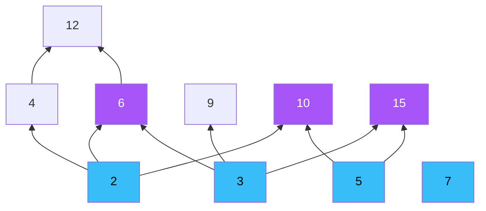
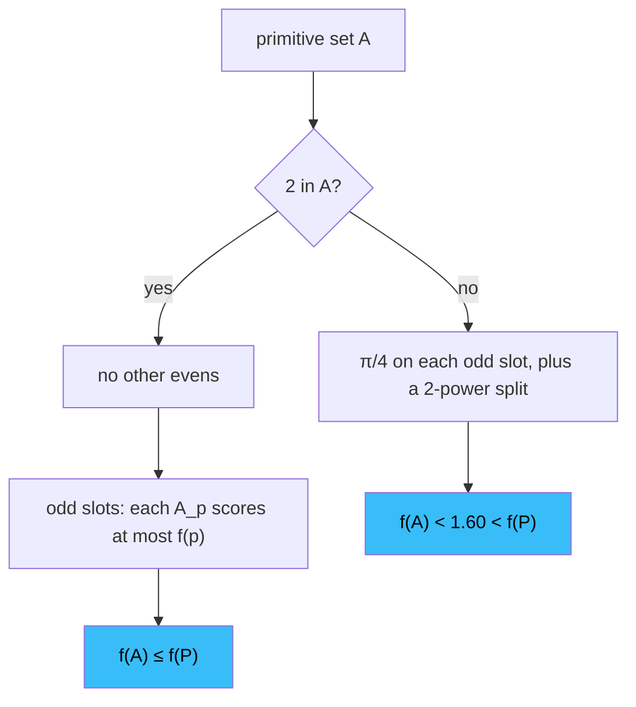

Every integer greater than $1$ factors uniquely into primes. That is the uniqueness theorem from a first algebra course. Here is a stranger one, about the primes as a *set*.

Take any collection of integers greater than $1$ in which no element divides another. Weigh each integer $a$ by $1/(a\log a)$. Among all such collections, finite or infinite, **the primes are the heaviest.**

That is the Erdős primitive set conjecture, in print by 1974, proved by Jared Duker Lichtman in 2022. The [paper is here](https://arxiv.org/abs/2202.02384). I first met the statement in locked-down Boston and was sure it had to be true. What follows is a walk from "what does divide mean?" to the $\pi/4$ that finishes the argument. Every term is defined before it is used. The published paper has extra numerical bounds for small primes and a separate estimate for the prime $2$; we will say exactly where those enter, and we will not pretend the napkin is the paper.

The calculus we need is substitution in integrals, the chain rule, and one named derivative: $\frac{d}{du}\arctan u = \frac{1}{1+u^2}$, with $\arctan 1 = \pi/4$. Throughout, $\log$ means the natural logarithm (what a calculus book calls $\ln$). So $\log e = 1$, and $\log 8 = 3\log 2$.

- [Divisibility](#divisibility)
- [Primitive sets](#primitive-sets)
- [Infinite sums](#infinite-sums)
- [The scale $f(A)$](#the-scale-fa)
- [A private territory for each $a$](#a-private-territory-for-each-a)
- [The territories do not overlap](#the-territories-do-not-overlap)
- [Mertens' theorem, and a uniform bound](#mertens-theorem-and-a-uniform-bound)
- [Compete slot by slot](#compete-slot-by-slot)
- [How close to prime?](#how-close-to-prime)
- [Copies, and the $\sqrt{v}$ packing](#copies-and-the-sqrtv-packing)
- [Buckets, then $\pi/4$](#buckets-then-pi4)
- [Odd primes beat their own composites](#odd-primes-beat-their-own-composites)
- [The prime $2$](#the-prime-2)
- [Why $f(\mathcal{P})$ is finite](#why-fp-is-finite)
- [What is still open](#what-is-still-open)

---

# Divisibility
{: #divisibility}

We write $a \mid b$, read "$a$ divides $b$", when $b$ is an integer multiple of $a$: $b = ka$ for some integer $k$. So $3 \mid 12$ because $12 = 4\cdot 3$, and $5 \nmid 12$ because $12/5$ is not an integer. Every integer divides itself. The integer $1$ divides everything.

The **fundamental theorem of arithmetic** says that every integer $n > 1$ factors uniquely as a product of primes, up to order:

$$
n \;=\; p_1^{e_1} p_2^{e_2} \cdots p_r^{e_r}, \qquad p_1 < p_2 < \cdots < p_r.
$$

For $60 = 2^2 \cdot 3 \cdot 5$, the primes are $2, 3, 5$ with exponents $2, 1, 1$. Uniqueness is the whole point: there is no other way to write $60$ as a product of primes.

Three bookkeeping functions come from this factorization.

- $p(n)$ is the **smallest** prime factor of $n$. So $p(60) = 2$, $p(35) = 5$, and $p(7) = 7$.
- $P(n)$ is the **largest** prime factor of $n$. So $P(60) = 5$, $P(35) = 7$, and $P(7) = 7$. For a prime $q$ one has $p(q) = P(q) = q$.
- $\Omega(n)$ is the number of prime factors of $n$, **counted with repetition**. So $\Omega(60) = 2+1+1 = 4$, $\Omega(12) = \Omega(2^2\cdot 3) = 3$, and $\Omega(7) = 1$.

If $a$ divides $b$ and $a \neq b$, then $b = ac$ for some integer $c > 1$, so $\Omega(b) = \Omega(a) + \Omega(c) > \Omega(a)$. Dividing strictly increases the number of prime factors.

---

# Primitive sets
{: #primitive-sets}

> **Definition.** A set $A$ of integers greater than $1$ is **primitive** if no element of $A$ divides another element of $A$.

That is the whole definition. Draw the integers with an arrow from $a$ to $b$ whenever $a$ divides $b$ and $a \neq b$. A primitive set is a selection of dots with no arrow between any two of them.

**The primes** $\{2, 3, 5, 7, 11, \ldots\}$. The only positive divisors of a prime $p$ are $1$ and $p$, and $1$ is excluded from every primitive set. So no prime divides another prime.

**$\{6, 10, 15\}$.** Check every pair: $6 \nmid 10$, $6 \nmid 15$, $10 \nmid 15$, and the three reverse directions. Nothing divides anything else. (As factorizations: $2\cdot 3$, $2\cdot 5$, $3\cdot 5$. Each pair shares a prime, but neither number is a multiple of the other.)

**$\{6, 12, 15\}$** is not primitive, because $6 \mid 12$.

**All the integers in an interval $(x, 2x]$,** for any $x \ge 1$. If $a$ and $b$ both sit in $(x, 2x]$ and $a$ divides $b$ with $b \neq a$, then $b \ge 2a > 2x$, so $b$ has already left the interval.

**All integers with $\Omega(n) = k$,** for a fixed $k$. If $a$ divides $b$ and $a \neq b$, then $\Omega(b) > \Omega(a)$, so two numbers with the same $\Omega$ cannot divide one another. The primes are the case $k = 1$. The case $k = 2$ is the numbers with exactly two prime factors (repeats allowed): $\{4, 6, 9, 10, 14, 15, \ldots\}$.

**Even perfect numbers** $\{6, 28, 496, 8128, \ldots\}$. Each has the Euclid–Euler form $2^{p-1}(2^p-1)$ with $2^p-1$ itself prime, and these do not divide one another.

```mermaid
graph BT
    2 --> 4
    2 --> 6
    2 --> 10
    3 --> 6
    3 --> 9
    3 --> 15
    5 --> 10
    5 --> 15
    4 --> 12
    6 --> 12
    7["7"]
    style 2 fill:#38bdf8,color:#000
    style 3 fill:#38bdf8,color:#000
    style 5 fill:#38bdf8,color:#000
    style 7 fill:#38bdf8,color:#000
    style 6 fill:#a855f7,color:#fff
    style 10 fill:#a855f7,color:#fff
    style 15 fill:#a855f7,color:#fff
```

Blue nodes $\{2,3,5,7\}$: one primitive set. Purple nodes $\{6,10,15\}$: another. You cannot take both $6$ and $12$ --- there is an arrow between them.

## Why did anyone define this?

A number $n$ is **abundant** if its proper divisors (the positive divisors except $n$ itself) add up to more than $n$. For $12$, those divisors are $1, 2, 3, 4, 6$, summing to $16 > 12$, so $12$ is abundant. A number is **perfect** if they add up to exactly $n$ (so $6 = 1+2+3$), and **deficient** otherwise. **Non-deficient** means abundant or perfect.

Davenport proved in the 1930s that the abundant numbers occupy a positive proportion of the integers. The original proof was analytic and heavy. Erdős found a shortcut: it is enough to understand the *primitive* non-deficient numbers --- those that are not multiples of a smaller non-deficient number. Every non-deficient number is a multiple of one of those, so the primitive ones control the whole set.

Once the definition was on the table, it was more interesting than the application. Classic Erdős. The question became: among all primitive sets, which one is the "largest"?

Largest in what sense is the next section but one. Counting how many elements you have, or what proportion of the integers they occupy, is the wrong scale. A long interval $(x, 2x]$ is primitive and, at that moment, occupies about half the integers up to $2x$. Besicovitch showed that by placing such intervals farther and farther out you can make the *upper* density of a primitive set arbitrarily close to $1/2$. Behrend and Erdős showed that the *lower* density is always $0$. Density oscillates too wildly to pick a winner. We need a scale that notices small integers more than large ones, and that stays finite even for infinite sets.

---

# Infinite sums
{: #infinite-sums}

We will compare primitive sets by adding infinitely many positive numbers. Two facts from calculus, and two applications, are the entire analytic toolkit.

**The harmonic series diverges.** Group the terms of $\sum 1/n$ into blocks whose lengths are powers of two:

$$
1 + \frac12 + \underbrace{\Bigl(\frac13+\frac14\Bigr)}_{\ge \frac12} + \underbrace{\Bigl(\frac15+\cdots+\frac18\Bigr)}_{\ge \frac12} + \underbrace{\Bigl(\frac19+\cdots+\frac1{16}\Bigr)}_{\ge \frac12} + \cdots.
$$

There are infinitely many blocks, each at least $1/2$, so the sum is infinite. We write $\sum 1/n = \infty$.

**The integral test.** If $g(x)$ is positive and decreasing, the series $\sum_{n \ge N} g(n)$ and the integral $\int_N^\infty g(x)\,dx$ either both settle to a finite number or both run off to infinity. The picture is that the sum is a staircase of rectangles of height $g(n)$ and width $1$, and the integral is the area under the curve, which sandwiches the staircase.

Two integrals we will use. Substitute $u = \log x$, so $du = dx/x$:

$$
\int_3^{\infty} \frac{dx}{x\log x} \;=\; \int_{\log 3}^{\infty} \frac{du}{u} \;=\; \infty,
$$

$$
\int_3^{\infty} \frac{dx}{x(\log x)^2} \;=\; \int_{\log 3}^{\infty} \frac{du}{u^2} \;=\; \frac{1}{\log 3} \;<\; \infty.
$$

So $\sum 1/(n\log n)$ diverges, and $\sum 1/(n(\log n)^2)$ converges. One extra $\log$ in the denominator is the difference between "infinite" and "finite." That borderline is where the whole subject lives.

A word on notation: we write $g(x) \sim h(x)$ to mean $g(x)/h(x) \to 1$ as $x \to \infty$. The two sides become indistinguishable as a percentage, even if they still differ by a large number.

---

# The scale $f(A)$
{: #the-scale-fa}

For a set $A$ of integers greater than $1$, define

$$
f(A) \;=\; \sum_{a \in A} \frac{1}{a \log a}.
$$

This is the Erdős sum. Each integer $a$ is given a positive weight that gets smaller as $a$ gets larger, but slowly.

**A small set, computed by hand.** For $A = \{6, 10, 15\}$:

$$
\log 6 \approx 1.792, \quad 6\log 6 \approx 10.75, \quad \frac{1}{6\log 6} \approx 0.093,
$$
$$
\log 10 \approx 2.303, \quad \frac{1}{10\log 10} \approx 0.043, \qquad \log 15 \approx 2.708, \quad \frac{1}{15\log 15} \approx 0.025.
$$

So $f(\{6,10,15\}) \approx 0.161$. Tiny.

**The primes, the first few terms.** Write $\mathcal{P}$ for the set of all primes, and $f(p)$ as shorthand for $1/(p\log p)$.

| $p$ | $f(p) = 1/(p\log p)$ | running sum |
|-----|----------------------|-------------|
| $2$ | $0.7213$ | $0.7213$ |
| $3$ | $0.3034$ | $1.0248$ |
| $5$ | $0.1243$ | $1.1490$ |
| $7$ | $0.0734$ | $1.2224$ |
| $11$ | $0.0379$ | $1.2604$ |
| $13$ | $0.0300$ | $1.2903$ |
| $17$ | $0.0208$ | $1.3111$ |
| $19$ | $0.0179$ | $1.3290$ |

The first two primes already contribute more than $1$. Henri Cohen computed the full sum:

$$
f(\mathcal{P}) \;=\; 1.6366\ldots
$$

(That the infinite sum settles at all is not obvious. We will prove it at the end, using that the $n$th prime is about $n\log n$. For now, the table plus Cohen's computation is the score to beat.)

> **Theorem (Lichtman, 2022).** For every primitive set $A$,
> $$ f(A) \;\le\; f(\mathcal{P}) \;=\; 1.6366\ldots $$

Why this weight, and not another?

- Weighing by $1/a$ makes the primes score $\sum 1/p = \infty$. The numbers with $\Omega(n) = k$ score infinity too. The scale cannot tell the contestants apart.
- Weighing by $1/a^2$ makes everything converge too easily. The primes score only $\sum_p 1/p^2 \approx 0.452$, and a pile of small composites can compete. The scale no longer sees the primes as special.
- Weighing by $1/(a(\log a)^2)$ still lets the primes converge, but it over-penalizes the small integers, which are exactly the ones that should matter.

The weight $1/(a\log a)$ sits on the knife-edge from the last section: $\sum_n 1/(n\log n)$ diverges, while $\sum_p 1/(p\log p)$ converges. The scale is sensitive enough to see the primes as a finite budget, but not so harsh that composites become irrelevant.

There is also a calculus identity behind the weight. For any $a \ge 2$,

$$
\int_1^{\infty} a^{-t}\,dt \;=\; \frac{1}{a\log a}.
$$

To see it, write $a^{-t} = e^{-t\log a}$ and substitute $u = t\log a$, so $du = \log a\, dt$:

$$
\int_1^{\infty} e^{-t\log a}\,dt \;=\; \frac{1}{\log a} \int_{\log a}^{\infty} e^{-u}\,du \;=\; \frac{1}{\log a}\cdot e^{-\log a} \;=\; \frac{1}{a\log a}.
$$

We will not need this identity for the proof. It is here because it is where the weight comes from, and because it explains a warning: if you ask for the stronger comparison $\sum_{a \in A} a^{-t} \le \sum_p p^{-t}$ at *every* $t > 1$, the answer is no. That holds only for $t \ge \tau \approx 1.1403$. Shift the original weight slightly to $1/(a(\log a+h))$ and the primes stop winning as soon as $h \ge 1.04$. The theorem, once proved, is only just true.

Before asking which primitive set is heaviest, you need to know that every primitive set has a finite score, bounded by a constant that does not depend on the set. That is Erdős 1935, and it is where the machinery of the later proof begins.

---

# A private territory for each $a$
{: #a-private-territory-for-each-a}

The idea is to give each $a$ in a primitive set a block of integers that nobody else in the set is allowed to claim, then see that the blocks cannot cover more than the whole number line.

For each integer $a \ge 2$, define the **L-multiples** of $a$ by

$$
L_a \;=\; \bigl\{ a\cdot b \,:\, b \ge 1,\; \text{every prime factor of } b \text{ is at least } P(a) \bigr\}.
$$

In words: start with $a$, and multiply by integers built only from primes $\ge$ the largest prime factor of $a$. The letter L alludes to *lexicographic*. Write the prime factorization of $n$ in nondecreasing order. Then $n$ is an L-multiple of $a$ when that factorization *starts with* the factorization of $a$, and continues with primes $\ge P(a)$.

**Example: $a = 6$.** Here $6 = 2\cdot 3$, so $P(6) = 3$. Then $L_6$ is $6$ times any integer built from primes $\ge 3$:

$$
L_6 \;=\; \{6,\; 18,\; 30,\; 42,\; 54,\; 66,\; 90,\; \ldots\}.
$$

The number $12 = 6\cdot 2$ is *not* in $L_6$, because $2 < 3$. In nondecreasing factorization, $12 = 2\cdot 2\cdot 3$ does not start with $2\cdot 3$.

**Example: a prime $p$.** Here $P(p) = p$, so $L_p$ is $p$ times any integer built from primes $\ge p$. Equivalently: $L_p$ is the set of integers whose *smallest* prime factor is $p$. Thus $L_2$ is the even numbers, $L_3$ is $\{3, 9, 15, 21, 27, 33, \ldots\}$, $L_5$ is $\{5, 25, 35, 55, \ldots\}$, and so on. Every integer $n \ge 2$ has a unique smallest prime factor, so the sets $L_p$, as $p$ runs over the primes, split the integers $\ge 2$ into disjoint pieces whose union is everything except $1$.

## Density

The **natural density** of a set $S$ of positive integers, when the limit exists, is the proportion of integers that lie in $S$:

$$
d(S) \;=\; \lim_{N \to \infty} \frac{\text{how many elements of } S \text{ are } \le N}{N}.
$$

The even numbers have density $1/2$: among $1, 2, \ldots, N$, about half are even. The multiples of $a$ have density $1/a$.

For $L_a$, a number $n$ lies in $L_a$ when $a$ divides $n$ *and* the cofactor $n/a$ is not divisible by any prime smaller than $P(a)$. So we need two things: "multiple of $a$", which has density $1/a$, and "avoids the primes $< P(a)$."

Why is the proportion of integers not divisible by any prime in a list $q_1, \ldots, q_k$ equal to $\prod_i (1-1/q_i)$? For one prime, the proportion not divisible by $2$ is $1-1/2$. For two primes, inclusion-exclusion:

$$
1 - \frac12 - \frac13 + \frac16 \;=\; \frac13 \;=\; \Bigl(1-\frac12\Bigr)\Bigl(1-\frac13\Bigr).
$$

The same pattern continues for any finite list (the sieve of Eratosthenes): the events "divisible by $q$" for distinct primes $q$ multiply, because a number is divisible by $q$ and $q'$ if and only if it is divisible by $qq'$. Hence

$$
d(L_a) \;=\; \frac{1}{a} \prod_{q < P(a)}\Bigl(1 - \frac{1}{q}\Bigr).
$$

**Check: $a = 6$.** The only prime $< P(6) = 3$ is $2$, so $d(L_6) = \frac16 \cdot \bigl(1-\frac12\bigr) = \frac1{12}$. Among $1, \ldots, 60$, the set $L_6$ is $\{6, 18, 30, 42, 54\}$, five numbers, and $60/12 = 5$.

**Check: a prime $p$.** Then $d(L_p) = \frac1p \prod_{q < p}(1-1/q)$, which is the proportion of integers with smallest prime factor $p$. For $p = 2$, the product is empty. An empty product equals $1$ (the same way an empty sum equals $0$), so $d(L_2) = 1/2$, matching "the even numbers."

---

# The territories do not overlap
{: #the-territories-do-not-overlap}

> **Disjointness lemma.** If $A$ is primitive, then the sets $L_a$ for $a \in A$ are pairwise disjoint.

Before the proof, a picture of what the lemma is saying. Take $n = 90$. Is $90$ in two different $L$-sets of a primitive pair?

- $90 = 6 \cdot 15$ and $15 = 3\cdot 5$, all of whose primes are $\ge P(6) = 3$. So $90 \in L_6$.
- $90 = 10 \cdot 9$ and $9 = 3^2$, but $3 < P(10) = 5$. So $90 \notin L_{10}$.
- $90 = 18 \cdot 5$ and $5 \ge P(18) = 3$. So $90 \in L_{18}$.

Thus $90 \in L_6 \cap L_{18}$. But $\{6, 18\}$ is *not* primitive, because $6 \mid 18$. The lemma says this is the only way two $L$-sets can meet: one of the two generators must divide the other.

**Proof.** Suppose $n \in L_a \cap L_{a'}$ with $a \neq a'$ both in $A$. Write $n = a\cdot s = a'\cdot s'$, where every prime factor of $s$ is $\ge P(a)$ and every prime factor of $s'$ is $\ge P(a')$. Swap names if needed so that $P(a) \le P(a')$.

If $s' = 1$, then $n = a'$, so $a$ divides $a'$, contradicting primitivity.

Now suppose $s' > 1$. Every prime factor of $a$ is $\le P(a) \le P(a')$, and every prime factor of $s'$ is $\ge P(a')$.

- If $P(a) < P(a')$, these two ranges of primes do not overlap. So $a$ and $s'$ share no prime factors: $\gcd(a, s') = 1$. But $a$ divides $a s = a' s'$. An integer that divides a product and is coprime to one factor must divide the other factor, so $a$ divides $a'$. Contradiction.
- If $P(a) = P(a') = p$, write $a = p^{\alpha} m$ and $a' = p^{\beta} m'$ with $p$ dividing neither $m$ nor $m'$. Then $m$ and $m'$ are built from primes $< p$, while $s$ and $s'$ are built from primes $\ge p$. From $p^{\alpha} m s = p^{\beta} m' s'$ we get that $m$ divides $m' s'$. But $m$ shares no primes with $s'$, so $m$ divides $m'$. The same argument the other way gives $m'$ divides $m$. Thus $m = m'$, and $a, a'$ are $p^{\alpha} m$ and $p^{\beta} m$: the one with the smaller exponent divides the other. Contradiction.

So no such $n$ exists.

The argument used only finite arithmetic --- unique factorization and Euclid's lemma --- not density, not primes being infinite, nothing. It is the engine of everything that follows.

Because the $L_a$ are disjoint, they cannot cover more than the whole number line. A catch: natural density is not a measure, so we cannot blindly add infinitely many densities. We do not need to. For any *finite* subcollection of $A$, the corresponding $L_a$ are disjoint, the density of their union is the sum of their densities, and a subset of the integers cannot have density greater than $1$. Every finite sum of the $d(L_a)$ is therefore $\le 1$, and so the infinite sum is $\le 1$ as well:

$$
\sum_{a \in A} d(L_a) \;=\; \sum_{a \in A} \frac{1}{a} \prod_{q < P(a)}\Bigl(1 - \frac{1}{q}\Bigr) \;\le\; 1.
$$

This is a **budget**. Each $a \in A$ spends $d(L_a)$ of a total of at most $1$.

---

# Mertens' theorem, and a uniform bound
{: #mertens-theorem-and-a-uniform-bound}

Mertens proved in 1874 that

$$
\prod_{q \le x} \Bigl(1 - \frac{1}{q}\Bigr) \;\sim\; \frac{e^{-\gamma}}{\log x}.
$$

Here $\gamma = 0.57721\ldots$ is the Euler–Mascheroni constant

$$
\gamma \;=\; \lim_{N \to \infty} \Bigl( \sum_{n=1}^{N} \frac{1}{n} - \log N \Bigr),
$$

and $e^{\gamma} \approx 1.781$. We take Mertens as a named fact: sieving out the primes up to $x$ leaves a proportion about $e^{-\gamma}/\log x$ of the integers. (The harmonic sum and $\log N$ differ by $\gamma$ in the limit; Mertens is the prime-sieve version of that gap.)

Apply this with $x = P(a)$. The off-by-one between "primes $< P(a)$" and "primes $\le P(a)$" is absorbed in the $\sim$, and we get

$$
d(L_a) \;\sim\; \frac{e^{-\gamma}}{a \log P(a)},
$$

or, rearranged,

$$
\frac{1}{a \log P(a)} \;\sim\; e^{\gamma}\, d(L_a).
$$

Always $P(a) \le a$, so $\log P(a) \le \log a$, so $1/(a\log a) \le 1/(a\log P(a))$. Combining,

$$
\frac{1}{a\log a} \;\le\; \frac{1}{a\log P(a)} \;\approx\; e^{\gamma}\, d(L_a).
$$

Sum over $A$ and use the budget:

$$
f(A) \;\approx\text{at most}\; e^{\gamma} \sum_{a \in A} d(L_a) \;\le\; e^{\gamma} \cdot 1 \;=\; e^{\gamma} \approx 1.781.
$$

Lichtman and Pomerance (2019) turn the $\approx$ into a strict inequality $f(A) < e^{\gamma}$, by using explicit numerical bounds on Mertens' product in place of the $\sim$, and by using that a composite $a$ satisfies $a \ge 2P(a)$, so $\log a$ is a little larger than $\log P(a)$.

> **Theorem (Erdős 1935; Lichtman–Pomerance 2019).** For every primitive set $A$, $f(A) < e^{\gamma} = 1.781\ldots$

The primes score $1.6366$. The bound $1.781$ is about $9\%$ too large. That gap is the remaining problem.

Look back at the inequality $1/(a\log a) \le 1/(a\log P(a))$. This is an **equality** when $a$ is prime ($P(a) = a$), and a **loss** when $a$ is composite ($P(a) < a$). The 1935 argument treats every integer as if it were a prime. Lichtman's idea is to charge composites for that loss --- and to prove they cannot dodge the charge by clustering just below the primes.

---

# Compete slot by slot
{: #compete-slot-by-slot}

The weight is front-loaded:

$$
f(2) = 0.721, \qquad f(3) = 0.303, \qquad f(5) = 0.124, \qquad f(6) = 0.093.
$$

If you put $6$ in a primitive set, you cannot also put $2$ or $3$. Starting from the primes and making that trade produces the primitive set $\{6\} \cup \{p : p \neq 2, 3\}$, with score

$$
f(\mathcal{P}) - f(2) - f(3) + f(6) \;=\; f(\mathcal{P}) - 0.931.
$$

You sold the two heaviest elements in the store for pocket change. Any one-for-one substitution of a composite $a$ for the primes dividing $a$ looks like a bad deal. The conjecture says there is no clever *infinite* combination of such trades that comes out ahead.

The right way to organise the comparison is not globally but **slot by slot**. Every integer $a > 1$ has a smallest prime factor $p(a)$. Split any set $A$ by that prime:

$$
A_p \;=\; \{ a \in A : p(a) = p \}, \qquad A \;=\; \text{the disjoint union of the } A_p.
$$

Then $f(A) = \sum_p f(A_p)$, because the blocks $A_p$ do not overlap. The conjecture would follow if, for every prime $p$ and every primitive $A$,

$$
f(A_p) \;\le\; f(p) \;=\; \frac{1}{p\log p}.
$$

In English: in the slot of numbers whose smallest prime factor is $p$, the single best choice is to take $\{p\}$ itself, not a primitive bunch of composites all divisible by $p$. A prime $p$ with this property (for every primitive $A$) is called **Erdős-strong**. If every prime were Erdős-strong, the primes would win.

Here is a sufficient condition, from the 2019 bound. For $a \in A_p$ one has $p(a) = p$, so $a \in L_p$, and therefore $L_a \subset L_p$. By disjointness, $\sum_{a \in A_p} d(L_a) \le d(L_p)$. Combining with $f(a) \approx\text{at most } e^{\gamma}\, d(L_a)$,

$$
f(A_p) \;\approx\text{at most}\; e^{\gamma}\, d(L_p) \;=\; e^{\gamma} \cdot \frac{1}{p} \prod_{q < p}\Bigl(1 - \frac{1}{q}\Bigr).
$$

We want this $\le 1/(p\log p)$. Cancel $1/p$: it is enough that

$$
e^{\gamma} \prod_{q < p}\Bigl(1 - \frac{1}{q}\Bigr) \;\le\; \frac{1}{\log p}. \tag{$\star$}
$$

Mertens says the two sides of $(\star)$ are *asymptotically equal*. Direct computation shows that $(\star)$ holds for the first $10^8$ odd primes. For $p = 3$ it is already tight: the left side is $\approx 0.891$ and the right side is $1/\log 3 \approx 0.910$.

It **fails for $p = 2$**. The product over primes $q < 2$ is empty, hence equals $1$, and

$$
e^{\gamma} \approx 1.781 \qquad\text{while}\qquad \frac{1}{\log 2} \approx 1.443.
$$

Worse: even among odd primes, $(\star)$ is not a theorem. It fails for infinitely many primes (and, on the Riemann hypothesis, for a positive proportion of them). The strategy "prove every prime is Erdős-strong via $(\star)$" cannot finish the conjecture. That is why the problem sat open.

The missing idea is to stop treating composites as if they were primes.

---

# How close to prime?
{: #how-close-to-prime}

The loss in the 1935 argument, for a single $a$, is the ratio $\log P(a)/\log a \le 1$. Define

$$
v(a) \;=\; \frac{\log a}{\log P(a)} - 1 \;\ge\; 0.
$$

Then $v(a) = 0$ if and only if $P(a) = a$, if and only if $a$ is prime. Rearranging the definition,

$$
\frac{1}{a\log a} \;=\; \frac{1}{1+v(a)}\cdot \frac{1}{a\log P(a)} \;\approx\; \frac{e^{\gamma}}{1+v(a)}\, d(L_a).
$$

So $v(a)$ is the discount at which $a$ converts density into $f$-weight. Primes convert at full rate $e^{\gamma}$. A composite converts at rate $e^{\gamma}/(1+v(a))$.

Worked example: $a = 15 = 3\cdot 5$. Then $P(15) = 5$, and

$$
v(15) \;=\; \frac{\log 15}{\log 5} - 1 \;=\; \frac{2.708}{1.609} - 1 \;\approx\; 0.683, \qquad \frac{1}{1+v(15)} \;\approx\; 0.594.
$$

| $a$ | factorization | $P(a)$ | $v(a)$ | conversion $1/(1+v)$ |
|-----|----------------|--------|--------|----------------------|
| $7$ | $7$ | $7$ | $0$ | $1$ |
| $14$ | $2\cdot 7$ | $7$ | $0.356$ | $0.738$ |
| $22$ | $2\cdot 11$ | $11$ | $0.289$ | $0.776$ |
| $15$ | $3\cdot 5$ | $5$ | $0.683$ | $0.594$ |
| $6$ | $2\cdot 3$ | $3$ | $0.631$ | $0.613$ |
| $9$ | $3^2$ | $3$ | $1$ | $1/2$ |
| $221$ | $13\cdot 17$ | $17$ | $0.905$ | $0.525$ |

Read the table against the 1935 loss. The **dangerous** composites are those with *small* $v$: a large prime times a small factor. For $a = 2p$,

$$
v(2p) \;=\; \frac{\log 2}{\log p} \;\longrightarrow\; 0 \quad\text{as } p \to \infty.
$$

So $2p$ looks almost like a prime to the 1935 bound: $P(2p) = p$ is a little more than half of $2p$, and the conversion rate tends to $1$. Numbers such as $9$ and $13\cdot 17$ are *very* composite in this sense ($P(a)^2 \approx a$, so $v \approx 1$) and convert at half rate or worse. They are no threat: even if they spent the whole density budget they would score at most $e^{\gamma}/2 \approx 0.89$, well below $f(\mathcal{P})$.

Lichtman's outline says the same thing in the other direction: the 1935 argument already saves a lot when $P(a)^2 < a$. The **critical case** is a composite with $P(a)$ close to $a$ in size --- a large prime with a small factor stuck on.

The remaining question: can a primitive set contain *many* dangerous (small-$v$) composites in the same slot? If it can fill the whole density of $L_p$ with $v \approx 0.01$ composites, the 1935 bound barely improves and $(\star)$ is still the bottleneck. If it cannot, we win.

---

# Copies, and the $\sqrt{v}$ packing
{: #copies-and-the-sqrtv-packing}

A baby version of the idea. Suppose you have some disjoint subsets of the integers, of total density $D$, and suppose you can also fit a second family of disjoint copies of those subsets, still disjoint from the first family. Then $2D \le 1$, so $D \le 1/2$. More copies, smaller $D$.

Lichtman produces many copies of each $L_a$, indexed by extra multipliers $c$, provided every $a$ in the set is uniformly $v$-close to being prime --- that is, $P(a)^{1+v} > a$, or equivalently $v(a) < v$. The copies live *inside* the ambient territory $L_n$ of the slot (for instance $L_p$ when we are competing with a prime $p$). That is the true statement, and it is local:

> **Proposition (Lichtman).** Let $A$ be primitive, let $n \notin A$, and suppose $P(a)^{1+v} > a$ for every $a$ in the slot $A_n$. Then
> $$ \sum_{a \in A_n} d(L_a) \;\le\; \sqrt{v}\cdot\bigl(1+o(1)\bigr)\cdot d(L_n). $$

For $v < 1$ this is strictly better than the trivial budget $\sum d(L_a) \le d(L_n)$. At $v = 1/4$ you may spend at most about half the slot; at $v = 1/100$, at most about a tenth. A primitive set cannot fill a slot with numbers that are all nearly prime.

Where does $\sqrt{v}$ come from? For each $a$, let $a^* = a/P(a)$ (so $a^*$ is $a$ with its largest prime stripped off), and let $Q = P(a^*)$ be the second-largest prime factor of $a$. The extra multipliers $c$ are the integers --- including $c = 1$ --- whose prime factors all lie in a window

$$
\bigl[Q,\; Q^{1/\sqrt{v}}\bigr).
$$

The one genuinely hard lemma in the paper, which we will not prove, is that the sets $L_{ac}$ ranging over $a \in A_n$ and over such $c$ remain pairwise disjoint, and all sit inside $L_n$, as long as $A$ is primitive and uniformly $v$-close. Primitivity is essential: the weaker "no one is an L-multiple of another" is enough for ordinary disjointness of the $L_a$, but not for the copies. (That is why the $e^{\gamma}$ bound is essentially sharp for that weaker class, while primitive sets can be pushed down to $f(\mathcal{P})$.)

Granting disjointness of the copies, their densities add, and cannot exceed $d(L_n)$. For each fixed $a$, the copy $L_{ac}$ is just $L_a$ scaled by $c$, so $d(L_{ac}) = d(L_a)/c$. The total copy-density attached to one $a$ is therefore $d(L_a)$ times $\sum 1/c$.

That sum is an Euler product. Unique factorization says every such $c$ is a product of primes from the window, so

$$
\sum_c \frac{1}{c} \;=\; \prod_{Q \le q < Q^{1/\sqrt{v}}} \Bigl(1 + \frac{1}{q} + \frac{1}{q^2} + \cdots\Bigr) \;=\; \prod_{Q \le q < Q^{1/\sqrt{v}}} \Bigl(1 - \frac{1}{q}\Bigr)^{-1},
$$

using the geometric series $1 + x + x^2 + \cdots = 1/(1-x)$ with $x = 1/q$. Mertens says $\prod_{q < x} (1-1/q)^{-1} \sim e^{\gamma} \log x$, so a product over a *range* is a **ratio of logarithms**:

$$
\frac{\log\bigl(Q^{1/\sqrt{v}}\bigr)}{\log Q} \;=\; \frac{1}{\sqrt{v}}.
$$

Each original $L_a$ therefore comes with about $1/\sqrt{v}$ times as much copy-density. All of those copies still sit inside $L_n$, so

$$
\frac{1}{\sqrt{v}} \sum_{a \in A_n} d(L_a) \;\lesssim\; d(L_n) \qquad\Longrightarrow\qquad \sum_{a \in A_n} d(L_a) \;\lesssim\; \sqrt{v}\; d(L_n).
$$

The exponent $1/\sqrt{v}$ on the window is the largest Lichtman could take and still prove the copies disjoint. A larger window would improve $\sqrt{v}$ to a smaller power of $v$, and would improve the $\pi/4$ in the next section.

When $v$ is small --- the dangerous $2p$ numbers --- the window $Q^{1/\sqrt{v}}$ is *large*, so there are many copies, so the original density is forced to be *small*. That is the packing constraint biting exactly on the critical case.

---

# Buckets, then $\pi/4$
{: #buckets-then-pi4}

We now have two functions of $v$, inside a fixed slot $A_n$ of composites:

- an element at level $v$ converts density to $f$-weight at rate about $e^{\gamma}/(1+v)$;
- all the elements with $v(a) < v$ together spend at most about $\sqrt{v}$ of the ambient density $d(L_n)$.

To bound the total $f$, split the composites into **buckets** by $v$, which is how the paper actually proceeds, and only then pass to an integral.

Pick a partition $0 = v_0 < v_1 < \cdots < v_k = 1$ of the interval $[0,1]$. Put in bucket $i$ those $a \in A_n$ with $v_i \le v(a) < v_{i+1}$. (Anything with $v(a) \ge 1$, i.e. $P(a)^2 \le a$, converts at rate $\le 1/2$ and can be lumped into the last bucket.) In bucket $i$,

$$
f(\text{bucket } i) \;\le\; \frac{e^{\gamma}}{1+v_i} \cdot d(\text{that bucket's $L$-sets}),
$$

because every element there has conversion rate $\le 1/(1+v_i)$. Write $d_i$ for that bucket's density. The packing constraint, applied to the union of the first $j$ buckets (the *closer-to-prime* elements), says

$$
d_0 + d_1 + \cdots + d_{j-1} \;\le\; \sqrt{v_j}\, d(L_n).
$$

The rates $1/(1+v_i)$ are *decreasing* in $i$: small $v$ is the high-value real estate. Given a decreasing sequence of rates and upper bounds on the *cumulative* densities, the most $f$ you can extract is by filling each cumulative budget as soon as it opens --- spend as much as you are allowed at the highest remaining rate. That worst case is $d_0 + \cdots + d_{j-1} = \sqrt{v_j}\, d(L_n)$, so the density of bucket $i$ is at most the newly unlocked packing room

$$
\bigl(\sqrt{v_{i+1}} - \sqrt{v_i}\bigr)\, d(L_n).
$$

Hence

$$
f(A_n) \;\le\; e^{\gamma}\, d(L_n) \sum_{i=0}^{k-1} \frac{\sqrt{v_{i+1}} - \sqrt{v_i}}{1+v_i}.
$$

This is a Riemann sum for an integral. Taking a finer and finer partition ($v_i = i/k$, then $k \to \infty$),

$$
\sum_{i} \frac{\sqrt{v_{i+1}} - \sqrt{v_i}}{1+v_i} \;\longrightarrow\; \int_0^1 \frac{1}{1+v}\cdot \frac{d}{dv}\bigl[\sqrt{v}\bigr]\, dv \;=\; \int_0^1 \frac{dv}{2\sqrt{v}\,(1+v)}.
$$

The derivative of $\sqrt{v}$ is $1/(2\sqrt{v})$: the extra packing room unlocked at level $v$ is $dv/(2\sqrt{v})$.

A coarse numerical check, four buckets, left endpoints:

| $v_i$ | $\sqrt{v_i}$ | $\sqrt{v_{i+1}}-\sqrt{v_i}$ | $1/(1+v_i)$ | product |
|------|-------------|------------------------------|-------------|---------|
| $0$ | $0$ | $0.500$ | $1$ | $0.500$ |
| $0.25$ | $0.500$ | $0.207$ | $0.800$ | $0.166$ |
| $0.50$ | $0.707$ | $0.159$ | $0.667$ | $0.106$ |
| $0.75$ | $0.866$ | $0.134$ | $0.571$ | $0.076$ |
| **sum** | | | | **$0.848$** |

The sum $0.848$ is a coarse overestimate of $\pi/4 \approx 0.785$, as a left Riemann sum on a decreasing integrand should be. Finer partitions close the gap.

Now the integral, by substitution. Set $u = \sqrt{v}$, so $v = u^2$ and $dv = 2u\, du$. The limits stay $0$ to $1$:

$$
\int_0^1 \frac{dv}{2\sqrt{v}\,(1+v)} \;=\; \int_0^1 \frac{2u\, du}{2u\,(1+u^2)} \;=\; \int_0^1 \frac{du}{1+u^2}.
$$

The antiderivative of $1/(1+u^2)$ is $\arctan u$. And $\arctan 1 = \pi/4$, because that is the angle whose tangent is $1$: a $45^\circ$ angle, a quarter of a half-turn. Also $\arctan 0 = 0$. So

$$
\boxed{\displaystyle \int_0^1 \frac{dv}{2\sqrt{v}\,(1+v)} \;=\; \frac{\pi}{4}}.
$$

The factor $\pi/4 \approx 0.785$ is the proportion of a full-rate $e^{\gamma}$ that a slot of composites can realize under the $\sqrt{v}$ constraint. In the envelope, a slot $A_n$ of composites scores at most about

$$
f(A_n) \;\le\; \frac{\pi}{4}\, e^{\gamma}\, d(L_n).
$$

That is the true output of the $\pi/4$ argument: a bound on a *slot of composites*, in terms of the density of the ambient territory $L_n$. It is not a global bound "$f(\text{all composites}) \le 1.399$." (That global-looking number $e^{\gamma}\pi/4 \approx 1.399$ does appear, as an upper bound on $f(A)$ for primitive sets of *large* elements. That is a different theorem, about tails.)

---

# Odd primes beat their own composites
{: #odd-primes-beat-their-own-composites}

Specialize to $n = p$, an odd prime, with $p \notin A$. Then $A_p$ is a primitive set of composites all having smallest prime factor $p$, and the ambient territory is $L_p$, with

$$
e^{\gamma}\, d(L_p) \;\approx\; f(p)
$$

by Mertens (this is the same comparison that produced $(\star)$). The $\pi/4$ bound becomes

$$
f(A_p) \;\le\; \frac{\pi}{4}\cdot\bigl(1+\text{a small Mertens error}\bigr)\cdot f(p).
$$

The error is tracked in the paper with explicit bounds on Mertens' product. The worst odd prime is $p = 3$, and even there the constant comes out strictly less than $0.901$. For larger odd primes it is better, and it tends to $\pi/4 \approx 0.785$ as $p \to \infty$. In all cases it is less than $1$:

> **Theorem (Lichtman, Theorem 1.3).** For every primitive set $A$ and every odd prime $p$,
> $$ f(A_p) \;\le\; f(p). $$
> If $p \notin A$, the inequality is strict: $f(A_p) < 0.901\, f(p)$.

In English: **you should never skip an odd prime in favour of composites with that smallest prime factor.** Skipping $p$ and filling the slot with $2p$, $3p$, $p^2$, products of larger primes, whatever primitive combination you like, returns less than $90\%$ of what $p$ itself was worth.

That is the true reason the primes win on the odd slots. The $\pi/4$ is a local comparison of composites to their parent prime, not a global score for "all the composites in $A$."

If $p \in A$, then primitivity forbids any other multiple of $p$ from joining $A$, so $A_p = \{p\}$ and $f(A_p) = f(p)$ on the nose.

---

# The prime $2$
{: #the-prime-2}

Every odd prime is Erdős-strong. The remaining slot is $p = 2$.

**If $2 \in A$**, then $A$ contains no other even number. The odd part of $A$ is a primitive set of odd numbers, and the odd-prime theorem gives $f(A_p) \le f(p)$ for every odd $p$. Adding $f(2)$ back, $f(A) \le f(\mathcal{P})$.

**If $2 \notin A$**, the criterion $(\star)$ fails and the constants around $\pi/4$ do not quite prove that $2$ is Erdős-strong. Lichtman splits $A$ by the exact power of $2$ dividing each element, applies the odd-prime bounds to the odd parts, and gets a global estimate $f(A) < 1.60 < f(\mathcal{P})$. The conjecture does not need $2$ to be Erdős-strong: when $2$ is missing, this direct bound already loses to the primes.

Whether $2$ itself is Erdős-strong --- whether some primitive set of even numbers, none of which is $2$, can score more than $f(2) \approx 0.721$ in the even slot --- was left open in 2022.

```mermaid
graph TD
    A["primitive set A"] --> B{"2 in A?"}
    B -->|"yes"| C["no other evens"]
    C --> D["odd slots: each A_p scores at most f(p)"]
    D --> E["f(A) ≤ f(P)"]
    B -->|"no"| F["π/4 on each odd slot, plus a 2-power split"]
    F --> G["f(A) < 1.60 < f(P)"]
    style E fill:#38bdf8,color:#000
    style G fill:#38bdf8,color:#000
```

The napkin is the $\pi/4$ on a slot of composites. The paper is the Mertens-error tracking that makes $0.901 < 1$ for every odd prime, and the separate $1.60$ when $2$ is missing.

---

# Why $f(\mathcal{P})$ is finite
{: #why-fp-is-finite}

We used $f(\mathcal{P}) = 1.6366\ldots$ as a finite number. Here is why the series converges.

The prime number theorem, taken as a named fact, says that the $n$th prime is $p_n \sim n\log n$. Then

$$
\frac{1}{p_n \log p_n} \;\sim\; \frac{1}{n\log n \cdot \log(n\log n)}.
$$

And $\log(n\log n) = \log n + \log\log n \sim \log n$, so

$$
\frac{1}{p_n \log p_n} \;\sim\; \frac{1}{n(\log n)^2}.
$$

We already know $\sum 1/(n(\log n)^2)$ converges, by the integral test in the infinite-sums section. A series of positive terms that behaves like a convergent series converges. So $\sum_p 1/(p\log p)$ converges.

The same integral explains the tail. The amount contributed by primes larger than $x$ is about $1/\log x$:

| primes up to | partial sum | gap to $1.6366$ | $1/\log x$ |
|-------------|-------------|-----------------|------------|
| $10^2$ | $1.4216$ | $0.215$ | $0.217$ |
| $10^4$ | $1.5282$ | $0.108$ | $0.109$ |
| $10^6$ | $1.5642$ | $0.072$ | $0.072$ |
| $10^8$ | $1.5823$ | $0.054$ | $0.054$ |

Each extra two orders of magnitude in the cutoff trims the gap by a factor of about $2/3$, not by an order of magnitude. That is what a $1/\log x$ tail looks like. It is also why the conjecture cannot be checked by adding up primitive sets until $10^{12}$ and comparing: the tail is large enough to hide a counterexample sitting out at infinity.

Where the sum sits among its neighbours:

| series | converges? | value / growth |
|--------|-----------|----------------|
| $\sum_p 1/p^2$ | yes | $0.4522\ldots$ |
| $\sum_p 1/(p\log p)$ | yes | $1.6366\ldots$ |
| $\sum_p 1/p$ | no | $\sim \log\log x$ |
| $\sum_n 1/(n\log n)$ | no | $\sim \log\log x$ |

The extra $\log$ in the denominator is not enough to make the sum over *all* integers converge. It *is* enough once you keep only the primes, because the primes themselves contribute another $1/\log n$ of sparsity. That second logarithm is a gift of the prime number theorem.

---

# What is still open
{: #what-is-still-open}

**Is $2$ Erdős-strong?** Lichtman proved every odd prime is. A negative answer would not have damaged the 2022 theorem --- the case $2 \notin A$ is already lost to $f(\mathcal{P})$ by the global bound $1.60$ --- but it would have meant that some primitive set of even numbers, none of which is $2$, scores more than $f(2) \approx 0.721$ in the even slot.

**The Erdős–Sárközy–Szemerédi tail conjecture (1968).** Restrict to primitive sets of *large* elements:

$$
\lim_{x \to \infty} \sup_{\substack{A \subset [x,\infty)\\ A \text{ primitive}}} f(A) \;\stackrel{?}{\le}\; 1.
$$

This is where $e^{\gamma}\pi/4 \approx 1.399$ appears as a theorem: Lichtman's method gives that upper bound on the lim-sup. The value $1$ is forced as a lower bound if the conjecture is true, because the set of integers with $\Omega(n) = k$ lives in $[2^k, \infty)$ and Lichtman had already proved that its Erdős sum tends to $1$ as $k \to \infty$.

A May 2026 preprint of Alexeev, Barreto, Li, Lichtman, Price, Shah, Tang, and Tao, [arXiv:2605.00301](https://arxiv.org/abs/2605.00301), claims both that $2$ is Erdős-strong and that the tail conjecture is true, by a different method. It is marked preliminary. The 2022 $\pi/4$ argument remains the one this post unpacks.

---

The theorem says something simple enough to tell after one semester: among all the ways to pick integers so that none divides another, the primes are the heaviest, when each integer $a$ is weighed by $1/(a\log a)$. The reason, on a napkin, is local. In the slot of numbers with smallest prime factor $p$, a composite converts density at a discount $1/(1+v)$, the dangerous nearly-prime composites cannot spend more than density $\sqrt{v}$ of the slot, and the integral of that tradeoff is a quarter-circle. For every odd prime, that is strictly worse than taking $p$ itself.

Cheers.

---

# Further reading

Jared Duker Lichtman, [A proof of the Erdős primitive set conjecture](https://arxiv.org/abs/2202.02384). *Forum of Mathematics, Pi* (2023). The paper. The envelope in this post is the argument of its introduction; the actual inequalities are in sections 2–4.

Boris Alexeev, Kevin Barreto, Yanyang Li, Jared Duker Lichtman, Liam Price, Jibran Iqbal Shah, Quanyu Tang, and Terence Tao, [Primitive sets and von Mangoldt chains](https://arxiv.org/abs/2605.00301). May 2026 preprint. A different method, claiming the tail conjecture and that $2$ is Erdős-strong.

Jared Duker Lichtman, [Almost primes and the Banks–Martin conjecture](https://arxiv.org/abs/1909.00804). Proves $f(\mathbb{N}_k) \to 1$.

Paul Erdős and András Sárközy, [On the divisibility of sequences of integers](https://users.renyi.hu/~p_erdos/1970-13.pdf). Source of the 1968 tail conjecture.

Tsz Ho Chan, Jared Duker Lichtman, and Carl Pomerance, [On the critical exponent for $k$-primitive sets](https://math.dartmouth.edu/~carlp/4695pomerance.pdf). Where $\tau = 1.1403\ldots$ comes from, and why the $t$-pointwise analogue of the conjecture fails.

Jared Duker Lichtman and Carl Pomerance, [The Erdős conjecture for primitive sets](https://arxiv.org/abs/1904.12226). The $e^{\gamma}$ bound.

Hugh L. Montgomery and Robert C. Vaughan, *Multiplicative Number Theory I: Classical Theory*. Cambridge, 2007. Mertens' theorems and the prime number theorem.

Quanta Magazine, [Graduate Student's Side Project Proves Prime Number Conjecture](https://www.quantamagazine.org/graduate-students-side-project-proves-prime-number-conjecture-20220606/). The human story of the proof.
