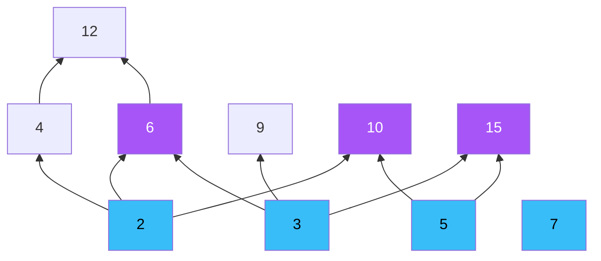

*Primitive Sets:* **I** · [II](/blog/2025/06/08/Back-of-the-Envelope-Primitive-Sets-Vol-II) · [III](/blog/2025/06/08/Back-of-the-Envelope-Primitive-Sets-Vol-III) · [IV](/blog/2025/06/08/Back-of-the-Envelope-Primitive-Sets-Vol-IV) · [V](/blog/2025/06/08/Back-of-the-Envelope-Primitive-Sets-Vol-V)



*A zero-to-hero guide to one theorem: among all sets of integers in which no element divides another, the primes are the heaviest. We start with the definition of "divides".*

Every integer greater than $1$ factors uniquely into primes. That is the uniqueness theorem from a first algebra course. Here is a stranger one, about the primes as a *set*.

Take any collection of integers greater than $1$ in which no element divides another. Weigh each integer $a$ by $1/(a\log a)$. Among all such collections, finite or infinite, **the primes are the heaviest.**

That is the Erdős primitive set conjecture, in print by 1974, proved by Jared Duker Lichtman in 2022. The [paper is here](https://arxiv.org/abs/2202.02384). I first met the statement in locked-down Boston and was sure it had to be true. This series is a walk from "what does divide mean?" to the $\pi/4$ that finishes the argument. Every term is defined before it is used. The published paper has extra numerical bounds for small primes and a separate estimate for the prime $2$; we will say exactly where those enter, and we will not pretend the napkin is the paper.

The calculus we need is substitution in integrals, the chain rule, and one named derivative: $\frac{d}{du}\arctan u = \frac{1}{1+u^2}$, with $\arctan 1 = \pi/4$. Throughout, $\log$ means the natural logarithm (what a calculus book calls $\ln$). So $\log e = 1$, and $\log 8 = 3\log 2$.

<table class="pv-tab">
  <thead><tr><th>Vol.</th><th>Topic</th><th>What it contributes to the proof</th></tr></thead>
  <tbody>
    <tr><td><strong>I</strong></td><td>No one divides another</td><td>Divisibility, unique factorization, primitive sets, and why counting or density cannot rank them.</td></tr>
    <tr><td><strong>II</strong></td><td>The Erdős sum</td><td>The scale $f(A)=\sum 1/(a\log a)$, why it sits on the knife-edge between finite and infinite, and why the primes score $1.6366$.</td></tr>
    <tr><td><strong>III</strong></td><td>Territories and the $e^\gamma$ bound</td><td>Each $a$ gets a private territory $L_a$. Primitivity makes them disjoint, a density budget of $1$, and Mertens turns the budget into $f(A)\lt e^\gamma\approx 1.781$.</td></tr>
    <tr><td><strong>IV</strong></td><td>Slots and the $\sqrt v$ packing</td><td>Compete prime by prime. Composites convert density at a discount $1/(1+v)$, and nearly-prime composites cannot fill more than $\sqrt v$ of a slot.</td></tr>
    <tr><td><strong>V</strong></td><td>The quarter-turn</td><td>Discount against packing integrates to $\pi/4$. Every odd prime beats its composites; the prime $2$ is handled separately; what is still open.</td></tr>
  </tbody>
</table>

<strong>Contents</strong>
<ol>
  <li><a href="#divisibility">divisibility</a></li>
  <li><a href="#primitive-sets">primitive sets</a></li>
  <li><a href="#why-did-anyone-define-this">why did anyone define this?</a></li>
  <li><a href="#the-wrong-rulers">the wrong rulers: counting and density</a></li>
  <li><a href="#where-this-goes">where this goes</a></li>
</ol>

---

# divisibility
{: #divisibility}

<strong>Definition (divides).</strong> For integers $a,b$ we write $a \mid b$, read "$a$ divides $b$", when $b$ is an integer multiple of $a$: $b = ka$ for some integer $k$.

So $3 \mid 12$ because $12 = 4\cdot 3$, and $5 \nmid 12$ because $12/5$ is not an integer. Every integer divides itself. The integer $1$ divides everything.

Divisibility is an *order*, not just a relation. It is reflexive ($a\mid a$), antisymmetric (for positive integers, $a\mid b$ and $b\mid a$ force $a=b$), and transitive ($a\mid b$ and $b\mid c$ give $a\mid c$, since $c = kb = k\ell a$). Unlike $\le$, it is only a *partial* order: neither $4\mid 6$ nor $6 \mid 4$. The whole subject lives in that gap.

The **greatest common divisor** $\gcd(a,b)$ is the largest positive integer that divides both $a$ and $b$. Two integers are **coprime** when $\gcd(a,b)=1$: they share no prime factor. So $\gcd(8,12)=4$ and $\gcd(8,15)=1$.

The **fundamental theorem of arithmetic** says that every integer $n > 1$ factors uniquely as a product of primes, up to order:

$$
n \;=\; p_1^{e_1} p_2^{e_2} \cdots p_r^{e_r}, \qquad p_1 < p_2 < \cdots < p_r.
$$

For $60 = 2^2 \cdot 3 \cdot 5$, the primes are $2, 3, 5$ with exponents $2, 1, 1$. Uniqueness is the whole point: there is no other way to write $60$ as a product of primes.

In the language of factorizations, $a \mid b$ says exactly this: every prime appears in $b$ with at least the exponent it has in $a$. So $12 = 2^2\cdot 3$ divides $60 = 2^2\cdot 3\cdot 5$, while $8 = 2^3$ does not, because $60$ only has $2^2$. Keep that picture. Every divisibility argument in this series is exponent bookkeeping.

Unique factorization gives a lemma we will need in [Vol. III](/blog/2025/06/08/Back-of-the-Envelope-Primitive-Sets-Vol-III), when two territories try to occupy the same integer.

<strong>Euclid's lemma.</strong> If $a$ divides a product $bc$ and $\gcd(a,b)=1$, then $a$ divides $c$.

**Proof.** Write $bc = ak$. Every prime in the factorization of $a$ appears on the left, hence in $b$ or in $c$. None of those primes appear in $b$, because $a$ and $b$ are coprime. So they all appear in $c$, with at least the same exponents. Thus $a$ divides $c$.

Three bookkeeping functions come from the factorization.

- $p(n)$ is the **smallest** prime factor of $n$. So $p(60) = 2$, $p(35) = 5$, and $p(7) = 7$.
- $P(n)$ is the **largest** prime factor of $n$. So $P(60) = 5$, $P(35) = 7$, and $P(7) = 7$. For a prime $q$ one has $p(q) = P(q) = q$.
- $\Omega(n)$ is the number of prime factors of $n$, **counted with repetition**. So $\Omega(60) = 2+1+1 = 4$, $\Omega(12) = \Omega(2^2\cdot 3) = 3$, and $\Omega(7) = 1$. (The twin function $\omega(n)$ counts *distinct* primes and is not used here: $\omega(12)=2$.)

If $a$ divides $b$ and $a \neq b$, then $b = ac$ for some integer $c > 1$, so $\Omega(b) = \Omega(a) + \Omega(c) > \Omega(a)$. **Dividing strictly increases the number of prime factors.** That one line produces an infinite family of examples in the next section.

The small letter $p(n)$ and the capital $P(n)$ will both matter. $p(n)$ sorts integers into *slots* in [Vol. IV](/blog/2025/06/08/Back-of-the-Envelope-Primitive-Sets-Vol-IV). $P(n)$ decides how far each integer's *territory* reaches in [Vol. III](/blog/2025/06/08/Back-of-the-Envelope-Primitive-Sets-Vol-III).

---

# primitive sets
{: #primitive-sets}

<strong>Definition.</strong> A set $A$ of integers greater than $1$ is <em>primitive</em> if no element of $A$ divides another element of $A$.

That is the whole definition. Draw the integers with an arrow from $a$ to $b$ whenever $a$ divides $b$ and $a \neq b$. A primitive set is a selection of dots with no arrow between any two of them. (In order-theory language: an *antichain* in the divisibility order.)

**The primes** $\lbrace 2, 3, 5, 7, 11, \ldots\rbrace$. The only positive divisors of a prime $p$ are $1$ and $p$, and $1$ is excluded from every primitive set. So no prime divides another prime.

**$\lbrace 6, 10, 15\rbrace$.** Check every pair: $6 \nmid 10$, $6 \nmid 15$, $10 \nmid 15$, and the three reverse directions. Nothing divides anything else. (As factorizations: $2\cdot 3$, $2\cdot 5$, $3\cdot 5$. Each pair shares a prime, but neither number is a multiple of the other.)

**$\lbrace 6, 12, 15\rbrace$** is not primitive, because $6 \mid 12$.

**All the integers in an interval $(x, 2x]$,** for any $x \ge 1$. If $a$ and $b$ both sit in $(x, 2x]$ and $a$ divides $b$ with $b \neq a$, then $b \ge 2a > 2x$, so $b$ has already left the interval.

**All integers with $\Omega(n) = k$,** for a fixed $k$. If $a$ divides $b$ and $a \neq b$, then $\Omega(b) > \Omega(a)$, so two numbers with the same $\Omega$ cannot divide one another. The primes are the case $k = 1$. The case $k = 2$ is the numbers with exactly two prime factors (repeats allowed): $\lbrace 4, 6, 9, 10, 14, 15, \ldots\rbrace$.

**Even perfect numbers** $\lbrace 6, 28, 496, 8128, \ldots\rbrace$. Each has the Euclid–Euler form $2^{p-1}(2^p-1)$ with $2^p-1$ itself prime. The odd parts $2^p-1$ and $2^q-1$ are distinct primes, so neither divides the other, and therefore these numbers do not divide one another.

```mermaid
graph BT
    2 --> 4
    2 --> 6
    2 --> 10
    3 --> 6
    3 --> 9
    3 --> 15
    5 --> 10
    5 --> 15
    4 --> 12
    6 --> 12
    7["7"]
    style 2 fill:#38bdf8,color:#000
    style 3 fill:#38bdf8,color:#000
    style 5 fill:#38bdf8,color:#000
    style 7 fill:#38bdf8,color:#000
    style 6 fill:#a855f7,color:#fff
    style 10 fill:#a855f7,color:#fff
    style 15 fill:#a855f7,color:#fff
```

Blue nodes $\lbrace 2,3,5,7\rbrace$: one primitive set. Purple nodes $\lbrace 6,10,15\rbrace$: another. You cannot take both $6$ and $12$ --- there is an arrow between them.

Build your own. Click integers to add or remove them. Any divisibility between two chosen numbers is drawn as an arrow, and the set is primitive exactly when there are none. The readout also shows the score $f(A)$ that [Vol. II](/blog/2025/06/08/Back-of-the-Envelope-Primitive-Sets-Vol-II) is about; for now, just notice how much the small numbers weigh.

  
Pick a set, look for arrows

  

  <svg id="pv-pick-svg" viewBox="0 0 640 276" role="img" aria-label="Grid of the integers 1 to 40; chosen numbers are highlighted and divisibilities between them drawn as arrows"></svg>
  

  

    <button type="button" data-s="primes">primes</button>
    <button type="button" data-s="61015">{6, 10, 15}</button>
    <button type="button" data-s="half">(20, 40]</button>
    <button type="button" data-s="om2">Ω = 2</button>
    <button type="button" data-s="clear">clear</button>
    <b style="background:#3987e5"></b>chosen<b style="background:#e5484d"></b>a divides b
  

Try trading the primes $2$ and $3$ for $6$: primitivity survives, and the score drops by more than $0.8$. That one-for-one trade looks like a bad deal. The theorem is that no infinite combination of such trades comes out ahead.

<strong>Student.</strong> Why is $1$ banned? It seems arbitrary.

<strong>Teacher.</strong> Two reasons, one structural and one numerical. Structurally, $1$ divides everything, so a primitive set containing $1$ is just $\lbrace 1\rbrace$ and the question dies. Numerically, the weight we will use is $1/(a\log a)$, and $\log 1 = 0$: the integer $1$ would weigh infinitely much.

<strong>Check yourself.</strong> Is $\lbrace 4, 6, 9, 10, 15, 25\rbrace$ primitive? How large can a primitive subset of $\lbrace 2,\ldots,20\rbrace$ be?

Yes: every element has $\Omega = 2$, so none divides another.

At most $10$, and $(10,20] = \lbrace 11,\ldots,20\rbrace$ achieves it. Why no more: write each integer as $2^k m$ with $m$ odd. There are only $10$ odd numbers $m \le 20$, so among any $11$ integers from $\lbrace 2,\ldots,20\rbrace$ two share the same odd part $m$. Those two are $2^j m$ and $2^k m$, and the one with the smaller power of $2$ divides the other. This is the pigeonhole principle, and the same argument shows a primitive subset of $\lbrace 1,\ldots,2n\rbrace$ has at most $n$ elements.

---

# why did anyone define this?
{: #why-did-anyone-define-this}

A number $n$ is **abundant** if its proper divisors (the positive divisors except $n$ itself) add up to more than $n$. For $12$, those divisors are $1, 2, 3, 4, 6$, summing to $16 > 12$, so $12$ is abundant. A number is **perfect** if they add up to exactly $n$ (so $6 = 1+2+3$), and **deficient** otherwise. **Non-deficient** means abundant or perfect.

Davenport proved in the 1930s that the abundant numbers occupy a positive proportion of the integers. The original proof was analytic and heavy. Erdős found a shortcut: it is enough to understand the *primitive* non-deficient numbers --- those that are not multiples of a smaller non-deficient number. Every non-deficient number is a multiple of one of those, so the primitive ones control the whole set. (A multiple of a non-deficient number is non-deficient: if $n \mid m$, the divisors $d$ of $n$ give divisors $dm/n$ of $m$, so the divisor sum of $m$ is at least $m/n$ times that of $n$.)

Once the definition was on the table, it was more interesting than the application. Classic Erdős. The question became: among all primitive sets, which one is the "largest"?

---

# the wrong rulers: counting and density
{: #the-wrong-rulers}

Largest in what sense? The first two rulers anyone reaches for both fail, and seeing *how* they fail tells you what the right ruler must look like.

<strong>Student.</strong> Isn't the largest primitive set just the one with the most elements?

<strong>Teacher.</strong> The primes are infinite. So are the numbers with $\Omega=2$, and with $\Omega = 3$, and so on. Counting says $\infty = \infty = \infty$ and ranks nothing. We need a ruler that sees how the elements are spread out, not just how many there are.

The natural next ruler is proportion. The **natural density** of a set $S$, when the limit exists, is

$$
d(S) \;=\; \lim_{N \to \infty} \frac{\#\{ n \in S : n \le N \}}{N}.
$$

The even numbers have density $1/2$. The multiples of $a$ have density $1/a$. The primes have density $0$ (they thin out like $1/\log N$, a fact from [Vol. II](/blog/2025/06/08/Back-of-the-Envelope-Primitive-Sets-Vol-II)). A single interval $(x,2x]$ is a *finite* set, so its density is $0$ --- it occupies about half the integers up to $2x$, and then as $N\to\infty$ it is diluted to nothing.

What one can do is string infinitely many such intervals together, with huge gaps between them. Pick $x_1 = 2$ and take $(2,4]$. Skip far enough that those two integers are a negligible fraction of the next $x_2$, then take $(x_2, 2x_2]$. Repeat. (The union is not automatically primitive; see the exercise below.) Two running proportions oscillate:

- **Upper density** is the $\limsup$ of the proportion up to $N$. At each $N = 2x_i$ you have just swallowed an interval of length $x_i$, so the proportion is close to $1/2$.
- **Lower density** is the $\liminf$. At each $N = x_{i+1}$, just before the next interval, you have diluted the previous harvest down toward $0$.

Besicovitch showed that by placing the intervals farther and farther out you can make the *upper* density of a primitive set arbitrarily close to $1/2$. Behrend and Erdős showed that the *lower* density is always $0$. Density oscillates too wildly to pick a winner.

<strong>Check yourself.</strong> Why isn't the naive union $(2,4] \cup (8,16]$ primitive, and what does Besicovitch have to do about it?

$3 \mid 12$ and $4 \mid 12$. An element of an early interval can divide an element of a later one, and spacing the intervals out does not stop that. The later intervals have to be thinned: discard their multiples of earlier elements, and choose the construction so that the discarded proportion is small. That thinning is why the upper density only approaches $1/2$, and never reaches it.

So the ruler must

1. notice small integers more than large ones (the primes are sparse, yet they should be able to win),
2. stay finite on infinite sets, so that different infinite primitive sets get different scores, and
3. be exactly as harsh as needed that *primitivity* is what keeps the score bounded.

---

# where this goes
{: #where-this-goes}

We have the objects: primitive sets, the antichains of divisibility. We have three bookkeeping functions, $p(n)$, $P(n)$, $\Omega(n)$, and Euclid's lemma. And we know counting and density are useless for ranking them.

[Vol. II](/blog/2025/06/08/Back-of-the-Envelope-Primitive-Sets-Vol-II) builds the ruler. It is a weighted sum, $f(A) = \sum_{a\in A} 1/(a\log a)$, and the weight is not arbitrary: it sits on the exact borderline between series that add up and series that run off to infinity.

---

**Next:** [Vol. II: The Erdős Sum](/blog/2025/06/08/Back-of-the-Envelope-Primitive-Sets-Vol-II)

*Primitive Sets:* **Vol. I** · [Vol. II](/blog/2025/06/08/Back-of-the-Envelope-Primitive-Sets-Vol-II) · [Vol. III](/blog/2025/06/08/Back-of-the-Envelope-Primitive-Sets-Vol-III) · [Vol. IV](/blog/2025/06/08/Back-of-the-Envelope-Primitive-Sets-Vol-IV) · [Vol. V](/blog/2025/06/08/Back-of-the-Envelope-Primitive-Sets-Vol-V)
