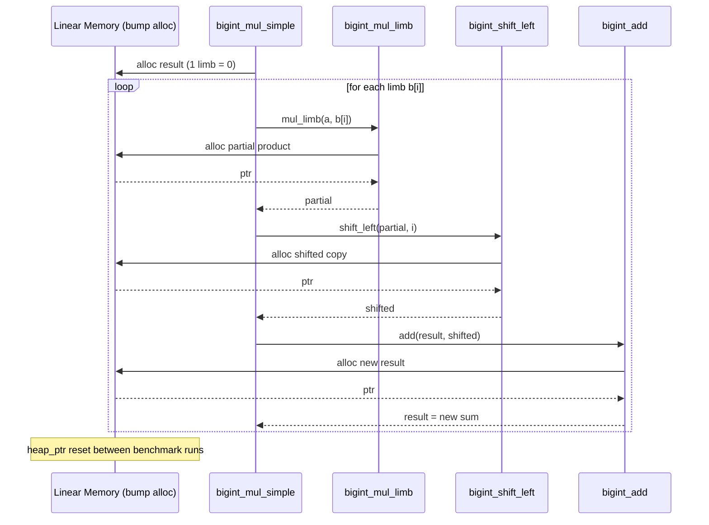
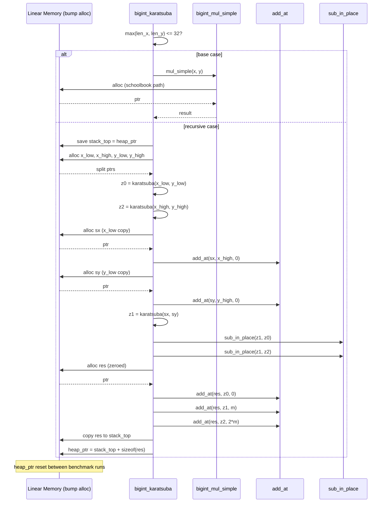

[View on GitHub](https://github.com/juleshenry/wasmatsuba)


A while back I wrote a [lengthy treatise on multiplication algorithms](/blog/2025/12/19/On-Multiplication), covering the whole arc from schoolbook to Karatsuba to Schönhage-Strassen to the galactic Harvey-Hoeven result. Theory is gorgeous. Theory is also cheap. I wanted to see the $O(N^{1.58})$ divergence with my own eyes, in a browser, in WebAssembly, beating on numbers until the asymptotic crossover revealed itself empirically.

So I sat down and wrote Karatsuba multiplication in WAT by hand. Yes, the WebAssembly Text Format. By hand. I do not recommend this. I do recommend the results.

The experiment was simple in conception:
1. Implement schoolbook $O(N^2)$ multiplication in WASM
2. Implement Karatsuba $O(N^{1.58})$ multiplication in WASM
3. Race both against native JavaScript BigInt
4. Sweep across power-of-two sizes and plot the log-log graph
5. Watch the curves diverge and feel something

I will tell you right now: JavaScript BigInt annihilates both WASM implementations. Absolutely destroys them. This is not a story of WASM supremacy. This is a story about proving a mathematical fact empirically, inside a sandbox, while the JIT-compiled C++ engine of V8 laps you like you are standing still. But the divergence between $O(N^2)$ and $O(N^{1.58})$? That is real, that is visible, and that is the point.

## The Repo

- `karatsuba/` — All WASM sources, binaries, and test harnesses.
- `karatsuba/test-bigint.js` — Node benchmark: JS BigInt vs WASM.
- `karatsuba/test-bigint.html` — Browser benchmark with parameter controls.
- `karatsuba/graph.html` + `karatsuba/graph.js` — Power-of-two size sweep and graph output (up to 1024 limbs).
- `karatsuba/karatsuba.wat` — The final consolidated Karatsuba implementation (WAT).
- `karatsuba/schoolbook.wat` — Baseline $O(N^2)$ schoolbook implementation (WAT).

## Design Choices, or, How to Lose Gracefully

### 1) Representation

Base: $2^{32}$ limbs (i32 words), little-endian. Layout in linear memory:

```
[len: i32, limb0: i32, limb1: i32, ...]
```

Why $2^{32}$? Because it matches native i32 ops and minimizes limb count versus base-10 splits. I briefly considered base-10 for "human readability" and then remembered nobody is reading raw WASM linear memory for fun. Well, almost nobody.

### 2) Memory Management

Here is where things get philosophical. WASM gives you linear memory. No GC. No malloc. No free. You are on your own, partner.

I went with a bump allocator. An exported global `heap_ptr` that only moves forward. You allocate by incrementing the pointer. You "free" by resetting it between benchmark runs. This is the memory management equivalent of never cleaning your apartment and instead moving to a new one every month.

Exported memory boundary: 2,000 pages (~128MB). Why so much? Karatsuba recurses. Karatsuba recurses a lot. Each level of recursion allocates temporaries for the split, the partial products, the sums, the differences. Without enough headroom, you OOM mid-recursion and the whole experiment dies unceremoniously. I learned this the hard way. Several times.

### 3) Core Ops

- `bigint_add` / `bigint_sub`: carry/borrow handled with i64 intermediates. Straightforward, boring, essential.
- `bigint_mul_simple`: schoolbook base case. The $O(N^2)$ workhorse.
- `bigint_karatsuba`: recursive split with three multiplications. The star of the show.

### 4) Threshold

Base case threshold = 8 limbs (256 bits). Below this, Karatsuba falls back to schoolbook. Why 8? Because the overhead of splitting, allocating temporaries, recursing, and recombining is not free. At small sizes the constant factors of the recursive approach absolutely murder you. 8 limbs was the empirical sweet spot. I tried 4 (too much recursion overhead), 16 (leaving performance on the table), and 32 (barely recursing at all). 8 it is.

## The Bump Allocator Saga

Both algorithms rely on WebAssembly's linear memory. To prevent Out of Memory errors during heavy recursive iterations, the benchmark suite leverages the bump allocator design. Memory is allocated forward during operations, and the `heap_ptr` is dynamically exported and reset between benchmark iterations.

This sounds clean. It is not.

### Schoolbook $O(N^2)$ — Memory Allocation

The schoolbook algorithm allocates aggressively across its iterations. For a 1024-limb BigInt, a single multiplication issues over 3000 bump allocations, inflating the heap pointer by roughly ~16.7MB per multiplication.

My God! 16.7 megabytes for one multiply! And you have to do it hundreds of times in a benchmark loop! This is why we reset the heap pointer between iterations. This is also why we need 128MB of linear memory.

```
bigint_mul_simple(a, b):
    result = alloc(0)                       # single-limb zero
    for i in 0..len(b):
        partial = bigint_mul_limb(a, b[i])  # alloc: N+1 limbs
        partial = bigint_shift_left(partial, i)  # alloc: N+1+i limbs
        result  = bigint_add(result, partial)    # alloc: new sum
    normalize(result)
    return result
```



Every single iteration of the inner loop allocates three new chunks. The old ones? Left behind. Orphaned. The bump allocator does not care about your feelings or your memory fragmentation. It marches forward until you tell it to go home.

### Karatsuba $O(N^{1.58})$ — Limb Split Logic

The Karatsuba approach trades raw arithmetic for recursive complexity. It splits the BigInt representations (stored as an array of 32-bit limbs) exactly in half, repeatedly chunking them until hitting the base case (where it defaults back to schoolbook).

The memory situation is, somehow, both better and worse. Better because the total asymptotic work is less. Worse because the recursion tree creates a stack of saved `heap_ptr` values, each level doing its own allocations, and the cleanup at the end involves copying the result back to the saved stack top and resetting. It is a manual stack discipline implemented via a global pointer. It is terrifying. It works.

```
bigint_karatsuba(x, y):
    if max(len(x), len(y)) <= 32:
        return bigint_mul_simple(x, y)      # base case

    stack_top = heap_ptr                     # save for cleanup
    m = (max(len(x), len(y)) + 1) / 2

    x_low, x_high = split(x, m)             # alloc + memory.copy
    y_low, y_high = split(y, m)             # alloc + memory.copy

    z0 = bigint_karatsuba(x_low, y_low)     # recurse
    z2 = bigint_karatsuba(x_high, y_high)   # recurse

    sx = x_low + x_high                     # alloc + add_at
    sy = y_low + y_high                     # alloc + add_at
    z1 = bigint_karatsuba(sx, sy)           # recurse
    z1 = z1 - z0 - z2                       # sub_in_place (in-place)

    res = alloc_zeroed(len(x) + len(y))
    add_at(res, z0, offset=0)               # in-place
    add_at(res, z1, offset=m)               # in-place
    add_at(res, z2, offset=2*m)             # in-place
    normalize(res)

    copy res -> stack_top                    # reclaim intermediates
    heap_ptr = stack_top + sizeof(res)
    return stack_top
```



Look at that diagram. Three recursive calls. Four splits. A manual stack save-and-restore. In-place subtraction to avoid yet more allocation. And at the end, the result gets `memory.copy`'d back to the saved stack top so that the parent call's heap pointer remains sane. This is systems programming in a language that was designed for compilers, not humans.

I wrote this by hand in WAT.

I digress.

## Running the Experiment

### 1) Node benchmark (fast sanity check)

```bash
cd karatsuba
node test-bigint.js
```

What you get:
- JS BigInt baseline time
- Correctness checks up to 10,000 digits
- Average execution time across JS, Schoolbook, and Karatsuba

### 2) Browser benchmark (interactive)

```bash
cd karatsuba
python3 -m http.server 8000
```

Open `http://localhost:8000/test-bigint.html`. Adjust `num_digits` (default 1000) and `iterations` (default 100). Watch the numbers scroll by. Feel the machine work.

### 3) Graph sweep (power-of-two sizes)

With the same server running, open `http://localhost:8000/graph.html`. This runs a log-log sweep from $2^1$ to $2^{10}$ limbs and dynamically renders the benchmark graph. This is where you see it. The schoolbook curve bending upward, the Karatsuba curve pulling away, the mathematical divergence between $N^2$ and $N^{1.58}$ made visible in your browser tab.

## On Results, and Humility

The mathematical divergence between $O(N^2)$ and $O(N^{1.58})$ is successfully proven locally in the WASM sandbox. You can see it. The log-log slopes are different. The curves separate. Karatsuba wins. The theory is correct.

And then you look at the JavaScript BigInt line and it is somewhere near the bottom of the graph, having finished its work before the WASM implementations even got warmed up. Native JavaScript BigInt leverages compiled C++ bindings, hardware carry flags, and dynamic FFT-based algorithms ($O(N \log N)$), ensuring it evaluates substantially faster than the sandboxed WASM implementations.

This is the Bitter Lesson applied to arithmetic. I hand-rolled an asymptotically superior algorithm in a portable bytecode format and it got bodied by V8's optimized native code path. The browser engine people have been at this for decades. They have SIMD. They have carry propagation in hardware. They have algorithms that switch strategies based on operand size at runtime.

What is even more funny? The whole point was never to beat BigInt. The point was to see two curves diverge on a log-log plot and know, viscerally, that Karatsuba's 1960 insight — that you can trade one multiplication for three additions — actually works. Not in a textbook. Not in a proof. In a browser. On your machine. Right now.

And it does.

Meticulosity is for chumps, but sometimes you write 2000 lines of WAT just to watch two curves separate on a graph.

Worth it.
