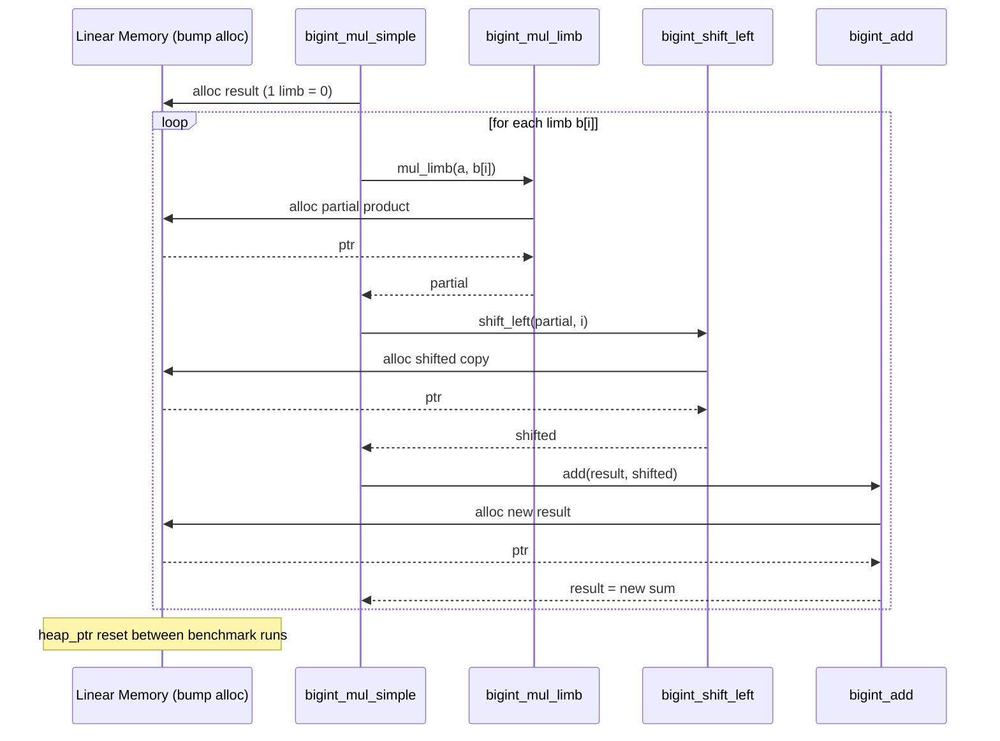
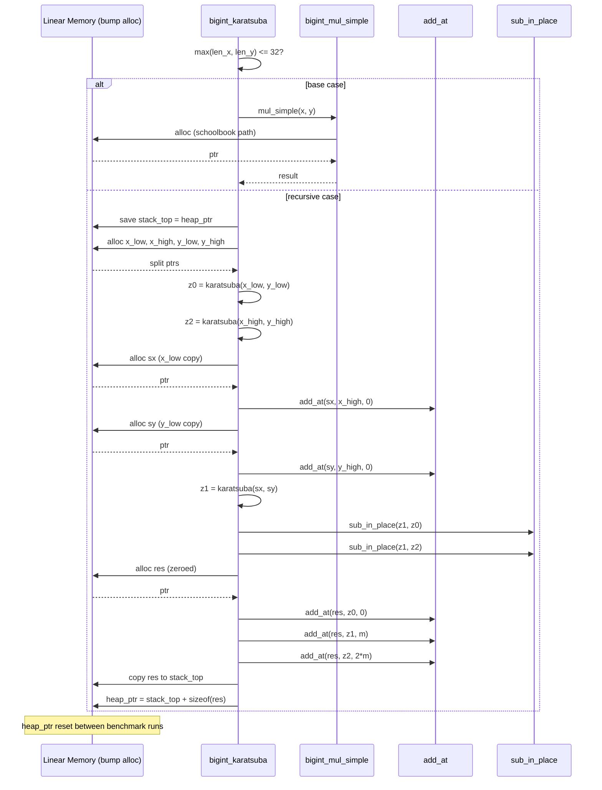

[View on GitHub](https://github.com/juleshenry/intersekt)

A while back I wrote a [four-volume treatise on multiplication algorithms](/blog/2025/12/19/On-Multiplication), covering the whole arc from schoolbook to Karatsuba to Schönhage-Strassen to the galactic Harvey-Hoeven result. Theory is gorgeous. Theory is also cheap. So I asked a concrete question: can hand-built WebAssembly multiply big integers faster than the JavaScript engine's own `BigInt`?

The answer is yes. But only one kind of WASM multiplier can do it: a **WebAssembly Fast Fourier Transform** (WASM FFT) multiply, running in WASM's SIMD floating point. It beats V8's native `BigInt` multiply at every size I tested from 16 kbit to 33.5 Mbit, by 1.2–4.5× in kernel time and up to 2.9× including conversion to and from `BigInt`.

This post is about why *only* the WASM FFT can do it. The argument runs through my earlier project, Wasmatsuba: a hand-written WAT Karatsuba that lost to V8 badly. That work is not lost. It is where the argument starts. It proved the Karatsuba curve bends exactly as the textbook says, then showed that bending is not enough. It also turned up a bug and two benchmarking mistakes that I would never have found otherwise.

The plan:

1. Meet the opponent: what V8 actually does when you write `a * b`.
2. Wasmatsuba: schoolbook and Karatsuba in hand-written WAT, and what they proved.
3. The Karatsuba ceiling: why no Karatsuba in WASM can ever overtake V8.
4. WASM FFT: the multiplier that does.
5. The numbers, and the fine print.

## 1. The Opponent

The first version of this post said V8 wins because of "compiled C++ bindings, hardware carry flags, and dynamic FFT-based algorithms." That was a guess. So I measured V8's `a*b` (Node 26.5, V8 14.6, Apple M1 Pro) across 35 sizes from 8 to 1,048,576 32-bit limbs.

- **Up to about 2,048 limbs**, V8's time grows with a local exponent of about 1.6. That is Karatsuba.
- **Above that**, the exponent drops to 1.05–1.2. That is an FFT-class algorithm.
- **At every size**, V8 works in 64-bit digits with native 64×64→128-bit multiplies.

That last point is the one that matters. WASM has no 64×64→128 multiply. The `wide-arithmetic` proposal adds `i64.mul_wide_u`, but this V8 rejects it. So a WASM kernel works in 32-bit limbs and does about **4× more digit products than V8 at every size**, before any algorithm even enters the picture.

Keep that 4× in mind. Everything below follows from it.

## 2. Wasmatsuba


The original experiment was simple in conception:

1. Implement schoolbook $O(N^2)$ multiplication in WASM
2. Implement Karatsuba $O(N^{1.58})$ multiplication in WASM
3. Race both against native JavaScript BigInt
4. Sweep across power-of-two sizes and plot the log-log graph
5. Watch the curves diverge and feel something

So I sat down and wrote Karatsuba multiplication in WAT by hand. Yes, the WebAssembly Text Format. By hand. I do not recommend this. I do recommend the results.

The sources live in `karatsuba/` in the repo:

- `karatsuba/karatsuba.wat` — the consolidated Karatsuba implementation.
- `karatsuba/schoolbook.wat` — the baseline $O(N^2)$ schoolbook implementation.
- `karatsuba/test-bigint.js` / `test-bigint.html` — Node and browser benchmarks against JS BigInt.
- `karatsuba/graph.html` + `graph.js` — a power-of-two size sweep up to 1,024 limbs, rendered as a log-log graph.

### Representation

Base $2^{32}$ limbs (i32 words), little-endian, laid out in linear memory as:

```
[len: i32, limb0: i32, limb1: i32, ...]
```

Why $2^{32}$? Because it matches native i32 ops and minimizes limb count versus base-10 splits. I briefly considered base-10 for "human readability" and then remembered nobody is reading raw WASM linear memory for fun. Well, almost nobody.

This choice is also forced. With no 64×64→128 multiply, 32-bit limbs are the widest that multiply exactly in an `i64`. That is the 4× from section 1, baked in on line one.

### The bump allocator saga

WASM gives you linear memory. No GC. No malloc. No free. You are on your own, partner.

I went with a bump allocator: an exported global `heap_ptr` that only moves forward. You allocate by incrementing the pointer. You "free" by resetting it between benchmark runs. This is the memory management equivalent of never cleaning your apartment and instead moving to a new one every month. The module exports 2,000 pages (~128MB), because Karatsuba recurses, each level allocates temporaries, and without headroom you OOM mid-recursion. I learned this the hard way. Several times.

The schoolbook kernel allocates aggressively. For a 1,024-limb multiply it issues over 3,000 bump allocations and moves the heap pointer by about 16.7MB. My God! 16.7 megabytes for one multiply!

```
bigint_mul_simple(a, b):
    result = alloc(0)                       # single-limb zero
    for i in 0..len(b):
        partial = bigint_mul_limb(a, b[i])  # alloc: N+1 limbs
        partial = bigint_shift_left(partial, i)  # alloc: N+1+i limbs
        result  = bigint_add(result, partial)    # alloc: new sum
    normalize(result)
    return result
```



Every iteration of the inner loop allocates three new chunks. The old ones? Left behind. Orphaned. The bump allocator marches forward until you tell it to go home.

### Karatsuba, by hand

Karatsuba splits each operand in half and replaces four half-size multiplies with three. The recursion stops at 32 limbs, where it falls back to schoolbook. The memory story is both better and worse. The total work is lower, but every level saves `heap_ptr`, allocates its own splits and sums, then copies the result back down to the saved stack top. It is a manual stack discipline implemented via a global pointer. It is terrifying.

```
bigint_karatsuba(x, y):
    if max(len(x), len(y)) <= 32:
        return bigint_mul_simple(x, y)      # base case

    stack_top = heap_ptr                     # save for cleanup
    m = (max(len(x), len(y)) + 1) / 2

    x_low, x_high = split(x, m)             # alloc + memory.copy
    y_low, y_high = split(y, m)             # alloc + memory.copy

    z0 = bigint_karatsuba(x_low, y_low)     # recurse
    z2 = bigint_karatsuba(x_high, y_high)   # recurse

    sx = x_low + x_high                     # alloc + add_at
    sy = y_low + y_high                     # alloc + add_at
    z1 = bigint_karatsuba(sx, sy)           # recurse
    z1 = z1 - z0 - z2                       # sub_in_place (in-place)

    res = alloc_zeroed(len(x) + len(y))
    add_at(res, z0, offset=0)               # in-place
    add_at(res, z1, offset=m)               # in-place
    add_at(res, z2, offset=2*m)             # in-place
    normalize(res)

    copy res -> stack_top                    # reclaim intermediates
    heap_ptr = stack_top + sizeof(res)
    return stack_top
```



### What Wasmatsuba proved

The divergence is real. On the log-log sweep the schoolbook curve bends upward and the Karatsuba curve pulls away, $N^2$ against $N^{1.58}$, visible in a browser tab. Karatsuba's 1960 insight works. Not in a textbook. On your machine.

And JavaScript BigInt sat at the bottom of the graph, having finished before the WASM kernels warmed up. At the time I called it the Bitter Lesson applied to arithmetic and moved on.

### What Wasmatsuba got wrong

Going back to find out *why* it lost turned up three problems.

**The Karatsuba kernel was wrong, not just slow.** Look at `sx = x_low + x_high`. The sum can carry into an extra limb, so `sx` gets an $(m+1)$-limb block, but only $m$ limbs are copied into it. The top limb is never zeroed. When the add carries, it lands on whatever the heap held before. On fresh, zeroed memory, which is how every one of my tests ran, the answer is correct. On a reused heap, random operands failed 17 times out of 20 at 48 limbs and 20 out of 20 at every size from 96 limbs up. The recursion reuses its own memory too, so it fails even inside a single call once it is two levels deep. The fix is one `i32.store` of zero (`research/oldfix/` in the repo).

**The harness timed the wrong thing.** It counted an $O(N^2)$ BigInt-to-limbs conversion as part of the WASM multiply.

**The baseline was flattered.** It gave BigInt the same operands on every repetition, so V8 hoisted the loop-invariant `a*b` out of the loop entirely. When I first timed V8 naively in the new harness, it read 3 ns at every size, which is meaningless. The new harness rotates four distinct operand pairs and stores every product, so nothing can be hoisted.

With the bug fixed and the benchmark corrected, the old Karatsuba still runs at only 0.17–0.22× of V8's speed. The loss was real. The question is whether *any* Karatsuba could have won.

## 3. The Karatsuba Ceiling

To answer that, I rebuilt Karatsuba to be as fast as I could make it, in C compiled to WASM with SIMD128:

- **Subtractive form.** $a_0b_1 + a_1b_0 = a_0b_0 + a_1b_1 - (a_0 - a_1)(b_0 - b_1)$. The half-differences never grow a carry limb, which removes Wasmatsuba's entire bug class.
- **In place.** The whole recursion runs over one scratch buffer of about $4n$ limbs. Nothing is allocated during a multiply.
- **SIMD Comba base case below 96 limbs.** Each output column is a contiguous dot product. `i64x2.extmul` forms two 32×32 products per instruction, and low and high halves go into separate 64-bit accumulators, so there is no carry chain.

It is 3.8× faster than the fixed Wasmatsuba kernel at 1,024 limbs. It still loses to V8, and it always will.

From 128 to 2,048 limbs, where V8 is also running Karatsuba, the fitted exponents are **1.65 for WASM and 1.64 for V8**. Same slope. WASM sits a flat 1.47–1.52× behind, and a constant ratio between equal slopes never crosses. That ratio is the digit width from section 1: one 64×64 product costs WASM four 32×32 products, and an extra level of Karatsuba recursion only claws back part of that.

Above 2,048 limbs it gets worse. V8 switches to its FFT (exponent 1.18) while WASM Karatsuba keeps climbing at 1.59, and it falls 23× behind by 1M limbs.

So here is the argument in one line. **Same algorithm, narrower digits: you lose by a constant forever. To win you need a lower exponent than V8's best, with better constants.** In WASM that means an FFT. And it has to be an FFT that does its heavy lifting somewhere WASM is *not* handicapped.

## 4. WASM FFT

That somewhere is floating point. WASM's `f64x2` SIMD does two double-precision operations per instruction, with no digit-width penalty against native code. The WASM FFT is a double-precision complex FFT multiply that lives entirely there, in five steps, all SIMD on split real/imaginary arrays:

1. **Balanced digits.** Cut each operand into $b$-bit digits in $[-2^{b-1}, 2^{b-1})$, with $b$ as large as $2b + \log_2 N \le 56$ allows (15–20 bits).
2. **One forward transform for both operands.** Pack $z = a + i\,b$ and run a radix-4 DIF FFT of size $N$, depth-first until a sub-transform fits in L1 (4,096 points). Each radix-4 group loads one twiddle and derives the rest: $w_{j+q} = -i\,w_j$, $w_2 = w_1^2$.
3. **Pointwise product in scrambled order.** $A_k B_k = (Z_k^2 - \overline{Z_{-k}}^2)/4i$. In bit-reversed order the mirror of position $p$ in block $[2^m, 2^{m+1})$ is $3 \cdot 2^m - 1 - p$, so no permutation pass is needed.
4. **Half-size inverse.** The product spectrum is Hermitian, so it folds in place into a size-$N/2$ complex spectrum and inverts to give two real coefficients per complex output. Transform work drops from $2N$ to $1.5N$.
5. **Round, carry, verify.** Accept only if the max rounding error is below 0.375 and the residues mod $2^{32}-1$ and $2^{31}-1$ match. Otherwise retry with $b-1$. A single wrong coefficient changes the result by $\pm 2^{bk}$, which is never $0 \bmod 2^{32}-1$, so it is always caught.

`mul_auto` uses the rebuilt Karatsuba below 216 limbs and the WASM FFT from there up.

### Why balanced digits matter

Unsigned digits average $2^{b-1}$, so the products in each convolution sum add up coherently and the rounding error grows like $N$. Balanced digits average zero and add like a random walk. Max rounding error at 1M limbs, random operands:

| Bits/digit | Balanced | Unsigned |
| --- | --- | --- |
| 12 | 1.5e-5 | 0.020 |
| 14 | 2.4e-4 | 0.31 |
| 15 | 7.9e-4 | 0.5 (fail) |
| 17 (chosen) | 0.014 | — |
| 19 | 0.17 | — |
| 20 | 0.5 (fail) | — |

The gap grows with size: 53× at 1K limbs, about 160× at 16K, 1,280× at 1M. More bits per digit means a shorter transform, and that is where the single biggest speedup came from.

### The optimisation ladder

At 1M limbs (33.5 Mbit), where V8 takes 304 ms:

| Step | WASM FFT (ms) | vs V8 |
| --- | --- | --- |
| Radix-2, bit-reversal-free, depth-first; budget 50 | 206 | 1.5× |
| Budget 56 with balanced digits | 114 | 2.7× |
| Radix-4 passes | 122 | 2.5× |
| Vectorised rounding and residues | 99 | 3.1× |
| Derived twiddles (1 load instead of 3) | 81 | 3.7× |
| Half-size real-output inverse | 73 | 4.2× |

Radix-4 was a step backwards on its own. It only paid off once the rounding and twiddle loads around it were vectorised.

## 5. The Numbers

Node 26.5 / V8 14.6 on an Apple M1 Pro. Speedup is V8 time ÷ WASM time; higher is better. "End-to-end" includes converting from `BigInt` into WASM memory and back.

| Size | WASM FFT kernel | WASM FFT end-to-end | Wasmatsuba Karatsuba (fixed) |
| --- | --- | --- | --- |
| 2 kbit | 0.68× | 0.19× | 0.22× |
| 8 kbit | 0.84× | 0.38× | 0.19× |
| 16 kbit | 1.29× | 0.68× | 0.18× |
| 32 kbit | 1.85× | 1.00× | 0.17× |
| 64 kbit | 2.72× | 1.47× | 0.17× |
| 256 kbit | 2.81× | 1.64× | 0.087× |
| 1 Mbit | 3.39× | 2.01× | — |
| 8 Mbit | 4.49× | 2.89× | — |
| 32 Mbit | 4.16× | 2.93× | — |

The kernel column is `mul_auto`, so at 2 kbit (64 limbs) it is really the rebuilt Karatsuba. The switch to the WASM FFT happens at 216 limbs, about 7 kbit.



Measured time per multiply, log-log. The FFT line is the pure FFT kernel, so it loses below 16 kbit, where `mul_auto` uses Karatsuba instead. Hover a point for its value.

The scaling tells the whole story. From 128 kbit to 33 Mbit the fitted exponents are **V8 1.18, WASM Karatsuba 1.59, WASM FFT 1.08**. Karatsuba runs parallel to V8's Karatsuba and then falls away from V8's FFT. Only the WASM FFT bends below V8. At 33.5 Mbit, Karatsuba is 98× slower than the WASM FFT.

**Correctness.** All 1,336 test products matched V8 exactly, up to 1M limbs. The tests cover every size from 1 to 80 limbs; $2^p-1$, $2^p$, $2^p+1$ and $1.37 \cdot 2^p$ for $p = 7$ to $16$; and 262,144, 777,777 and 1,048,576 limbs, with random and all-ones operands. Adversarial inputs, with every balanced digit maximal and the same sign, blow the rounding budget on the first try. The residue check caught every one, and each came out exact after one retry, or two at 1M limbs (458 ms).

### Fine print

- One machine and one engine. Other engines and CPUs may differ.
- Balanced $n \times n$ products only.
- Below about 12 kbit, V8 still wins by 1.2–1.9×.
- Power-of-two padding creates a sawtooth: just above each power of two the speedup drops to 2.1–3.0×.
- End-to-end only pays off from about 1,024 limbs, because the hex round trip costs about half the multiply.
- Exactness rests on verification plus the residue check, not a proof. Cancelling multi-coefficient errors are not ruled out, though none were observed.
- Adversarial inputs cost one retry (~2.2×), and two at 1M limbs, which makes that case 1.5× slower than V8.
- The WASM FFT needs about $5N$ doubles (~170 MB at 1M limbs). wasm32's 4 GB address space caps operands near 20M limbs.

Next steps: `wide-arithmetic` 64-bit digits once engines ship it, mixed-radix or truncated FFTs to remove the sawtooth, Toom-3 for 128–400 limbs, worker threads for large transforms, and an NTT for proof-level exactness.

## Running It

The original Wasmatsuba sweep:

```bash
cd karatsuba
node test-bigint.js              # Node benchmark vs JS BigInt
python3 -m http.server 8000      # then open /test-bigint.html or /graph.html
```

The WASM FFT and the research harness (`research/src/bigmul.c`, 654 lines of C, compiled to a 21 KB module):

```bash
cd research
./build.sh                               # needs clang with the wasm32 target
node verify.mjs                          # 1,336 exact comparisons against V8
node bench.mjs 3 20 v8,kara,fft,auto 2   # kernel timing sweep
node e2e.mjs                             # BigInt in / BigInt out
node old_check.mjs                       # the old karatsuba.wasm returning wrong products
node errsweep.mjs                        # rounding error, balanced vs unsigned digits
```

The full write-up is in [`research/PAPER.md`](https://github.com/juleshenry/intersekt/blob/main/research/PAPER.md).

## Coda

Wasmatsuba set out to watch two curves separate, and they did. What it could not do was cross V8's curve, and working out why is the whole argument. Same algorithm, narrower digits, constant loss. Lower exponent, better constants, win. Karatsuba's 1960 insight is real, and it was never going to be enough. To beat the engine from inside the sandbox, you need Cooley and Tukey's 1965 one, running where WASM is V8's equal: in floating point.

Meticulosity is for chumps, but sometimes you hand-write WAT just to find out which algorithm you actually needed.

Worth it.
