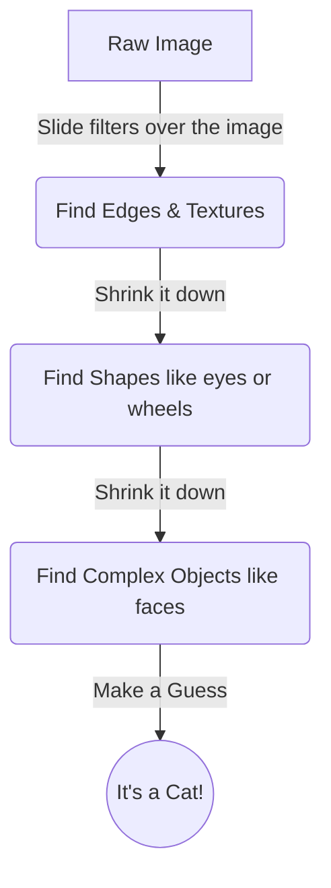

# Welcome to the Machine Learning Smorgasbord! 🍽️

Hey everyone! Welcome to Part 1 of my new 6-part series where we're going to demystify some of the most important papers in Machine Learning. If you're a college freshman who just heard the word "neural network" and wants to know what the hype is about—you're in the right place. I promise to keep the math friendly and the code simple!

Today, we're going back to 2012. A model called **AlexNet** basically kickstarted the entire modern AI boom. 

## What was the big deal?

Imagine trying to teach a computer to recognize a cat. Before 2012, programmers used to manually write rules: "look for pointy ears," "look for whiskers." This was incredibly tedious and didn't work very well. 

Then came "ImageNet Classification with Deep Convolutional Neural Networks" by Krizhevsky, Sutskever, and Hinton. They built a **Convolutional Neural Network (CNN)**. Instead of humans telling the computer what features to look for, the computer *learned* the features itself by looking at millions of images. It crushed the competition and blew everyone's minds.

## Three Magic Ingredients ✨

AlexNet succeeded because of three big ideas that we still use today:

1. **GPUs (Graphics Cards):** The same chips used to render video games are insanely good at doing thousands of math problems at once. AlexNet used two of them to train for nearly a week!
2. **ReLU (The "Turn It On" Math Function):** Inside the brain of the network, they used a math function called ReLU: $f(x) = \max(0, x)$. Basically, if a number is negative, make it zero. If it's positive, keep it. This simple trick stopped the network from "forgetting" how to learn in its deep layers.
3. **Dropout:** Imagine if you were studying for a test, but your professor randomly kicked you out of half your study groups. You'd be forced to learn the material yourself instead of relying on your friends. Dropout does this to neurons—it randomly turns some off during training so the network doesn't memorize the data.

## Visualizing the Brain

Here is a simple map of how an image flows through a CNN:



## Let's Code a Mini-AlexNet!

Let's build a tiny version of this using PyTorch (the standard library for AI in Python). Don't worry if you don't know PyTorch yet; just read the comments!

```python
import torch
import torch.nn as nn
import torch.nn.functional as F

# We create our custom brain by inheriting from nn.Module
class MiniAlexNet(nn.Module):
    def __init__(self):
        super(MiniAlexNet, self).__init__()
        # 1. Convolutional Layers: These are the "filters" that slide over the image
        self.conv1 = nn.Conv2d(in_channels=1, out_channels=16, kernel_size=3)
        self.conv2 = nn.Conv2d(in_channels=16, out_channels=32, kernel_size=3)
        
        # 2. Max pooling: This shrinks the image down, keeping only the most important pixels
        self.pool = nn.MaxPool2d(kernel_size=2, stride=2)
        
        # 3. Fully Connected Layers: The final decision makers
        self.fc1 = nn.Linear(32 * 5 * 5, 128)
        self.dropout = nn.Dropout(p=0.5) # Here is our famous Dropout! (50% chance to turn off)
        self.fc2 = nn.Linear(128, 10) # 10 outputs for digits 0-9

    def forward(self, x):
        # This is the path the image takes: Conv -> ReLU -> Shrink
        x = self.pool(F.relu(self.conv1(x)))
        x = self.pool(F.relu(self.conv2(x)))
        
        # Flatten the grid into a single line of numbers
        x = x.view(-1, 32 * 5 * 5)
        
        # Final decision making with Dropout
        x = F.relu(self.fc1(x))
        x = self.dropout(x) 
        x = self.fc2(x)
        
        return x # Output our guesses!
```

Next week, in **Part 2**, we're going to step away from images and talk about text. How does an AI remember the beginning of a sentence by the time it reaches the end? We'll dive into Recurrent Neural Networks (RNNs)! See you then!
