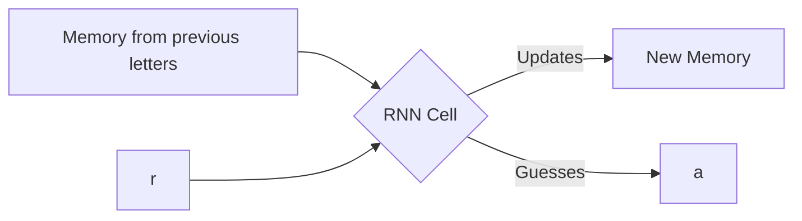

# Giving AI a Memory 🧠

Welcome back to Part 2 of the ML Smorgasbord! Last week we talked about AlexNet, which is great at looking at a single, frozen picture. But what if we want to process a video, or a sentence? "I grew up in France, so I speak fluent ____." To guess "French", the AI needs to remember the word "France" from the beginning of the sentence. 

Standard networks can't do this. They have goldfish memory. Enter the **Recurrent Neural Network (RNN)**.

## The Paper: Visualizing and Understanding Recurrent Networks

In 2015, Andrej Karpathy (who later became the Director of AI at Tesla) wrote a super cool paper showing *exactly* how RNNs think. 

Instead of feeding an entire sentence to the AI at once, an RNN reads a sentence **one letter at a time**. 
1. It reads "F"
2. It updates its internal "scratchpad" (called the hidden state).
3. It reads "r", looks at its scratchpad, and updates the scratchpad again. 

### The Math (Don't panic!)

At any given step ($t$), the new scratchpad ($h_t$) is a combination of the current letter ($x_t$) and the old scratchpad ($h_{t-1}$). 

$$ \text{New Scratchpad} = \text{Mix}(\text{Current Letter} + \text{Old Scratchpad}) $$

## What's actually on the scratchpad?

Karpathy proved that the network spontaneously learns to track grammar! If you train it on Shakespeare, one of the "neurons" in the network will turn ON when a quote `"` opens, and turn OFF when the quote closes. It learned what a quotation mark is just by reading text over and over!



## Let's Code a Tiny RNN

Here is the absolute core logic of an RNN in plain Python using Numpy. Notice how the `hidden_state` gets passed along!

```python
import numpy as np

# Pretend our AI has a "scratchpad" of 100 numbers, and our alphabet has 26 letters
hidden_size = 100
vocab_size = 26

# These are the "rules" the AI learns (randomly guessed at first)
Weight_for_letter = np.random.randn(hidden_size, vocab_size) 
Weight_for_memory = np.random.randn(hidden_size, hidden_size)

def rnn_read_one_letter(current_letter, previous_memory):
    """
    This function processes exactly one letter.
    """
    # Step 1: Combine the current letter and the old memory!
    # np.dot is just matrix multiplication (combining the numbers)
    combined = np.dot(Weight_for_letter, current_letter) + np.dot(Weight_for_memory, previous_memory)
    
    # Step 2: Squash the numbers so they don't get too big (using a math function called tanh)
    new_memory = np.tanh(combined)
    
    return new_memory

# Let's test it! Start with a blank memory (all zeros)
memory = np.zeros((hidden_size, 1))

# Let's say we read the letter "a" (represented as a column of numbers)
letter_a = np.random.randn(vocab_size, 1)

# Read the letter!
print("Memory before:", memory[0][0]) # 0.0
memory = rnn_read_one_letter(letter_a, memory)
print("Memory after reading 'a':", memory[0][0]) # It changed!

# Next time, we pass this NEW memory back into the function. That's the "recurrence"!
```

In **Part 3**, we are going to combine what we learned in Part 1 (Images) and Part 2 (Text). Can we make an AI that looks at a picture and answers a written question about it? You bet. See you next week!
