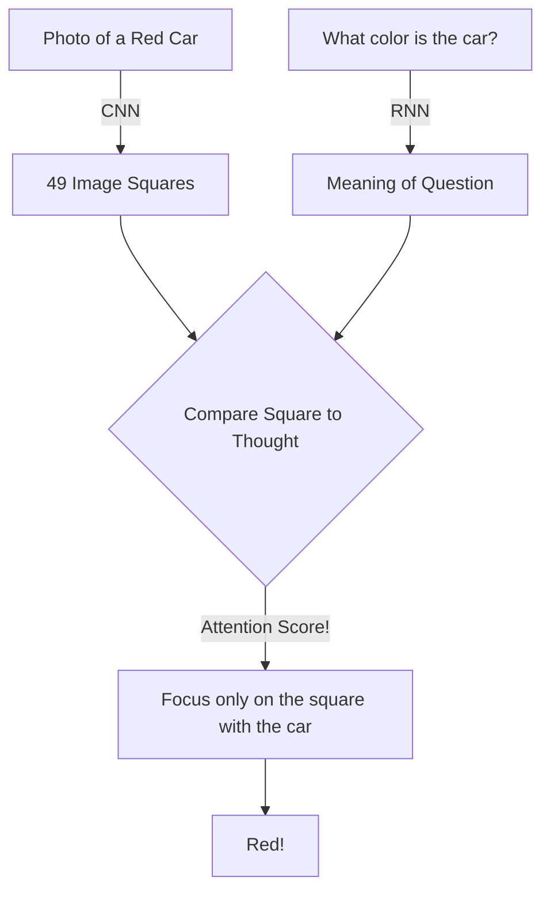

# When Vision Meets Language 📸✍️

Welcome back to Part 3! In Part 1, we learned how CNNs look at images. In Part 2, we learned how RNNs read text. Today, we're going to smash them together to create a system that can look at a photo and answer questions about it.

This field is called **Visual Question Answering (VQA)**.

## The Paper: Visual7W

In 2016, Zhu et al. published "Visual7W: Grounded Question Answering in Images." It wasn't enough for the AI to just *say* the answer; it had to *point* to the answer in the image. Imagine asking a toddler, "Where is the dog?" The toddler says "There!" and points their finger. That's what this AI does.

## How do you make an AI point a finger?

The secret ingredient is called **Spatial Attention**.

1. **The Eyes:** A CNN (from Part 1) scans the image and chops it up into a grid of 49 squares. It extracts the features of each square.
2. **The Ears:** An RNN (from Part 2) reads the question ("What color is the car?") and summarizes it into a single "thought."
3. **The Finger (Attention):** The AI takes its "thought" and compares it to all 49 image squares. It scores each square: *Does this square look like it has a car?* The square with the highest score gets "pointed" at!



## The "Where's Waldo" Code

Let's look at a conceptual PyTorch snippet of how we combine the image and the text.

```python
import torch
import torch.nn as nn
import torch.nn.functional as F

class PointingFinger(nn.Module):
    def __init__(self):
        super(PointingFinger, self).__init__()
        # We need to translate the image math and the text math into the same language
        self.translate_image = nn.Linear(512, 128)
        self.translate_text = nn.Linear(256, 128)
        self.scorer = nn.Linear(128, 1)

    def forward(self, image_squares, question_thought):
        # image_squares is a list of 49 squares from the CNN
        # question_thought is the final memory state from the RNN
        
        # 1. Translate both into our shared "attention" language
        img_lang = self.translate_image(image_squares)
        txt_lang = self.translate_text(question_thought)
        
        # 2. Add them together! 
        # (We use unsqueeze to add the single text thought to all 49 squares)
        combined = torch.tanh(img_lang + txt_lang.unsqueeze(1))
        
        # 3. Give each square a score
        scores = self.scorer(combined).squeeze() 
        
        # 4. Turn the scores into percentages (e.g., 90% sure it's square #12)
        # This is the AI "pointing" its finger!
        pointing_percentages = F.softmax(scores, dim=1) 
        
        return pointing_percentages

# It works! The AI now has a heat-map of where it is looking.
```

In **Part 4**, we are going to throw away the RNNs from Part 2. Why read a sentence one word at a time when you can read the *entire sentence at once*? Get ready for the Transformer revolution! 
