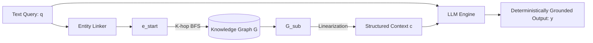

# Grounding Tensors in Logic 🕸️

Welcome to the grand finale of the ML Smorgasbord! 

In Part 5, we addressed LLM hallucinations by conditioning generation on dense vector embeddings of raw text (RAG). However, text is unstructured. To perform multi-hop logical reasoning (e.g., "Who directed the movie starring the actor born in the capital of France?"), flat vector search $v_q^T v_z$ breaks down. 

We need a **Neuro-Symbolic** approach: combining the continuous, differentiable reasoning of LLMs with the discrete, structured topology of a **Knowledge Graph (KG)**. 

## 1. Formalizing the Knowledge Graph

A Knowledge Graph is mathematically defined as a directed multigraph $G = (E, R, T)$, where:
*   $E = \{e_1, e_2, \dots, e_{N_e}\}$ is a set of entities (nodes).
*   $R = \{r_1, r_2, \dots, r_{N_r}\}$ is a set of relations (edges).
*   $T \subseteq E \times R \times E$ is a set of factual triples $(h, r, t)$ representing (head, relation, tail).

For example: $(\text{Albert Einstein}, \text{born\_in}, \text{Ulm})$.

Unlike a dense continuous embedding $v \in \mathbb{R}^d$, triples in $T$ are discrete and logical. They can be queried with absolute determinism using graph traversal algorithms.

## 2. Unifying LLMs and KGs: The Tripartite Framework

Pan et al. (2024) categorize the integration of continuous LLMs and discrete KGs into three frameworks:

### A. KG-Enhanced LLMs
During inference, a query $q$ is parsed to identify an entity $e_{start}$. We perform a $k$-hop traversal on $G$ to extract a subgraph $G_{sub} \subset G$. We linearize $G_{sub}$ into a text prompt sequence:
$$ c = \text{Linearize}(G_{sub}) = [\text{string}(h_i, r_i, t_i)]_{i=1}^k $$
The LLM generation is then conditioned on this logically rigorous context: $p_\theta(y | q, c)$.

### B. LLM-Augmented KGs
Here, the LLM acts as an Information Extraction engine to construct the graph $G$ from an unstructured corpus $D$. The LLM acts as a mapping function:
$$ f_{\theta}: d_i \rightarrow \{(h_j, r_j, t_j)\}_{j=1}^m \text{ where } d_i \in D $$
This is typically done via few-shot prompting or fine-tuning on relation-extraction tasks.

### C. Synergized Integration (Knowledge Graph Embeddings - KGE)
Perhaps the most mathematically elegant approach is embedding the nodes and edges of $G$ into the same continuous latent space as the LLM. Algorithms like **TransE** define a translation operation where the relation vector acts as an operator moving the head to the tail:
$$ \mathbf{h} + \mathbf{r} \approx \mathbf{t} $$
The loss function for the KGE model minimizes the distance function for valid triples:
$$ \mathcal{L} = \sum_{(h,r,t) \in T} || \mathbf{h} + \mathbf{r} - \mathbf{t} ||_2^2 $$
Once embedded, we can pass the node vectors $\mathbf{e}$ directly into the Transformer's input embedding matrix, allowing the LLM to attend to raw graph structures without text serialization!

## 3. The Neuro-Symbolic Pipeline



## 4. Coding the Graph Linearization

Let's look at how we transition from discrete graph mathematics in Python (`networkx`) back to string sequences for an LLM prompt.

```python
import networkx as nx

# 1. Initialize a directed multigraph G = (E, R, T)
G = nx.MultiDiGraph()

# 2. Define the set T of triples
T = [
    ("Albert_Einstein", "born_in", "Ulm"),
    ("Ulm", "located_in", "Germany"),
    ("Albert_Einstein", "studied", "Physics")
]

# 3. Populate the Graph
for h, r, t in T:
    G.add_edge(h, t, relation=r)

def linearize_k_hop_subgraph(graph, start_node, k=1):
    """
    Given a starting entity e_start, traverses k hops to build a linearized context c.
    """
    if start_node not in graph:
        return ""
        
    linearized_facts = []
    
    # 1-hop BFS for simplicity
    for neighbor in graph.successors(start_node):
        # We access the edge dictionary
        edge_data = graph.get_edge_data(start_node, neighbor)
        # There could be multiple relations between two nodes in a MultiDiGraph
        for edge_idx in edge_data:
            relation = edge_data[edge_idx]['relation']
            
            # Translate discrete triple into continuous string
            fact_string = f"{start_node.replace('_', ' ')} {relation.replace('_', ' ')} {neighbor}."
            linearized_facts.append(fact_string)
            
    return " ".join(linearized_facts)

# 4. Extract Context c
e_start = "Albert_Einstein"
c = linearize_k_hop_subgraph(G, e_start, k=1)

# 5. Formulate final probabilistic condition P(y | q, c)
q = f"Where was {e_start.replace('_', ' ')} born and what did he study?"
prompt = f"Context: {c}\nQuery: {q}\nAnswer: "

print("Generated Prompt Space:\n")
print(prompt)
```

## That's a wrap! 🎓

You've made it to the end! In this series, we've gone from the core calculus of convolutions in computer vision, derived the sequential memory gates of LSTMs, explored parallel self-attention mechanics of Transformers, and finally bridged continuous differentiable spaces with discrete non-parametric graphs in RAG and KGs.

Machine Learning is not a black box; it is highly structured, mathematically rigorous applied linear algebra and probability. Keep studying the equations, keep coding the algorithms from scratch, and keep pushing the boundary.

Thanks for reading!
