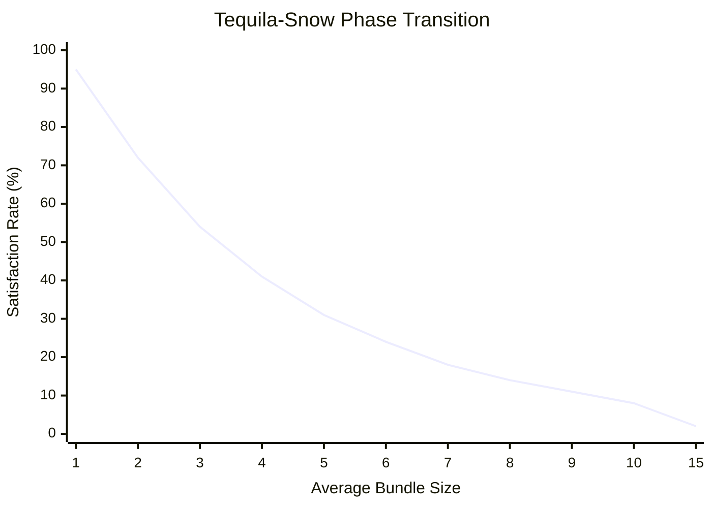

[View on GitHub](https://github.com/juleshenry/swiss-mexican-auction)

What if eBay let you bid on bundles?

You want a camera body, a specific lens, and a tripod -- but only if you can get all three. Buying the lens without the body is useless. Buying the body without the lens is expensive paperweight acquisition. You want the bundle, all or nothing.

This is the **exposure problem** in auction theory, and solving it optimally is NP-complete. The Swiss-Mexican Auction is a dual-layer framework that says: forget optimality. Get close enough, fast enough, at the scale of a real marketplace.

The project is on [GitHub](https://github.com/juleshenry/swiss-mexican-auction).

Interactive conflict graph: bidder nodes orbit the auctioneer. Edges represent item conflicts between bundles.

## The Problem: Satisfiability and Expenditure

Call it the SEP: Satisfiability and Expenditure Problem. You have a marketplace with $N$ items and $M$ bidders. Each bidder $i$ wants a specific bundle $O_i \subseteq \{1, ..., N\}$ (all or nothing) and has a hard budget ceiling $B_i$. The auctioneer wants to maximize total revenue while respecting three constraints:

1. **Budget**: No bidder pays more than $B_i$
2. **Indivisibility**: Either bidder $i$ gets the entire bundle $O_i$ or nothing
3. **Exclusivity**: Each item can be allocated to at most one bidder

This is simultaneously a Set Packing problem (maximize the number of non-overlapping bundles) and a Multi-Dimensional Knapsack problem (maximize revenue subject to capacity constraints). Both are NP-hard individually. Combined, the ILP formulation is:

$$\max \sum_{i=1}^{M} B_i \cdot x_i$$

subject to:

$$\sum_{i: j \in O_i} x_i \leq 1 \quad \forall j \in \{1, ..., N\}$$

$$x_i \in \{0, 1\} \quad \forall i$$

At eBay's scale -- 1.7 billion items, 134 million buyers -- exact ILP solutions are computationally impossible. The Swiss-Mexican Auction does not even try.

## The Two Layers

<svg viewBox="0 0 700 260" xmlns="http://www.w3.org/2000/svg" style="width:100%;max-width:700px;display:block;margin:1.5em auto;">
  <defs>
    <linearGradient id="swiss-grad" x1="0" y1="0" x2="0" y2="1">
      <stop offset="0%" stop-color="#1e3a5f"/>
      <stop offset="100%" stop-color="#0f1b2d"/>
    </linearGradient>
    <linearGradient id="mex-grad" x1="0" y1="0" x2="0" y2="1">
      <stop offset="0%" stop-color="#4a1a0a"/>
      <stop offset="100%" stop-color="#1a0a04"/>
    </linearGradient>
  </defs>
  <!-- Swiss Layer -->
  <rect x="20" y="15" width="660" height="100" rx="12" fill="url(#swiss-grad)" stroke="#3b82f6" stroke-width="2"/>
  <text x="350" y="42" text-anchor="middle" fill="#60a5fa" font-size="15" font-weight="bold" font-family="monospace">SWISS LAYER (Constraints)</text>
  <text x="350" y="65" text-anchor="middle" fill="#94a3b8" font-size="12" font-family="monospace">ILP Formulation | LP Relaxation | Budget Ceilings B_i | Bundle Integrity O_i</text>
  <text x="350" y="85" text-anchor="middle" fill="#475569" font-size="11" font-family="monospace">Rigid. Formal. Provides theoretical upper bounds.</text>
  <text x="350" y="102" text-anchor="middle" fill="#334155" font-size="10" font-family="monospace">x_i in {0,1} | sum x_i &lt;= 1 per item | NP-Complete</text>
  <!-- Arrow -->
  <polygon points="350,120 340,130 345,130 345,145 355,145 355,130 360,130" fill="#fbbf24"/>
  <!-- Mexican Layer -->
  <rect x="20" y="150" width="660" height="100" rx="12" fill="url(#mex-grad)" stroke="#f59e0b" stroke-width="2"/>
  <text x="350" y="177" text-anchor="middle" fill="#fbbf24" font-size="15" font-weight="bold" font-family="monospace">MEXICAN LAYER (Execution)</text>
  <text x="350" y="200" text-anchor="middle" fill="#94a3b8" font-size="12" font-family="monospace">Value Density rho_i = B_i / |O_i| | Greedy Sort | O(N log N)</text>
  <text x="350" y="220" text-anchor="middle" fill="#475569" font-size="11" font-family="monospace">Fast. Fluid. Good enough. Clears 50K items in 0.26s.</text>
  <text x="350" y="237" text-anchor="middle" fill="#334155" font-size="10" font-family="monospace">Anti-Whale Effect | Tequila-Snow Phase Transition</text>
</svg>

### The Swiss Layer (Constraints)

The "Swiss" layer is the rigid, formal mathematical scaffolding. It defines the ILP, establishes the feasibility space, and provides theoretical upper bounds via LP relaxation (relax $x_i \in \{0,1\}$ to $x_i \in [0,1]$ and solve the continuous problem with a linear solver). The LP relaxation gives you a ceiling: "no feasible allocation can exceed this revenue." You cannot achieve it, but you can measure how close your heuristic gets.

### The Mexican Layer (Execution)

The "Mexican" layer is the heuristic. Fast, fluid, good enough. The algorithm:

1. Compute each bidder's **value density**: $\rho_i = B_i / |O_i|$ (budget per item in the bundle)
2. Sort all bidders by $\rho_i$ in descending order
3. Iterate: for each bidder, check if all items in their bundle $O_i$ are still available. If yes, allocate. If any item is taken, skip.

That is it. $O(N \log N)$ time (dominated by the sort). The greedy heuristic favors bidders who pay the most per item -- the efficient bidders -- and allocates first-come-first-served among non-conflicting bundles.

## Results: 50,000 Items, 20,000 Bidders, 0.26 Seconds

<svg viewBox="0 0 600 200" xmlns="http://www.w3.org/2000/svg" style="width:100%;max-width:600px;display:block;margin:1.5em auto;">
  <!-- Background -->
  <rect width="600" height="200" rx="8" fill="#0f172a"/>
  <!-- Bars -->
  <rect x="60" y="45" width="130" height="40" rx="6" fill="#22d3ee" opacity="0.85"/>
  <text x="200" y="70" fill="#e2e8f0" font-size="13" font-family="monospace">36% bidders satisfied</text>
  <rect x="60" y="95" width="165" height="40" rx="6" fill="#6366f1" opacity="0.85"/>
  <text x="235" y="120" fill="#e2e8f0" font-size="13" font-family="monospace">45% items cleared</text>
  <rect x="60" y="145" width="200" height="40" rx="6" fill="#f59e0b" opacity="0.85"/>
  <text x="270" y="170" fill="#e2e8f0" font-size="13" font-family="monospace">$945K revenue in 0.26s</text>
  <!-- Title -->
  <text x="300" y="25" text-anchor="middle" fill="#64748b" font-size="12" font-family="monospace">Greedy Heuristic Market Clearance</text>
</svg>

The simulation generates a realistic marketplace:
- 50,000 items with log-normal price distributions
- 20,000 bidders with bundle sizes ranging from 1 to 15 items
- Budgets drawn from a distribution centered around the sum of desired item prices (with noise)

The greedy algorithm clears this market in **0.26 seconds**. It satisfies 36% of bidders (7,200 out of 20,000) with zero item conflicts, zero budget violations, and extracts ~$945,000 in revenue.

### The LP-Guided Hybrid

The "Swiss Fallback" improves on pure greedy. It solves the LP relaxation first (using SciPy's HiGHS solver), extracts the fractional solution weights, and uses them to re-rank bidders before running the greedy pass. Bidders that the LP heavily weights get priority in the greedy allocation.

On a smaller test market (500 items, 1,000 bidders), the hybrid closes **92.8%** of the gap between pure greedy and the theoretical LP upper bound, achieving an 8.8% revenue improvement. The LP solve adds computational cost, but for markets where the revenue stakes justify it, the hybrid is the clear winner.

## Two Emergent Phenomena

### The Anti-Whale Effect

The greedy algorithm naturally favors small, targeted bidders over large-bundle "whales." A bidder wanting 2 items with a $500 budget has $\rho = 250$ per item. A bidder wanting 15 items with a $2,000 budget has $\rho = 133$ per item. The small bidder ranks higher. By the time we reach the whale, several of their desired items are already allocated to smaller bidders, and the whale is skipped.

This produces a more **democratic** marketplace. The algorithm does not discriminate by total wealth -- it discriminates by efficiency. A buyer willing to pay a premium for a small, specific bundle is prioritized over a deep-pocketed buyer making a speculative grab at a large bundle. This is not a designed feature. It is an emergent property of sorting by value density.

### The Tequila-Snow Phase Transition

Market liquidity collapses non-linearly as desired bundle sizes grow. This is the "Tequila-Snow" phase transition, named by analogy to statistical mechanics.

When average bundle size is 1-2 items, the market is **liquid** -- most bidders can be satisfied because their bundles rarely conflict. When average bundle size exceeds 8-10 items, the market **freezes** -- almost no one gets their bundle because the probability of at least one item conflict approaches 1.

The critical insight: there is a **Viscous Goldilocks Zone** around bundle size 3-4 where the product of satisfaction rate and revenue per bidder is maximized. Smaller bundles have high satisfaction but low per-bidder revenue. Larger bundles have high per-bidder revenue but near-zero satisfaction. The sweet spot is in the middle. This has practical implications for marketplace design: if you are building an auction platform that supports bundling, you should nudge bidders toward bundles of 3-4 items for maximum overall market efficiency.

## Future Horizons

The paper sketches several extensions:

**Quantum Annealing.** The ILP can be reformulated as a QUBO (Quadratic Unconstrained Binary Optimization) problem, which maps naturally onto an Ising model. D-Wave's quantum annealers natively solve QUBO problems. For a 50,000-item market, the Ising model would have 20,000 qubits (one per bidder) with pairwise couplings encoding item conflicts. Current quantum hardware cannot handle this scale, but the formulation is ready for when it can.

**Neural Mechanism Design.** Train a Graph Neural Network on the conflict graph (bidders as nodes, item conflicts as edges) to learn allocation strategies that generalize across market structures. The GNN could learn market-type-specific heuristics that outperform the generic value-density sort.

**Zero-Knowledge Proofs.** Bidders currently reveal their budgets to the auctioneer. With zk-SNARKs, bidders could prove "my budget exceeds the price of my bundle" without revealing the actual budget. Cryptographic privacy for auction participants.

The Swiss-Mexican Auction is not optimal. By construction, it cannot be -- the optimal solution is NP-complete. But it is fast, it is principled, it closes 93% of the optimality gap, and it clears a 50,000-item market in a quarter of a second. Sometimes good enough, fast enough, is the right answer.
