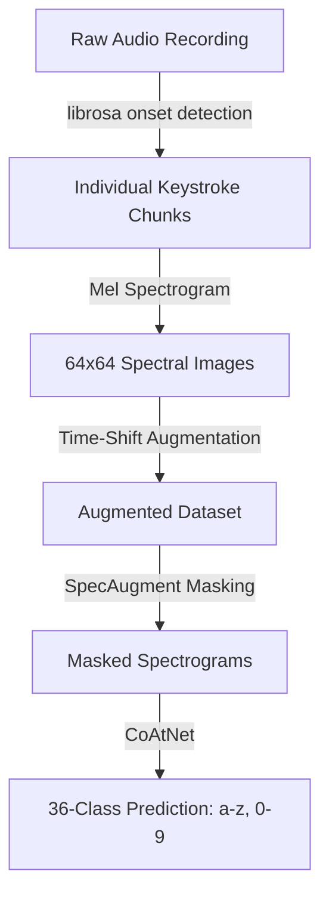

[View on GitHub](https://github.com/juleshenry/hacker-de-audio-de-teclado)

Every key on your keyboard makes a slightly different sound when pressed. The spacebar sounds different from the Enter key. The 'A' key sounds different from the 'S' key -- subtly, but measurably. If you record the audio of someone typing and feed it through a trained neural network, you can reconstruct what they typed.

This project is a from-scratch reimplementation of Harrison, Toreini, and Mehrnezhad's 2023 paper "A Practical Deep Learning-Based Acoustic Side Channel Attack on Keyboards" ([arXiv:2308.01074](https://arxiv.org/abs/2308.01074)). Written in Portuguese-flavored Python, built on PyTorch and librosa.

The project is on [GitHub](https://github.com/juleshenry/hacker-de-audio-de-teclado). MIT licensed.


## The Pipeline



Three stages: collect data, train a classifier, run the attack.

### Stage 1: Data Collection

The interactive recorder (`quickstart.py`) walks you through pressing each key on your keyboard. For each of the 36 alphanumeric keys (a-z, 0-9), it prompts you, records a short clip via your microphone using `sounddevice`, auto-detects the keystroke onset in the audio, and saves the isolated keystroke as a `.wav` file in a per-key directory.

For quick experimentation without a physical keyboard, a synthetic data generator (`gerar_exemplo_zorro.py` -- "generate fox example") creates fake keystroke audio using decaying sine waves at distinct frequencies. Each key gets a unique base frequency, so the spectrograms are distinguishable even though the sounds are artificial. The full pipeline (train, predict) works on synthetic data, letting you test end-to-end in under a minute.

The demo phrase is **"o zorro e gris"** -- Portuguese for "the fox is grey."

### Stage 2: Training

The training pipeline faithfully reproduces the paper's methodology.

**Onset Detection.** librosa detects keystroke onsets in the audio using energy-based peak detection with a 300ms minimum distance filter (to prevent detecting the same keypress twice).

**Mel Spectrogram Extraction.** Each keystroke chunk is converted into a 64-band Mel spectrogram with 1024-point FFT and 225 hop length, producing a 64x64 spectral image. This is the feature representation: a 2D image where the x-axis is time, the y-axis is frequency (mel-scaled), and pixel intensity represents energy at that time-frequency bin.

**Data Augmentation.** Two techniques from the paper:

1. **Time-shift augmentation** -- each keystroke is speed-distorted by +/- 40% using `librosa.effects.time_stretch`, producing 2 augmented copies per sample. This teaches the model to be invariant to typing speed.
2. **SpecAugment** -- at training time, random rectangular masks are applied to the spectrogram (2 frequency masks and 2 time masks, each spanning 10% of the axis width). This is the same augmentation technique used in speech recognition (Park et al. 2019), and it prevents the model from overfitting to specific time-frequency patterns.

**The Model: CoAtNet.** The classifier is a CoAtNet (Convolutional + Attention Network) -- a hybrid architecture that combines the local feature extraction of convolutions with the global context modeling of self-attention:

1. **Stem.** Conv2D (1 -> 32 channels, stride 2) with BatchNorm and GELU activation. Halves spatial dimensions.
2. **MBConv Phase.** Two Mobile Inverted Bottleneck Convolution blocks, expanding to 64 then 128 channels. These are depth-wise separable convolutions with squeeze-and-excitation -- the same building blocks used in EfficientNet. They capture local spectral patterns: the frequency distribution of a single keystroke.
3. **Transformer Phase.** Two Transformer Encoder layers with 4-head self-attention (d_model=128, feedforward dimension 512). These capture global dependencies across the entire spectrogram: the temporal shape of the keystroke's decay envelope, the relationship between the initial attack and the subsequent resonance.
4. **Classification Head.** Adaptive 2D Average Pooling -> Fully Connected Linear layer -> 36-class output.

The MBConv blocks say "what does this keystroke look like locally?" The Transformer blocks say "what does the overall shape tell us?" Together, they classify each 64x64 spectrogram as one of 36 alphanumeric characters.

<svg viewBox="0 0 700 320" xmlns="http://www.w3.org/2000/svg" style="width:100%;max-width:700px;display:block;margin:1.5em auto;">
  <rect width="700" height="320" rx="8" fill="#0f172a"/>
  <text x="350" y="25" text-anchor="middle" fill="#64748b" font-size="12" font-family="monospace">CoAtNet Architecture</text>
  <!-- Input -->
  <rect x="20" y="40" width="90" height="50" rx="8" fill="#1e293b" stroke="#475569"/>
  <text x="65" y="60" text-anchor="middle" fill="#94a3b8" font-size="10" font-family="monospace">64x64</text>
  <text x="65" y="75" text-anchor="middle" fill="#94a3b8" font-size="10" font-family="monospace">Mel Spec</text>
  <!-- Arrow -->
  <line x1="110" y1="65" x2="135" y2="65" stroke="#475569" stroke-width="2" marker-end="url(#arrowhead)"/>
  <!-- Stem -->
  <rect x="135" y="40" width="90" height="50" rx="8" fill="#1e3a5f" stroke="#3b82f6"/>
  <text x="180" y="60" text-anchor="middle" fill="#60a5fa" font-size="10" font-family="monospace">Stem</text>
  <text x="180" y="75" text-anchor="middle" fill="#475569" font-size="9" font-family="monospace">Conv2D 32ch</text>
  <!-- Arrow -->
  <line x1="225" y1="65" x2="250" y2="65" stroke="#475569" stroke-width="2"/>
  <!-- MBConv 1 -->
  <rect x="250" y="40" width="90" height="50" rx="8" fill="#1a2e1a" stroke="#22c55e"/>
  <text x="295" y="60" text-anchor="middle" fill="#4ade80" font-size="10" font-family="monospace">MBConv</text>
  <text x="295" y="75" text-anchor="middle" fill="#475569" font-size="9" font-family="monospace">64ch SE</text>
  <!-- Arrow -->
  <line x1="340" y1="65" x2="365" y2="65" stroke="#475569" stroke-width="2"/>
  <!-- MBConv 2 -->
  <rect x="365" y="40" width="90" height="50" rx="8" fill="#1a2e1a" stroke="#22c55e"/>
  <text x="410" y="60" text-anchor="middle" fill="#4ade80" font-size="10" font-family="monospace">MBConv</text>
  <text x="410" y="75" text-anchor="middle" fill="#475569" font-size="9" font-family="monospace">128ch SE</text>
  <!-- Arrow -->
  <line x1="455" y1="65" x2="480" y2="65" stroke="#475569" stroke-width="2"/>
  <!-- Transformer 1 -->
  <rect x="480" y="40" width="90" height="50" rx="8" fill="#2d1a3a" stroke="#a855f7"/>
  <text x="525" y="60" text-anchor="middle" fill="#c084fc" font-size="10" font-family="monospace">Transformer</text>
  <text x="525" y="75" text-anchor="middle" fill="#475569" font-size="9" font-family="monospace">4-Head Attn</text>
  <!-- Arrow -->
  <line x1="570" y1="65" x2="595" y2="65" stroke="#475569" stroke-width="2"/>
  <!-- Transformer 2 -->
  <rect x="595" y="40" width="85" height="50" rx="8" fill="#2d1a3a" stroke="#a855f7"/>
  <text x="637" y="60" text-anchor="middle" fill="#c084fc" font-size="10" font-family="monospace">Transformer</text>
  <text x="637" y="75" text-anchor="middle" fill="#475569" font-size="9" font-family="monospace">4-Head Attn</text>
  <!-- Arrow down to output -->
  <line x1="637" y1="90" x2="637" y2="110" stroke="#475569" stroke-width="2"/>
  <!-- Output -->
  <rect x="570" y="110" width="120" height="40" rx="8" fill="#3a1a1a" stroke="#ef4444"/>
  <text x="630" y="135" text-anchor="middle" fill="#f87171" font-size="10" font-family="monospace">36-class output</text>
  <!-- Legend -->
  <rect x="30" y="120" width="12" height="12" rx="3" fill="#1e3a5f" stroke="#3b82f6"/>
  <text x="48" y="131" fill="#60a5fa" font-size="10" font-family="monospace">Convolution</text>
  <rect x="30" y="140" width="12" height="12" rx="3" fill="#1a2e1a" stroke="#22c55e"/>
  <text x="48" y="151" fill="#4ade80" font-size="10" font-family="monospace">MBConv (local features)</text>
  <rect x="30" y="160" width="12" height="12" rx="3" fill="#2d1a3a" stroke="#a855f7"/>
  <text x="48" y="171" fill="#c084fc" font-size="10" font-family="monospace">Transformer (global context)</text>
  <!-- Spectrogram visualization -->
  <text x="350" y="210" text-anchor="middle" fill="#64748b" font-size="11" font-family="monospace">Sample Keystroke Spectrogram Heatmap</text>
  <g transform="translate(100,220)">
    <!-- Simulated mel spectrogram grid -->
    <rect x="0" y="0" width="500" height="80" rx="4" fill="#0a0e1a" stroke="#1e293b"/>
    <!-- Frequency bands (rows of varying intensity) -->
    <rect x="2" y="2" width="496" height="5" fill="#0f172a" opacity="0.6"/><rect x="60" y="2" width="40" height="5" fill="#1e40af" opacity="0.7"/>
    <rect x="2" y="8" width="496" height="5" fill="#0f172a" opacity="0.5"/><rect x="55" y="8" width="50" height="5" fill="#2563eb" opacity="0.8"/>
    <rect x="2" y="14" width="496" height="5" fill="#0f172a" opacity="0.4"/><rect x="50" y="14" width="60" height="5" fill="#3b82f6" opacity="0.9"/>
    <rect x="2" y="20" width="496" height="5" fill="#0f172a" opacity="0.3"/><rect x="45" y="20" width="70" height="5" fill="#60a5fa"/>
    <rect x="2" y="26" width="496" height="5" fill="#0f172a" opacity="0.3"/><rect x="40" y="26" width="80" height="5" fill="#93c5fd"/>
    <rect x="2" y="32" width="496" height="5" fill="#0f172a" opacity="0.4"/><rect x="42" y="32" width="75" height="5" fill="#bfdbfe"/>
    <rect x="2" y="38" width="496" height="5" fill="#0f172a" opacity="0.5"/><rect x="45" y="38" width="65" height="5" fill="#93c5fd" opacity="0.8"/>
    <rect x="2" y="44" width="496" height="5" fill="#0f172a" opacity="0.5"/><rect x="48" y="44" width="55" height="5" fill="#60a5fa" opacity="0.7"/>
    <rect x="2" y="50" width="496" height="5" fill="#0f172a" opacity="0.6"/><rect x="50" y="50" width="45" height="5" fill="#3b82f6" opacity="0.6"/>
    <rect x="2" y="56" width="496" height="5" fill="#0f172a" opacity="0.7"/><rect x="52" y="56" width="35" height="5" fill="#2563eb" opacity="0.5"/>
    <rect x="2" y="62" width="496" height="5" fill="#0f172a" opacity="0.8"/><rect x="55" y="62" width="25" height="5" fill="#1e40af" opacity="0.4"/>
    <rect x="2" y="68" width="496" height="5" fill="#0f172a" opacity="0.9"/><rect x="58" y="68" width="15" height="5" fill="#1e3a8a" opacity="0.3"/>
    <!-- Second keystroke -->
    <rect x="200" y="2" width="35" height="5" fill="#1e40af" opacity="0.6"/>
    <rect x="195" y="8" width="45" height="5" fill="#7c3aed" opacity="0.7"/>
    <rect x="190" y="14" width="55" height="5" fill="#8b5cf6" opacity="0.8"/>
    <rect x="188" y="20" width="60" height="5" fill="#a78bfa"/>
    <rect x="185" y="26" width="65" height="5" fill="#c4b5fd"/>
    <rect x="187" y="32" width="60" height="5" fill="#a78bfa" opacity="0.8"/>
    <rect x="190" y="38" width="50" height="5" fill="#8b5cf6" opacity="0.7"/>
    <rect x="193" y="44" width="40" height="5" fill="#7c3aed" opacity="0.6"/>
    <rect x="196" y="50" width="30" height="5" fill="#6d28d9" opacity="0.5"/>
    <rect x="199" y="56" width="20" height="5" fill="#5b21b6" opacity="0.4"/>
    <!-- Third keystroke -->
    <rect x="340" y="2" width="30" height="5" fill="#065f46" opacity="0.5"/>
    <rect x="335" y="8" width="40" height="5" fill="#059669" opacity="0.6"/>
    <rect x="330" y="14" width="50" height="5" fill="#10b981" opacity="0.7"/>
    <rect x="328" y="20" width="55" height="5" fill="#34d399" opacity="0.9"/>
    <rect x="325" y="26" width="60" height="5" fill="#6ee7b7"/>
    <rect x="328" y="32" width="55" height="5" fill="#34d399" opacity="0.8"/>
    <rect x="330" y="38" width="45" height="5" fill="#10b981" opacity="0.6"/>
    <rect x="333" y="44" width="35" height="5" fill="#059669" opacity="0.5"/>
    <text x="70" y="92" fill="#475569" font-size="9" font-family="monospace">key 'o'</text>
    <text x="210" y="92" fill="#475569" font-size="9" font-family="monospace">key 'z'</text>
    <text x="345" y="92" fill="#475569" font-size="9" font-family="monospace">key 'r'</text>
  </g>
</svg>

**Training Hyperparameters.** Adam optimizer with max LR 5e-4 and linear annealing over 1100 epochs. Batch size 16. 80/20 train/val split. Early stopping with patience of 50 epochs. Best model checkpointed to `keystroke_model_best.pth`.

The model supports Apple MPS (Metal), CUDA, and CPU fallback. On an M-series Mac, training completes in minutes.

### Stage 3: The Attack

```bash
python hacker_de_teclado.py --prever recording.wav
```

Given a recording of someone typing, the system:
1. Detects each keystroke onset using the same librosa pipeline
2. Extracts the 64x64 Mel spectrogram for each detected keystroke
3. Runs each spectrogram through the trained CoAtNet
4. Outputs the predicted text: `o z o r r o e g r i s`

## Why This Works

It seems implausible that a microphone across the room could distinguish 'A' from 'S'. But the acoustic differences are real and arise from physical properties:

**Key position.** Keys in different positions on the keyboard produce different resonance patterns because the mechanical structure beneath them varies. A key near the edge of the keyboard plate has different vibrational modes than a key near the center.

**Finger angle.** Different keys are typically struck by different fingers at different angles. The ring finger hitting 'A' produces a different impact profile than the index finger hitting 'J'.

**Travel distance.** Adjacent keys have slightly different travel distances and spring tensions due to manufacturing tolerances, wear patterns, and the geometry of the underlying switch mechanism.

These differences are tiny -- inaudible to a human listener comparing two keystrokes -- but they are consistent and repeatable. A Mel spectrogram captures them as subtle variations in the frequency distribution of the keystroke's initial attack and subsequent decay. The CoAtNet learns to detect these patterns.

The Harrison et al. paper reports 95% accuracy on a MacBook Pro keyboard using a smartphone microphone placed nearby. The accuracy degrades with distance, ambient noise, and different keyboard models (the model trained on one keyboard does not transfer well to another, because the acoustic properties are hardware-specific).

## The Security Implications

This is a real attack vector. If someone can record the audio of your typing -- via a compromised microphone, a nearby phone, or even a video call where keyboard sounds leak through -- they can potentially reconstruct your keystrokes. Passwords, emails, code, messages.

Defenses include:
- **Acoustic noise injection** -- playing white noise near the keyboard to mask keystroke sounds
- **Silent keyboards** -- membrane keyboards produce weaker acoustic signatures than mechanical ones
- **Software-based keystroke randomization** -- introducing random delays between keystrokes to disrupt the temporal patterns
- **Awareness** -- muting your microphone during video calls when typing sensitive information

The project is educational. It demonstrates that the attack is accessible (PyTorch + librosa + a microphone), reproducible (the synthetic data generator lets anyone test the pipeline), and frighteningly effective on controlled setups. The paper it reimplements is publicly available. The code is MIT licensed. The fox is grey.
