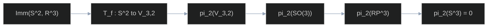

*A Socratic return to the two-sphere: the questions from a local Phi-3 session, answered so that the pictures are the equations.*

In May 2024 I asked a small language model, running locally, to talk me through Smale's theorem that any two immersions of $S^2$ in $\mathbb{R}^3$ are regularly homotopic. The transcript is [Sphere Eversion Phi3 Notes I](/blog/2024/05/22/sphere-eversion-phi3-notes-I). The questions were the right questions. The proofs were not: a linear interpolation was offered as a regular homotopy, the hairy-ball theorem was credited to Smale, and $S^2\times[0,1]$ was described as a solid ball.

In September I wrote a straight exposition, [The Eversion of the Sphere](/blog/2024/09/27/the-eversion-of-the-sphere). It had the theorem right and the pictures wrong. The interactive "eversion" flattened $z$ through zero --- exactly the crease the text forbade --- and the "Morin surface" was an unnamed polynomial that did not match any formula on the page.

This post is the two of them talking. The student is the transcript. The teacher is the theorem, at the level of a motivated undergraduate who has partial derivatives, the chain rule, and the rank of a matrix. Every canvas is a displayed equation with a slider.

The still below is a genuine eversion (Morin's halfway model). We will not pretend to reproduce that movie with a one-line formula. We will write the formulae we *can* write, and refuse to draw a crease and call it an eversion.

  

---

# the two-sphere, locally flat

<strong>Student.</strong> What is a manifold? What is a differentiable manifold? Give an example. Then give differentiable coordinates on $S^2$ and take a derivative at $(1,0,0)$.

<strong>Teacher.</strong> A manifold is a space that is Euclidean in the small. Formally, a smooth $n$-manifold is a Hausdorff space covered by charts $\varphi\sb{\alpha}: U\sb{\alpha}\to\mathbb{R}^n$ whose transition maps $\varphi\sb{\beta}\circ\varphi\sb{\alpha}^{-1}$ are $C^\infty$. You already know one: the surface of the Earth. No single paper map covers it, but an atlas does, and the overlap rules are smooth.

The **2-sphere** is the set of unit vectors,

$$S^2=\bigl\{(x,y,z)\in\mathbb{R}^3:x^2+y^2+z^2=1\bigr\}.$$

Spherical coordinates are a pair of charts (you need at least two: the azimuth $\varphi$ is not a global coordinate). On the complement of a meridian,

$$\mathbf{r}(\theta,\varphi)=\bigl(\sin\theta\cos\varphi,\;\sin\theta\sin\varphi,\;\cos\theta\bigr),\qquad \theta\in(0,\pi),\;\varphi\in(0,2\pi).$$

A **point** is not a function of $(\theta,\varphi)$. The model that answered you computed $\partial\sb{\theta}(1,0,0)=\mathbf{0}$ and called it a day. The object that has derivatives is the chart:

$$
\begin{aligned}
\mathbf{r}_\theta&=(\cos\theta\cos\varphi,\;\cos\theta\sin\varphi,\;-\sin\theta),\\
\mathbf{r}_\varphi&=(-\sin\theta\sin\varphi,\;\sin\theta\cos\varphi,\;0).
\end{aligned}
$$

At $(1,0,0)$ one has $(\theta,\varphi)=(\pi/2,\,0)$, so

$$\mathbf{r}_\theta=(0,0,-1),\qquad \mathbf{r}_\varphi=(0,1,0),\qquad \mathbf{r}_\theta\times\mathbf{r}_\varphi=(1,0,0)=\mathbf{r}.$$

Those two vectors are a basis of the tangent plane $T\sb{(1,0,0)}S^2$, the $yz$-plane. Drag the sliders; the cyan and pink arrows are exactly $\mathbf{r}\sb{\theta}$ and $\mathbf{r}\sb{\varphi}$.

  
r, r_theta, r_phi

  

    <label>theta <input type="range" id="cs-th" min="8" max="172" value="90"> pi/2</label>
    <label>phi <input type="range" id="cs-ph" min="0" max="628" value="0"> 0</label>
  

The sphere is the image of $\mathbf{r}$. Cyan is $\mathbf{r}\sb{\theta}$, pink is $\mathbf{r}\sb{\varphi}$, gold is their cross product. At the poles $\sin\theta=0$ and the <em>chart</em> is singular; the sphere is not. That distinction is the whole subject.

<strong>Student.</strong> Give a nonzero derivative --- a function that wraps around the sphere.

<strong>Teacher.</strong> Take the equator as a curve $\gamma:[0,2\pi]\to S^2$,
$$\gamma(t)=(\cos t,\;\sin t,\;0).$$
Then $\gamma'(t)=(-\sin t,\;\cos t,\;0)\neq\mathbf{0}$. At $t=0$ this is $(0,1,0)$, which is $\mathbf{r}\sb{\varphi}$ at $(1,0,0)$. The model wrote $\gamma(t)=(\sin(\pi t),0,\cos(\pi t))$ and claimed it was the equator with $\varphi$ fixed at $0$; that is a meridian, a semicircle from north pole to south, and at its midpoint the velocity is $(0,0,-\pi)$, not a trip around the equator. Wrapping around $S^2$ means the image of $\gamma$ is a closed loop that is not contractible in $S^2\setminus\{\text{two poles}\}$. We will need that loop.

---

# immersions, and the matrix that must not drop rank

<strong>Student.</strong> What is an immersion? What is a Jacobian? What happens when the Jacobian determinant is zero, or switches sign?

<strong>Teacher.</strong> For $f:\mathbb{R}^n\to\mathbb{R}^m$ the Jacobian is the $m\times n$ matrix of first partials --- rows are outputs, columns are inputs. The model wrote $n\times m$. An <strong>immersion</strong> $f:M\to N$ is a smooth map whose differential $df\sb{p}:T\sb{p}M\to T\sb{f(p)}N$ is injective at every $p$. For $f:S^2\to\mathbb{R}^3$ that is the statement that the $3\times 2$ matrix
$$
J_f=\begin{pmatrix}
\partial_u f_1 & \partial_v f_1 \\
\partial_u f_2 & \partial_v f_2 \\
\partial_u f_3 & \partial_v f_3
\end{pmatrix}
$$
has rank $2$ everywhere, equivalently $\mathbf{f}\sb{u}\times\mathbf{f}\sb{v}\neq\mathbf{0}$. There is no $2\times 2$ determinant to watch. The only vanishing that matters is that cross product.

A sign change of $\det J$ for a map $\mathbb{R}^n\to\mathbb{R}^n$ means the map reverses orientation. It does **not** mean a saddle: $f(x,y)=(e^x\cos y,\,e^x\sin y)$ has $\det J=e^{2x}>0$ everywhere (it is a local diffeomorphism, the complex exponential). At $(0,\pi/2)$ one has $\det J=1$, not $-1$, and there is no critical point. Vanishing of $\det J$ *does* mean the inverse-function theorem fails: the map is not a local diffeomorphism there.

Self-intersection is allowed. A figure-eight $\gamma(t)=(\sin 2t,\,\sin t)$ is an immersion --- $\gamma'$ never vanishes --- and it crosses itself. An **embedding** is an injective immersion (proper, on noncompact manifolds). The standard sphere $\iota(p)=p$ is an embedding. Mid-eversion surfaces are immersions and not embeddings.

---

# the homotopy that is not regular

<strong>Student.</strong> Any two $C^2$ immersions of $S^2$ in $E^3$ are regularly homotopic. Here is a proof: $H(x,t)=(1-t)f\sb{0}(x)+t f\sb{1}(x)$. Also, what is $S^2\times[0,1]$?

<strong>Teacher.</strong> $S^2\times[0,1]$ is a <em>thickened sphere</em>: a spherical shell, not the ball. Each point of $S^2$ grows an interval. A homotopy of maps $S^2\to\mathbb{R}^3$ is a single map
$$F:S^2\times[0,1]\to\mathbb{R}^3.$$
It is a <strong>regular homotopy</strong> when each slice $F(\,\cdot\,,t)$ is an immersion. Straight-line interpolation between immersions is a homotopy of smooth maps and almost never a regular homotopy. It routinely drops rank.

The sock-push is the interpolation from the identity to reflection through the equator,

$$F_s(\theta,\varphi)=\bigl(\sin\theta\cos\varphi,\;\sin\theta\sin\varphi,\;(1-2s)\cos\theta\bigr).$$

A short computation:

$$
\mathbf{F}_\theta\times\mathbf{F}_\varphi=\bigl((1-2s)\sin^2\theta\cos\varphi,\;(1-2s)\sin^2\theta\sin\varphi,\;\sin\theta\cos\theta\bigr),
$$

$$
\bigl\|\mathbf{F}_\theta\times\mathbf{F}_\varphi\bigr\|=\lvert\sin\theta\rvert\sqrt{(1-2s)^2\sin^2\theta+\cos^2\theta}.
$$

At $s=\tfrac12$ this is $\lvert\sin\theta\cos\theta\rvert$, which is zero all along the equator. The image is a disk covered twice, with a fold on the boundary. That is a crease. Colour in the canvas is $\lVert\mathbf{F}\sb{\theta}\times\mathbf{F}\sb{\varphi}\rVert$: indigo is a healthy tangent plane, red is rank drop.

  
min |F_theta x F_phi|

  
high rank rank drop

  

    <label>s <input type="range" id="cs-s" min="0" max="100" value="0"> 0.00</label>
  

$F\sb{s}(\theta,\varphi)=(\sin\theta\cos\varphi,\,\sin\theta\sin\varphi,\,(1-2s)\cos\theta)$. This is <em>not</em> an eversion. At $s=1$ you have reflected the sphere through the $xy$-plane, and at $s=1/2$ you have left $\mathrm{Imm}(S^2,\mathbb{R}^3)$.

An **eversion** is a regular homotopy from the inclusion $\iota(p)=p$ to the antipodal embedding $\alpha(p)=-p$. The map $\alpha$ reverses orientation of $\mathbb{R}^3$ ($\det D\alpha=(-1)^3=-1$), and the outward normal of the image sphere at $-p$ is $-p$, while the pushed tangent frame produces the opposite normal. Inside has become outside. $F\sb{s}$ never reaches $\alpha$. It reaches a reflection, and it cheats.

---

# circling in one dimension less

<strong>Student.</strong> Why can't we just push it through? And if a sphere can turn inside out, can a circle?

<strong>Teacher.</strong> A circle cannot, not in the plane. That is the Whitney--Graustein theorem, and it is the reason eversion feels impossible.

An immersed closed curve $\gamma:S^1\to\mathbb{R}^2$ has a unit tangent $\mathbf{T}(t)=\gamma'(t)/\lVert\gamma'(t)\rVert\in S^1$. The **turning number** is how many times $\mathbf{T}$ wraps the unit circle,

$$\tau(\gamma)=\frac{1}{2\pi}\bigl(\theta(2\pi)-\theta(0)\bigr)=\frac{1}{2\pi}\int_{S^1}d\theta,\qquad \mathbf{T}=(\cos\theta,\sin\theta).$$

For $\gamma(t)=(\cos t,\sin t)$ one has $\mathbf{T}(t)=(-\sin t,\cos t)$ and $\tau=+1$. For the reflected parametrization $\bar\gamma(t)=(\cos t,-\sin t)$ one has $\tau=-1$. Turning number is an integer and varies continuously under regular homotopy, so it cannot jump. Therefore $\gamma$ and $\bar\gamma$ lie in different path-components of $\operatorname{Imm}(S^1,\mathbb{R}^2)$. The figure-eight $(\sin 2t,\,\sin t)$ has $\tau=0$.

The yellow curve on the right is the **tangent indicatrix**, the path of $\mathbf{T}$ on $S^1$. Count windings. That integer is the obstruction.

  
turning number

  
left: gamma right: T(S^1)

  

    <label>curve
      <select id="cs-turn-sel">
        <option value="circle">circle, tau = +1</option>
        <option value="reflected">reflected, tau = -1</option>
        <option value="eight">figure-eight, tau = 0</option>
      </select>
    </label>
  

Left: $\gamma$ and $\mathbf{T}$. Right: the indicatrix. $\tau$ is the winding of the yellow curve, accumulated live as the gold point runs.

The surprise is dimensional. The turning number of a curve is an element of $\pi\sb{1}(S^1)=\mathbb{Z}$. For a surface in $\mathbb{R}^3$ the analogous invariant lives in $\pi\sb{2}(V\sb{3,2})$, and that group is $0$. One extra dimension is enough room for the obstruction to die.

---

# the gauss map is not the obstruction

<strong>Student.</strong> So what invariant do we actually compute? The model mentioned Jacobians staying positive, and also something called the hairy ball theorem of Smale.

<strong>Teacher.</strong> The hairy ball theorem is Poincaré--Brouwer: $S^2$ admits no continuous nowhere-zero tangent vector field. Smale proved a classification of immersions. Different theorem, different decade. The Jacobian-sign story is a confusion with local diffeomorphisms of $\mathbb{R}^n$. What we do compute is a <em>tangential</em> invariant, and its coarsest shadow is the Gauss map.

Given an immersion $f$,

$$\mathbf{n}_f=\frac{\mathbf{f}_u\times\mathbf{f}_v}{\lVert\mathbf{f}_u\times\mathbf{f}_v\rVert}:S^2\to S^2.$$

The **degree** of a map $g:S^n\to S^n$ is the integer that records signed coverings of the target. For the inclusion, $\mathbf{n}\sb{\iota}(p)=p$, so $\deg\mathbf{n}\sb{\iota}=1$. Degree is a regular-homotopy invariant (an integer moving continuously cannot jump). Gauss--Bonnet supplies the same integer without Smale: $\deg\mathbf{n}=\tfrac12\chi(S^2)=1$. Every immersion $S^2\looparrowright\mathbb{R}^3$ has Gauss degree $1$. The everted sphere does too. Degree does not forbid eversion.

The canvas is an ellipsoid, not a round sphere, so that $\mathbf{n}$ is not the identity. For

$$\mathbf{f}(\theta,\varphi)=(a\sin\theta\cos\varphi,\;b\sin\theta\sin\varphi,\;c\cos\theta)$$

the Gauss map is the normalization of $(x/a^2,\,y/b^2,\,z/c^2)$. It is still degree $1$: the yellow point on the right covers $S^2$ once as the gold point tours the ellipsoid.

  
left: ellipsoid f right: n_f(S^2)

  
n

$\mathbf{n}\sb{f}=(\mathbf{f}\sb{\theta}\times\mathbf{f}\sb{\varphi})/\lVert\cdot\rVert$. Gold on the left is a point of the domain; cyan on the right is its unit normal. The image of $\mathbf{n}\sb{f}$ is the whole target sphere, once.

The finer invariant records the whole **2-frame** $(\mathbf{f}\sb{u},\mathbf{f}\sb{v})$, not just its normal. That pair lives in the Stiefel manifold

$$V_{3,2}=\bigl\{(v_1,v_2)\in\mathbb{R}^3\times\mathbb{R}^3:v_1,v_2\text{ linearly independent}\bigr\}.$$

Normalizing, $V\sb{3,2}\simeq SO(3)$: a positively oriented orthonormal 2-frame completes uniquely to a rotation matrix. Each immersion $f$ gives a tangential map $T\sb{f}:S^2\to V\sb{3,2}$. Smale's invariant $\Omega(f,g)\in\pi\sb{2}(V\sb{3,2})$ is the homotopy class of the sphere you get by gluing $T\sb{f}$ to $T\sb{g}$ along a disk. Two immersions are regularly homotopic if and only if $\Omega(f,g)=0$.

---

# why the obstruction vanishes

<strong>Student.</strong> Prove the existence. Use Smale's 1958 paper. I can understand it.

<strong>Teacher.</strong> The paper is <em>A classification of immersions of the two-sphere</em>, Trans. Amer. Math. Soc. <strong>90</strong> (1958). It does not use contact structures, Reeb foliations, or a "magic formula" of Thurston. Those are neighbouring subjects that the model dragged in. The argument is: regular homotopy classes of immersions $S^2\to\mathbb{R}^n$ are in bijection with $\pi\sb{2}(V\sb{n,2})$, and for $n=3$ that group is zero.

The computation, written so each symbol is a space you can name:

1. $V\sb{3,2}\simeq SO(3)$. An oriented orthonormal 2-frame in $\mathbb{R}^3$ is the first two columns of a rotation.
2. $SO(3)\simeq\mathbb{RP}^3$. Unit quaternions are $S^3$. The map $q\mapsto$ (the rotation $v\mapsto qvq^{-1}$) identifies $q\sim -q$, so $SO(3)\simeq S^3/\{\pm 1\}=\mathbb{RP}^3$. This is the same double cover as the plate trick: a $2\pi$ rotation is a nontrivial loop, a $4\pi$ rotation is contractible.
3. The covering $S^3\to\mathbb{RP}^3$ has discrete fibre $S^0=\{\pm 1\}$. The long exact sequence of a fibration collapses, in degree $2$, to $\pi\sb{2}(\mathbb{RP}^3)\cong\pi\sb{2}(S^3)$.
4. $\pi\sb{k}(S^n)=0$ for $k<n$. In particular $\pi\sb{2}(S^3)=0$: a 2-sphere in a 3-sphere has room to shrink. (The same reason $\pi\sb{1}(S^2)=0$.)

Therefore

$$\pi_2(V_{3,2})\cong\pi_2(SO(3))\cong\pi_2(\mathbb{RP}^3)\cong\pi_2(S^3)=0.$$

So $\Omega(f,g)=0$ for every pair. In particular $\iota$ and $\alpha$ lie in the same path-component of $\operatorname{Imm}(S^2,\mathbb{R}^3)$.

This is an existence proof. It produces no picture. For $n=4$ the same machine gives $\pi\sb{2}(V\sb{4,2})\cong\mathbb{Z}$, so immersions $S^2\to\mathbb{R}^4$ have infinitely many regular homotopy classes, detected by the Euler class of the normal bundle (twice the algebraic self-intersection). The vanishing is special to codimension one in $\mathbb{R}^3$.

A **fiber bundle** $E\to B$ with fibre $F$ is a space that is locally $B\times F$ but perhaps twisted globally (a cylinder versus a Möbius strip). Smale's technical work is to show that "immersions of a disk with given boundary data" is a fibration over the space of that boundary data, and that the fibre is weakly homotopy equivalent to a loop space of $V\sb{n,2}$. That is why $\pi\sb{0}$ of the fibre --- path-components of immersions with fixed boundary --- is $\pi\sb{2}(V\sb{n,2})$. You do not need the tower to believe the computation above; you need it to believe that the computation classifies immersions.

---

# slack that does not crease

<strong>Student.</strong> Explain Thurston's magic formula, the one that proves eversion.

<strong>Teacher.</strong> There is no such formula, and Thurston did not prove existence --- Smale did. What Thurston gave, in the 1990s, is a <em>construction</em>: corrugate the surface so that it has slack, pass the ripples through one another, then iron the ripples out. The model invented a condition on $\det J(g\sb{t})>0$. The actual local move is a normal oscillation.

$$
\mathbf{f}_\varepsilon(\theta,\varphi)=\bigl(1+\varepsilon\sin\theta\sin(k\varphi)\bigr)\,\mathbf{r}(\theta,\varphi).
$$

The amplitude $\varepsilon\sin\theta$ dies at the poles, so the chart singularities of $\mathbf{r}$ stay chart singularities. For $\lvert\varepsilon\rvert<1$ the radial factor never vanishes, and a computation of $\mathbf{f}\sb{\theta}\times\mathbf{f}\sb{\varphi}$ shows the cross product stays a positive multiple of $\mathbf{r}$ plus a controlled ripple --- still nonzero. This is an immersion for every $\varepsilon$ in that range. It is **not** an eversion. It is the ingredient that makes an eversion possible: extra wiggles so that later, when you try to pass sheets through each other, you have room.

The old post implemented "corrugation" and then multiplied $z$ by a factor passing through zero. That second step is $F\sb{s}$ again. Here there is no second step. The heatmap is $\lVert\mathbf{f}\sb{\theta}\times\mathbf{f}\sb{\varphi}\rVert$; it should not go red.

  
corrugation

  
outside inside

  

    <label>eps <input type="range" id="cs-eps" min="0" max="70" value="0"> 0.00</label>
    <label>k <input type="range" id="cs-k" min="2" max="10" value="4"> 4</label>
  

$\mathbf{f}\sb{\varepsilon}=(1+\varepsilon\sin\theta\sin(k\varphi))\,\hat{\mathbf{r}}$. Indigo is the outside, orange the inside. Increase $\varepsilon$: petals, no fold. This is slack, not eversion.

---

# a formula that actually everts a band

Existence is not a picture. Morin gave the first explicit halfway model --- a four-lobed immersion with a single quadruple point --- and later Apéry wrote algebraic formulae. A family you can type into a shader is due to Adam and Witold Bednorz, *Analytic sphere eversion using ruled surfaces*, arXiv:1711.10466. They evert a cylinder (the sphere minus two polar caps) by a ruled surface, then close the caps by a damped inversion. We draw only the cylinder, so that every vertex is the displayed equation.

$$
\begin{aligned}
x&= t\cos\varphi + p\sin\bigl((n-1)\varphi\bigr) - h\sin\varphi,\\
y&= t\sin\varphi + p\cos\bigl((n-1)\varphi\bigr) + h\cos\varphi,\\
z&= h\sin(n\varphi) - \frac{t}{n}\cos(n\varphi) - q\,t\,h.
\end{aligned}
$$

Parameters: $n=2$ (Morin band) or $n=3$ (Boy band), $q=\tfrac23$, and $p=1-\lvert qt\rvert$, which is exactly the choice that keeps their smoothness inequality

$$(n-1)p\bigl(1-q\lvert t\rvert\bigr)+qt^2>0.$$

The coordinates are $(\varphi,h)\in S^1\times\mathbb{R}$. At $t=0$, $n=2$ this is the ruled halfway model: four sheets through the origin (the quadruple point $Q$), and no preferred side. Sliding $t$ from $-3/2$ to $3/2$ swaps the two rims of the cylinder. That swap, once the poles are sewn back on, is the eversion of the band.

  
Bednorz ruled band

  
front back

  

    <label>t <input type="range" id="cs-bt" min="-150" max="150" value="0"> 0.00</label>
    <label>n
      <select id="cs-bn">
        <option value="2" selected>2 (Morin)</option>
        <option value="3">3 (Boy)</option>
      </select>
    </label>
  

Equation (4) of Bednorz--Bednorz, $q=2/3$, $p=1-\lvert qt\rvert$, $h\in[-2.3,2.3]$. The poles are not closed; what you see is the formula, not a screenshot of <em>Outside In</em>. At $t=0$, $n=2$ you are looking at the ruled Morin halfway. At $n=3$, $t=0$ you are looking at a ruled Boy surface, an immersion of $\mathbb{RP}^2$.

To finish the sphere one maps $h=\omega\sin\theta/\cos^n\theta$ and applies Bednorz's damped inversion (their (7)--(8)). That is a page of algebra and a second rendering pass. The point of this canvas is narrower: a halfway model you can audit against a paper.

---

# an integral that must cross zero, and one that must not

<strong>Student.</strong> How do I know I am halfway?

<strong>Teacher.</strong> Track the average alignment of normals. For a path $f\sb{s}$ with unit normal $\mathbf{n}\sb{s}$,
$$S(s)=\int_{S^2}\mathbf{n}_0\cdot\mathbf{n}_s\,dA.$$
If $f\sb{s}$ is a genuine eversion, $S(0)=4\pi$ and $S(1)=-4\pi$, so the intermediate-value theorem --- freshman calculus, on a continuous function of one real variable --- produces an $s^*$ with $S(s^*)=0$. That is a reasonable definition of halfway. The Morin surface is a geometric refinement of that idea (four-fold symmetry, one quadruple point), not just the vanishing of an integral.

For the illegal homotopy $F\sb{s}$ one can compute the integrand in closed form, $\theta\in(0,\pi)$:

$$
\mathbf{n}_0\cdot\mathbf{n}_s=\frac{(1-2s)\sin^2\theta+\cos^2\theta}{\sqrt{(1-2s)^2\sin^2\theta+\cos^2\theta}}.
$$

Then $S(s)=2\pi\int\sb{0}^\pi(\mathbf{n}\sb{0}\cdot\mathbf{n}\sb{s})\sin\theta\,d\theta$. At $s=0$ this is $4\pi$. At $s=1$ it is $-4\pi/3$, not $-4\pi$: $F\sb{1}$ is equatorial reflection, not $\alpha$. At $s=\tfrac12$ the formula for $\mathbf{n}\sb{s}$ fails on the equator, because $F\sb{s}$ is not an immersion. The plot is that integral, by a trapezoid rule on the displayed integrand.

  <canvas id="cs-sync" style="width:100%; height:280px; display:block;"></canvas>
  

    <label>s <input type="range" id="cs-ss" min="0" max="100" value="0"> 0.00</label>
  

Gold: $S(s)/(4\pi)$ for the crease homotopy $F\sb{s}$. The red line is $s=1/2$, where the integrand is not the Gauss map of an immersion. A true eversion would run from $+1$ to $-1$ without that puncture.

---

# what the model got wrong

The May transcript is still worth reading. It is a record of the questions one actually asks. Here is the answer key.

<table class="cs-err">
  <thead>
    <tr><th>Claim in the Phi-3 notes</th><th>Fact</th></tr>
  </thead>
  <tbody>
    <tr><td>$H=(1-t)f\sb{0}+tf\sb{1}$ is a regular homotopy.</td><td>It is a homotopy of maps. Rank drops. See $F\sb{s}$.</td></tr>
    <tr><td>$\partial\sb{\theta}(1,0,0)=\mathbf{0}$.</td><td>Differentiate the chart, not the point. $\mathbf{r}\sb{\theta}(1,0,0)=(0,0,-1)$.</td></tr>
    <tr><td>Jacobian of $f:\mathbb{R}^n\to\mathbb{R}^m$ is $n\times m$.</td><td>$m\times n$. For immersions $S^2\to\mathbb{R}^3$ it is $3\times 2$; there is no determinant.</td></tr>
    <tr><td>$\det J=-1$ means a saddle.</td><td>It means orientation reversal. A saddle is a critical point, which requires $\det J=0$ (in the square case).</td></tr>
    <tr><td>$S^2\times[0,1]$ is a ball.</td><td>It is a spherical shell. The ball is $D^3$.</td></tr>
    <tr><td>Smale's hairy ball theorem.</td><td>Poincaré--Brouwer. Smale classified immersions of $S^2$.</td></tr>
    <tr><td>Thurston's magic formula ($J(g\sb{t})>0$) proves eversion.</td><td>Smale proved existence. Thurston gave corrugations. Bednorz wrote a ruled family.</td></tr>
    <tr><td>Eversion forbids self-intersection and uses contact / Reeb foliations.</td><td>Self-intersection is the point. Contact geometry is a different chapter.</td></tr>
    <tr><td>The complex exponential at $(0,\pi/2)$ has $\det J=-1$.</td><td>$\det J=e^{2x}=1$ there. The map is a local diffeomorphism everywhere.</td></tr>
  </tbody>
</table>

---

# the arc

Calculus gives the language: charts, $J\sb{f}$, $\mathbf{f}\sb{u}\times\mathbf{f}\sb{v}\neq\mathbf{0}$. Function spaces give the question: is $\operatorname{Imm}(S^2,\mathbb{R}^3)$ path-connected? Circles in the plane say no, by $\pi\sb{1}(S^1)=\mathbb{Z}$. One dimension up, the same instinct produces $\pi\sb{2}(V\sb{3,2})$, and that group is zero. Smale's theorem is that computation plus a fibration argument. Morin, Thurston, and Bednorz are what you do if you want to *see* a path.

The first post asked. The second post answered, and then drew the forbidden crease. This one circles the sphere until the picture and the equation are the same object.

**Further reading.** S. Smale, *A classification of immersions of the two-sphere*, Trans. Amer. Math. Soc. 90 (1958). A. Bednorz and W. Bednorz, [arXiv:1711.10466](https://arxiv.org/abs/1711.10466). S. Levy, D. Maxwell, T. Munzner, *Outside In*, Geometry Center, 1994. Guillemin--Pollack, *Differential Topology*. The two parents of this page: [Phi-3 notes](/blog/2024/05/22/sphere-eversion-phi3-notes-I), [The Eversion of the Sphere](/blog/2024/09/27/the-eversion-of-the-sphere).
